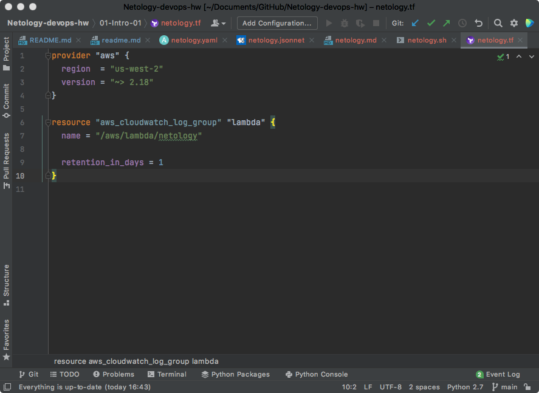
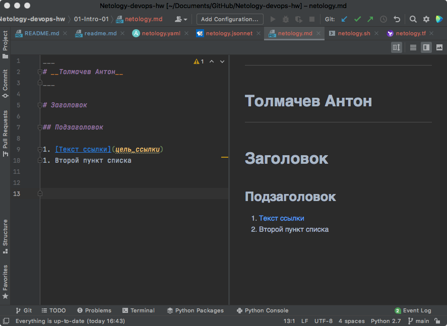
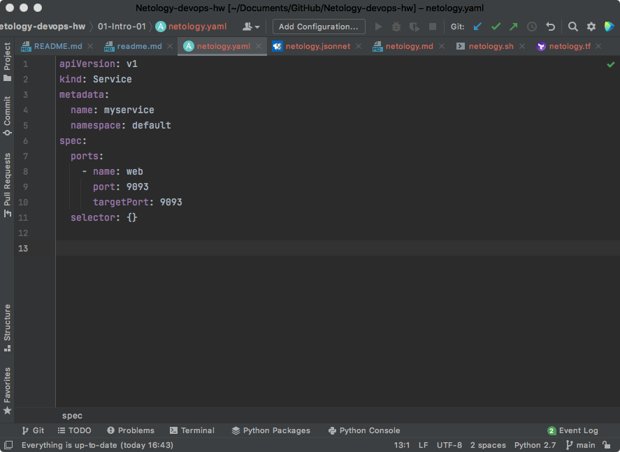
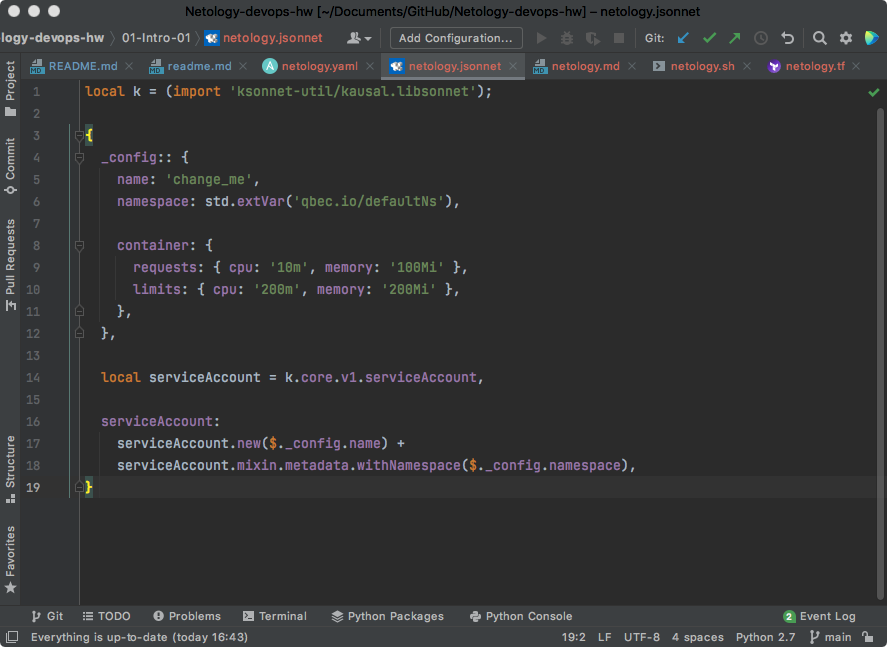

# Домашнее задание к занятию «1.1. Введение в DevOps»
## Задание №1 - Подготовка рабочей среды

Проверяем подсветку синтаксиса
- Terraform:

- Bash: 

- Markdown:
 

- Yaml:

- Jsonnet:

---
## Задание №2 - Описание жизненного цикла задачи (разработки нового функционала)

Описание жизненного цикла задачи (разработка нового функционала)

1.	Коммуникация.
2.	Инфраструктура.
3.	Разработка.
4.	Внешние интеграции.
5.	Тестирование и отладка.
6.	Выпуск приложения в эксплуатацию и поддержка.

__DevOps-инженер__ участвует во всех этапах жизненного цикла разработки ПО. 

