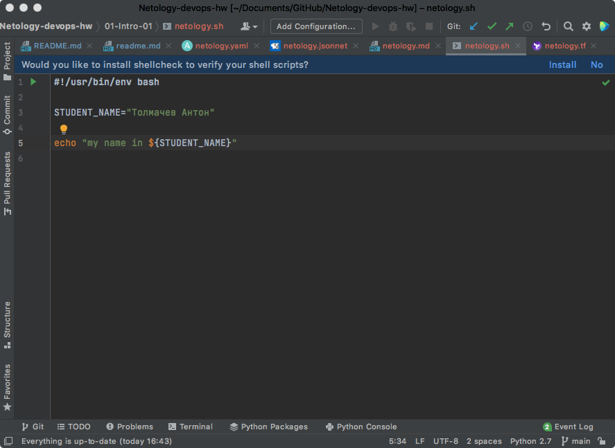

---
# Домашнее задание к занятию «1.1. Введение в DevOps»
## Задание №1 - Подготовка рабочей среды

- Проверяем подсветку синтаксиса
  - Terraform: 
  - Bash: 
  - Markdown: 
  - Yaml: 
  - Jsonnet: 

