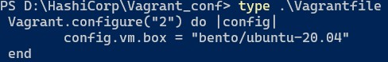

# Домашнее задание к занятию "3.1. Работа в терминале, лекция 1"

1. Установите средство виртуализации Oracle VirtualBox.


2. Установите средство автоматизации Hashicorp Vagrant.


3. В вашем основном окружении подготовьте удобный для дальнейшей работы терминал.


4. С помощью базового файла конфигурации запустите Ubuntu 20.04 в VirtualBox посредством Vagrant.
- `vagrant init`



- `vagrant up`


5. Ознакомьтесь с графическим интерфейсом VirtualBox, посмотрите как выглядит виртуальная машина, которую создал для вас Vagrant, какие аппаратные ресурсы ей выделены. Какие ресурсы выделены по-умолчанию?


6. Ознакомьтесь с возможностями конфигурации VirtualBox через Vagrantfile: документация. Как добавить оперативной памяти или ресурсов процессора виртуальной машине?
- добавим пару строк в Vagrantfile:
````
config.vm.provider "virtualbox" do |v|
  v.memory = 2024
  v.cpus = 2
end
````
- перезапустим виртуальну машину `vagrant reload`


7. Команда vagrant ssh из директории, в которой содержится Vagrantfile, позволит вам оказаться внутри виртуальной машины без каких-либо дополнительных настроек. Попрактикуйтесь в выполнении обсуждаемых команд в терминале Ubuntu.


8. Ознакомиться с разделами man bash, почитать о настройках самого bash.

   - какой переменной можно задать длину журнала history, и на какой строчке manual это описывается?
   
         `HISTSIZE`, строка 792/4163
         `HISTFILESIZE`, строка 778/4163  
   
   - что делает директива `ignoreboth` в bash?

         присваивается переменной HISTCONTROL и позволяет не записывать в историю команды которые начинаются с пробела, либо команды которые дублируют предыдущие (ignorespace & ignoredups)

9. В каких сценариях использования применимы скобки `{}` и на какой строчке `man bash` это описано?

   - зарезервированные слова (162);
   - списки (241), в т.ч. списки команд (367);
   - в условных циклах;
   - в условных операторах;
   - огранчивает тело функции (начало и конец).

10. Основываясь на предыдущем вопросе, как создать однократным вызовом `touch` 100000 файлов? А получилось ли создать 300000? Если нет, то почему? 

    - `touch {000001..100000}.txt`
    - не получилось создать 300000 файлов - слишком много аргументов

11. В man bash поищите по `/\[\[`. Что делает конструкция `[[ -d /tmp ]]`

    - проверяет условие у -d /tmp и возвращает ее статус (0 или 1)

12. Основываясь на знаниях о просмотре текущих (например, PATH) и установке новых переменных; командах, которые мы рассматривали, добейтесь в выводе type -a bash в виртуальной машине наличия первым пунктом в списке:


13. Чем отличается планирование команд с помощью `batch` и `at`?

    - `at` - выполняет команды в указанное время;
    - `batch` - выполняет команды, когда это позволяют уровни загрузки системы; другими словами, когда средняя загрузка падает ниже 1,5 или значения, указанного при вызове `atd`. 

14. Завершите работу виртуальной машины чтобы не расходовать ресурсы компьютера и/или батарею ноутбука.

    - `vagrant halt`


