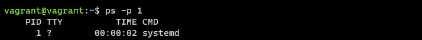
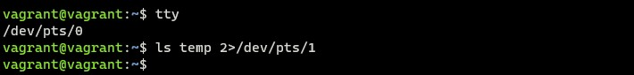
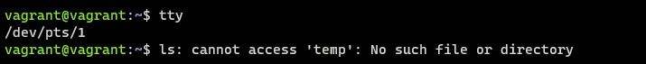
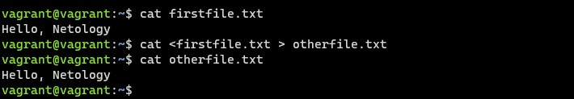
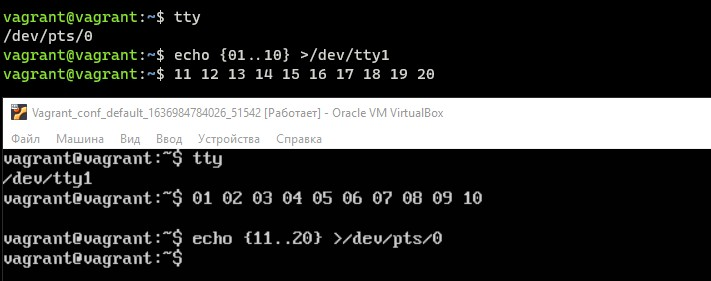
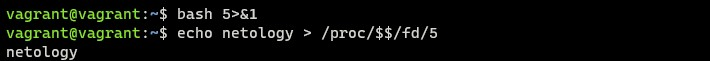
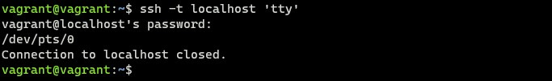

# Домашнее задание к занятию "3.2. Работа в терминале, лекция 2"

Q1. Какого типа команда `cd`? Попробуйте объяснить, почему она именно такого типа; опишите ход своих мыслей, если считаете что она могла бы быть другого типа.

A1. Команда `cd` (англ. change directory — изменить каталог) — команда командной строки для изменения рабочего каталога в операционных системах Unix, DOS и др. Доступна также для использования в скриптах или в пакетных файлах. `cd` является встроенной командой. Команда `cd` может быть использована для перехода во вложенные каталоги (подкаталоги), перехода обратно в родительский каталог, перехода в корневой каталог или для перехода в любой другой каталог. Смена каталога происходит для конкретного сеанса (для своего окружения) в других сеансах никакого влияния не оказывает.

Q2. Какая альтернатива без pipe команде `grep <some_string> <some_file> | wc -l`? `man grep` поможет в ответе на этот вопрос. Ознакомьтесь с [документом](http://www.smallo.ruhr.de/award.html) о других подобных некорректных вариантах использования pipe.

A2. `grep <some_string> <somefile> -c`


Q3. Какой процесс с PID `1` является родителем для всех процессов в вашей виртуальной машине Ubuntu 20.04?

A3. `ps -p 1`



Q4. Как будет выглядеть команда, которая перенаправит вывод stderr `ls` на другую сессию терминала?

A4. `ls temp 2>/dev/pts/1`





Q5. Получится ли одновременно передать команде файл на stdin и вывести ее stdout в другой файл? Приведите работающий пример.

   - получится, например: `cat < some_file > some_other_file`



Q6. Получится ли вывести, находясь в графическом режиме, данные из PTY в какой-либо из эмуляторов TTY? Сможете ли вы наблюдать выводимые данные?



Q7. Выполните команду `bash 5>&1`. К чему она приведет? Что будет, если вы выполните `echo netology > /proc/$$/fd/5`? Почему так происходит?

   - `bash 5` - создаст файловый дескриптор 5 и `>&1` перенаправит его в `stdout`;
   - `echo netology > /proc/$$/fd/5` - вывод перенаправлен в файловый дескриптор 5, который в свою очередь перенаправлен в `stdout`.



Q8. Получится ли в качестве входного потока для pipe использовать только stderr команды, не потеряв при этом отображение stdout на pty? Напоминаем: по умолчанию через pipe передается только stdout команды слева от `|` на stdin команды справа. Это можно сделать, поменяв стандартные потоки местами через промежуточный новый дескриптор, который вы научились создавать в предыдущем вопросе.

A8. `ls -l some 8>&2 2>&1 1>&8 | grep cannot`

- `8>&2` - новый дескриптор перенаправили в `stderr`;
- `2>&1` - `stderr` перенаправили в `stdout`;
- `1>&8` - `stdout` - перенаправили в в новый дескриптор.


Q9. Что выведет команда `cat /proc/$$/environ`? Как еще можно получить аналогичный по содержанию вывод?

A9. Команда выведет переменные окружения. Также можно получить аналогичный вывод командами:

- `printenv`
- `env`

Q10. Используя `man`, опишите что доступно по адресам `/proc/<PID>/cmdline`, `/proc/<PID>/exe`.

A10. По указанным адресам доступно:

- `/proc/<PID>/cmdline` - доступный только для чтения файл содержит полную командную строку для процесса, если только процесс не является зомби. В последнем случае в этом файле ничего нет: то есть чтение этого файла вернет 0 символов. Аргументы командной строки появляются в этом файле в виде набора строк, разделенных нулевыми байтами ('\0'), с последующим нулевым байтом после последней строки.
- `/proc/<PID>/exe` - В Linux 2.2 и новее этот файл представляет собой символическую ссылку, содержащую фактический путь к исполняемой команде. Эту символическую ссылку можно разыменовать обычным образом; при попытке открыть его откроет исполняемый файл.

Q11. Узнайте, какую наиболее старшую версию набора инструкций SSE поддерживает ваш процессор с помощью `/proc/cpuinfo`.

A11. `cat /proc/cpuinfo | grep sse` - __SSE4_2__ 

Q12. При открытии нового окна терминала и `vagrant ssh` создается новая сессия и выделяется pty. Это можно подтвердить командой `tty`, которая упоминалась в лекции 3.2. Однако:

     ```bash
     vagrant@netology1:~$ ssh localhost 'tty'
     not a tty
     ```
Почитайте, почему так происходит, и как изменить поведение.

A12. По умолчанию, когда запускаем команду на удаленном компьютере с помощью `ssh`, TTY не выделяется для удаленного сеанса. Чтобы принудительно выделить TTY необходимо запускать `ssh` с ключем `-t`.

  - `ssh -t localhost 'tty'`



Q13. Бывает, что есть необходимость переместить запущенный процесс из одной сессии в другую. Попробуйте сделать это, воспользовавшись `reptyr`. Например, так можно перенести в `screen` процесс, который вы запустили по ошибке в обычной SSH-сессии.

A13. Для работы `reptyr` отредактировал файл 10-patrace.conf и установил значение '0' в параметре `kernel.yama.ptrace_scope`, также можно изменить данное значение временно командой `echo 0 > /proc/sys/kernel/yama/ptrace_scope`. Попробовал перенести "долгий" процесс `top` в `screen`.

- Использование команды `reptyr <PID>`.

Q14. `sudo echo string > /root/new_file` не даст выполнить перенаправление под обычным пользователем, так как перенаправлением занимается процесс shell'а, который запущен без `sudo` под вашим пользователем. Для решения данной проблемы можно использовать конструкцию `echo string | sudo tee /root/new_file`. Узнайте что делает команда `tee` и почему в отличие от `sudo echo` команда с `sudo tee` будет работать.

A14. Команда `tee` одновременно производит вывод в `stdout` и в указанный файл.