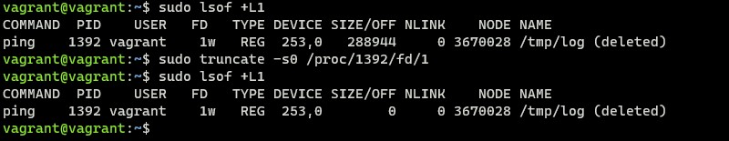
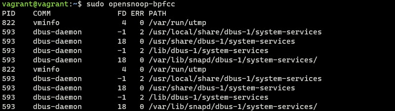

# Домашнее задание к занятию "3.3. Операционные системы, лекция 1"

Q1. Какой системный вызов делает команда `cd`? В прошлом ДЗ мы выяснили, что `cd` не является самостоятельной  программой, это `shell builtin`, поэтому запустить `strace` непосредственно на `cd` не получится. Тем не менее, вы можете запустить `strace` на `/bin/bash -c 'cd /tmp'`. В этом случае вы увидите полный список системных вызовов, которые делает сам `bash` при старте. Вам нужно найти тот единственный, который относится именно к `cd`.

A1. Системный вызов команды `cd`:
````
chdir("/tmp")
````

Q2. Попробуйте использовать команду `file` на объекты разных типов на файловой системе. Например:
```bash
    vagrant@netology1:~$ file /dev/tty
    /dev/tty: character special (5/0)
    vagrant@netology1:~$ file /dev/sda
    /dev/sda: block special (8/0)
    vagrant@netology1:~$ file /bin/bash
    /bin/bash: ELF 64-bit LSB shared object, x86-64
```

Используя `strace` выясните, где находится база данных `file` на основании которой она делает свои догадки.

A2. База данных команды `file` находится по следующему пути:

- `/usr/share/misc/magic.mgc`

Q3. Предположим, приложение пишет лог в текстовый файл. Этот файл оказался удален (deleted в lsof), однако возможности сигналом сказать приложению переоткрыть файлы или просто перезапустить приложение – нет. Так как приложение продолжает писать в удаленный файл, место на диске постепенно заканчивается. Основываясь на знаниях о перенаправлении потоков предложите способ обнуления открытого удаленного файла (чтобы освободить место на файловой системе).

A3. Ищем открытые удаленные файлы - `sudo lsof +L1`, в выводе находим PID процесса и FD, командой `truncate` обнуляем открытый удаленный файл - `truncate -s0 /proc/<PID>/fd/<fd>`



Q4. Занимают ли зомби-процессы какие-то ресурсы в ОС (CPU, RAM, IO)?

A4. Нет, зомби-процессы уже завершили свое выполнение, но присутствуют в списке процессов. Они будут оставаться в системе пока родительский процесс не считает их код завершения и не сделает системный вызов wait().

Q5. В iovisor BCC есть утилита `opensnoop`:
    ```bash
    root@vagrant:~# dpkg -L bpfcc-tools | grep sbin/opensnoop
    /usr/sbin/opensnoop-bpfcc
    ```
    На какие файлы вы увидели вызовы группы `open` за первую секунду работы утилиты? Воспользуйтесь пакетом `bpfcc-tools` для Ubuntu 20.04. Дополнительные [сведения по установке](https://github.com/iovisor/bcc/blob/master/INSTALL.md).

A5. Установим необходимый пакет:

- `sudo apt-get install bpfcc-tools linux-headers-$(uname -r)`
- `sudo opensnoop-bpfcc`    



Q6. Какой системный вызов использует `uname -a`? Приведите цитату из man по этому системному вызову, где описывается альтернативное местоположение в `/proc`, где можно узнать версию ядра и релиз ОС.

A6. `uname -a` использует системный вызов `uname()`:
- `strace uname -a`:

````
uname({sysname="Linux", nodename="vagrant", ...}) = 0
````

- Цитата из `man 2 uname`:
> Part of the utsname information is also accessible via /proc/sys/kernel/{ostype, hostname, osrelease, version, domainname}.

Q7. Чем отличается последовательность команд через `;` и через `&&` в bash? Например:
    ```bash
    root@netology1:~# test -d /tmp/some_dir; echo Hi
    Hi
    root@netology1:~# test -d /tmp/some_dir && echo Hi
    root@netology1:~#
    ```
    Есть ли смысл использовать в bash `&&`, если применить `set -e`?

A7. При использовании `;` команды выполняются последовательно не зависимо от успеха или ошибки других команд.
При использовании `&&` следующая команда выполнится только при условии успешного завершения предыдущей.

Команда `set` устанавливает значения параметров оболочки, флаг `-e` означает, что оболочка завершит выполнение команд, если команда в списке завершается с любой ошибкой (код возврата больше 0).
Следовательно, не имеет смысла использовать в bash `&&`, если применить `set -e`.

Q8. Из каких опций состоит режим bash `set -euxo pipefail` и почему его хорошо было бы использовать в сценариях?

A8. Режим bash `set -euxo pipefail` состоит из следующих опций:

- `-e` - завершить выполнение списка команд, если команда выдала ненулевой код завершения;
- `-u` - интерпретировать при подстановках неустановленные переменные как ошибки;
- `-x` - отображать команды вместе с их аргументами когда они выполняются;
- `-o pipefail` заменить код завершения конвейера на код завершения последней неудачно завершившейся команды или нулевой код завершения, если все команды в конвейере завершились удачно.

Q9. Используя `-o stat` для `ps`, определите, какой наиболее часто встречающийся статус у процессов в системе. В `man ps` ознакомьтесь (`/PROCESS STATE CODES`) что значат дополнительные к основной заглавной буквы статуса процессов. Его можно не учитывать при расчете (считать S, Ss или Ssl равнозначными).

A9. Наиболее часто встречающийся статус у процессов в системе `I` и `S`.

````
ps -eo stat | cut -c1 | sort | uniq -c
````


- `I` - бездействующие потоки ядра;
- `S` - процессы в прерываемом сне, в ожидании событий.