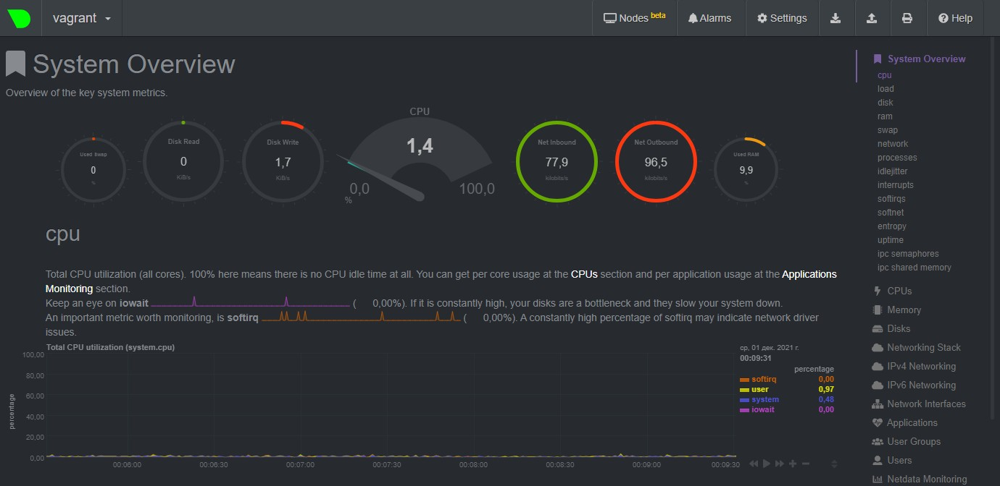
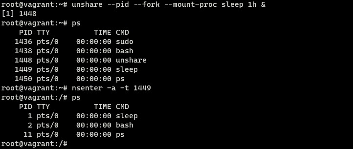

# Домашнее задание к занятию "3.4. Операционные системы, лекция 2"

Q1. На лекции мы познакомились с [node_exporter](https://github.com/prometheus/node_exporter/releases). В демонстрации его исполняемый файл запускался в background. Этого достаточно для демо, но не для настоящей production-системы, где процессы должны находиться под внешним управлением. Используя знания из лекции по systemd, создайте самостоятельно простой [unit-файл](https://www.freedesktop.org/software/systemd/man/systemd.service.html) для node_exporter:

   * поместите его в автозагрузку,
   * предусмотрите возможность добавления опций к запускаемому процессу через внешний файл (посмотрите, например, на `systemctl cat cron`),
   * удостоверьтесь, что с помощью systemctl процесс корректно стартует, завершается, а после перезагрузки автоматически поднимается.

A1. 

- Установил;
- Создал init-файл:

````
root@vagrant:~# systemctl cat node_exporter
# /etc/systemd/system/node_exporter.service
[Unit]
Description=Prometheus Node Exporter
Documentation=https://github.com/prometheus/node_exporter
After=network-online.target

[Service]
User=root
EnvironmentFile=/etc/default/node_exporter
ExecStart=/opt/node_exporter/node_exporter $OPTIONS
Restart=on-failure
RestartSec=5

[Install]
WantedBy=multi-user.target
````

- поместил в автозагрузку:


    `systemctl enable node_exporter`


- предусмотрел:

````
EnvironmentFile=/etc/default/node_exporter
ExecStart=/opt/node_exporter/node_exporter $OPTIONS
````

- убедился:

````
root@vagrant:~# systemctl stop node_exporter
root@vagrant:~# systemctl status node_exporter
● node_exporter.service - Prometheus Node Exporter
     Loaded: loaded (/etc/systemd/system/node_exporter.service; enabled; ve>
     Active: inactive (dead) since Tue 2021-11-30 18:30:14 UTC; 2s ago
       Docs: https://github.com/prometheus/node_exporter
    Process: 1627 ExecStart=/opt/node_exporter/node_exporter $OPTIONS (code>
   Main PID: 1627 (code=killed, signal=TERM)
````
&
````
root@vagrant:~# systemctl start node_exporter
root@vagrant:~# systemctl status node_exporter
● node_exporter.service - Prometheus Node Exporter
     Loaded: loaded (/etc/systemd/system/node_exporter.service; enabled; ve>
     Active: active (running) since Tue 2021-11-30 18:33:31 UTC; 3s ago
       Docs: https://github.com/prometheus/node_exporter
   Main PID: 1681 (node_exporter)
      Tasks: 4 (limit: 2291)
     Memory: 2.4M
     CGroup: /system.slice/node_exporter.service
             └─1681 /opt/node_exporter/node_exporter
````


Q2. Ознакомьтесь с опциями node_exporter и выводом `/metrics` по-умолчанию. Приведите несколько опций, которые вы бы выбрали для базового мониторинга хоста по CPU, памяти, диску и сети.

A2. Опции:

````
[CPU]
node_cpu_seconds_total{cpu="0",mode="system"} 16.6
node_cpu_seconds_total{cpu="0",mode="user"} 14.76
node_cpu_seconds_total{cpu="1",mode="idle"} 3002.52
[MEM]
node_memory_MemAvailable_bytes 1.71749376e+09
node_memory_MemFree_bytes 1.356754944e+09
node_memory_MemTotal_bytes 2.058911744e+09
[DISK]
node_disk_io_time_seconds_total{device="sda"} 34.512
node_disk_read_time_seconds_total{device="sda"} 96.269
node_disk_write_time_seconds_total{device="sda"} 6.069
[NET]
node_network_receive_packets_total{device="eth0"} 10733
node_network_transmit_bytes_total{device="eth0"} 5.130863e+06
node_network_transmit_errs_total{device="eth0"} 0

````

Q3. Установите в свою виртуальную машину [Netdata](https://github.com/netdata/netdata). Воспользуйтесь [готовыми пакетами](https://packagecloud.io/netdata/netdata/install) для установки (`sudo apt install -y netdata`). После успешной установки:

   * в конфигурационном файле `/etc/netdata/netdata.conf` в секции [web] замените значение с localhost на `bind to = 0.0.0.0`,
   * добавьте в Vagrantfile проброс порта Netdata на свой локальный компьютер и сделайте `vagrant reload`:

    ```bash
    config.vm.network "forwarded_port", guest: 19999, host: 19999
    ```

После успешной перезагрузки в браузере *на своем ПК* (не в виртуальной машине) вы должны суметь зайти на `localhost:19999`. Ознакомьтесь с метриками, которые по умолчанию собираются Netdata и с комментариями, которые даны к этим метрикам.

A3. Установил:



Q4. Можно ли по выводу `dmesg` понять, осознает ли ОС, что загружена не на настоящем оборудовании, а на системе виртуализации?

A4. Можно - "осознает":

````
[    0.000000] DMI: innotek GmbH VirtualBox/VirtualBox, BIOS VirtualBox 12/01/2006
[    0.000000] Hypervisor detected: KVM
[    0.003488] CPU MTRRs all blank - virtualized system.
[    0.127126] Booting paravirtualized kernel on KVM
[    4.334284] systemd[1]: Detected virtualization oracle.
````

Q5. Как настроен sysctl `fs.nr_open` на системе по-умолчанию? Узнайте, что означает этот параметр. Какой другой существующий лимит не позволит достичь такого числа (`ulimit --help`)?

A5. Параметр:
- `fs.nr_open` - лимит на количество открытых дескрипторов
````
root@vagrant:~# cat /proc/sys/fs/nr_open
1048576
````
- `ulimit -Hn` - жесткий лимит на пользователя
````
root@vagrant:~# ulimit -Hn
1048576
````
- `ulimit -Sn` - мягкий лимит на пользователя (увеличится в пределах жесткого лимита)
````
root@vagrant:~# ulimit -Sn
1024
````
- Q6. Запустите любой долгоживущий процесс (не `ls`, который отработает мгновенно, а, например, `sleep 1h`) в отдельном неймспейсе процессов; покажите, что ваш процесс работает под PID 1 через `nsenter`. Для простоты работайте в данном задании под root (`sudo -i`). Под обычным пользователем требуются дополнительные опции (`--map-root-user`) и т.д.

A6. Запускаю:



Q7. Найдите информацию о том, что такое `:(){ :|:& };:`. Запустите эту команду в своей виртуальной машине Vagrant с Ubuntu 20.04 (**это важно, поведение в других ОС не проверялось**). Некоторое время все будет "плохо", после чего (минуты) – ОС должна стабилизироваться. Вызов `dmesg` расскажет, какой механизм помог автоматической стабилизации. Как настроен этот механизм по-умолчанию, и как изменить число процессов, которое можно создать в сессии?

A7. Команда `:(){ :|:& };:`
> В действительности эта команда является логической бомбой. Она оперирует определением функции с именем ‘:‘, которая вызывает сама себя дважды: один раз на переднем плане и один раз в фоне. Она продолжает своё выполнение снова и снова, пока система не зависнет.

- Стабилизировать систему помогли лимиты на количество процессов для пользователя:

````
vagrant@vagrant:~$ systemctl status user-1000.slice
● user-1000.slice - User Slice of UID 1000
     Loaded: loaded
    Drop-In: /usr/lib/systemd/system/user-.slice.d
             └─10-defaults.conf
     Active: active since Tue 2021-11-30 20:18:24 UTC; 11min ago
       Docs: man:user@.service(5)
      Tasks: 9 (limit: 5040)
     Memory: 12.5M
````
- Изменить лимиты можно путем редактирования файла `/usr/lib/systemd/system/user-.slice.d/10-defaults.conf` и установкой другого значения для параметра `TasksMax`.

````
vagrant@vagrant:~$ cat /usr/lib/systemd/system/user-.slice.d/10-defaults.conf
#  SPDX-License-Identifier: LGPL-2.1+
#
#  This file is part of systemd.
#
#  systemd is free software; you can redistribute it and/or modify it
#  under the terms of the GNU Lesser General Public License as published by
#  the Free Software Foundation; either version 2.1 of the License, or
#  (at your option) any later version.

[Unit]
Description=User Slice of UID %j
Documentation=man:user@.service(5)
After=systemd-user-sessions.service
StopWhenUnneeded=yes

[Slice]
TasksMax=33%
````
