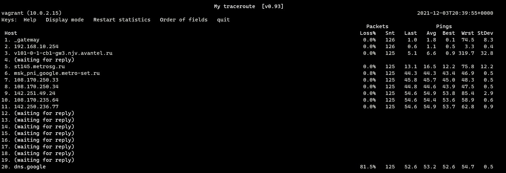

# Домашнее задание к занятию "3.6. Компьютерные сети, лекция 1"

Q1. Работа c HTTP через телнет.
- Подключитесь утилитой телнет к сайту stackoverflow.com
`telnet stackoverflow.com 80`
- отправьте HTTP запрос
```bash
GET /questions HTTP/1.0
HOST: stackoverflow.com
[press enter]
[press enter]
```
- В ответе укажите полученный HTTP код, что он означает?

A1. Сделано.

````
HTTP/1.1 301 Moved Permanently
cache-control: no-cache, no-store, must-revalidate
location: https://stackoverflow.com/questions
x-request-guid: adf746bf-59f3-4e3d-b748-d5a8b7900d0f
feature-policy: microphone 'none'; speaker 'none'
content-security-policy: upgrade-insecure-requests; frame-ancestors 'self' https://stackexchange.com
Accept-Ranges: bytes
Date: Fri, 03 Dec 2021 19:42:35 GMT
Via: 1.1 varnish
Connection: close
X-Served-By: cache-hhn4025-HHN
X-Cache: MISS
X-Cache-Hits: 0
X-Timer: S1638560555.209746,VS0,VE169
Vary: Fastly-SSL
X-DNS-Prefetch-Control: off
Set-Cookie: prov=e78aad54-fcfe-0f47-55f4-ed3935ec3396; domain=.stackoverflow.com; expires=Fri, 01-Jan-2055 00:00:00 GMT; path=/; HttpOnly

Connection closed by foreign host.
````

> **HTTP 301**
>
> Код состояния **HTTP 301** или **Moved Permanently** (с англ. — «Перемещено навсегда») — стандартный код ответа HTTP, получаемый в ответ от сервера в ситуации, когда запрошенный ресурс был на постоянной основе перемещён в новое месторасположение, и указывающий на то, что текущие ссылки, использующие данный URL, должны быть обновлены. Адрес нового месторасположения ресурса указывается в поле ***Location*** получаемого в ответ заголовка пакета протокола HTTP.

Q2. Повторите задание 1 в браузере, используя консоль разработчика F12.
- откройте вкладку `Network`
- отправьте запрос http://stackoverflow.com
- найдите первый ответ HTTP сервера, откройте вкладку `Headers`
- укажите в ответе полученный HTTP код.
- проверьте время загрузки страницы, какой запрос обрабатывался дольше всего?
- приложите скриншот консоли браузера в ответ.

A2. Сделано.

- Первый ответ HTTP сервера - 200 (ОК)
- Самый долгий запрос:


Q3. Какой IP адрес у вас в интернете?

A4. Сделано.

````
91.203.10.138
````
Q4. Какому провайдеру принадлежит ваш IP адрес? Какой автономной системе AS? Воспользуйтесь утилитой `whois`

A4. Сделано.

````
vagrant@vagrant:~$ whois 91.203.10.138

org-name:       JSC Avantel
origin:         AS44811
````

Q5. Через какие сети проходит пакет, отправленный с вашего компьютера на адрес 8.8.8.8? Через какие AS? Воспользуйтесь утилитой `traceroute`

A5. Сделано.

````
vagrant@vagrant:~$ traceroute -AI 8.8.8.8
traceroute to 8.8.8.8 (8.8.8.8), 30 hops max, 60 byte packets
 1  _gateway (10.0.2.2) [*]  0.333 ms  0.305 ms  0.298 ms
 2  192.168.10.254 (192.168.10.254) [*]  1.545 ms  1.540 ms  1.535 ms
 3  v101-0-1-cb1-gw3.njv.avantel.ru (91.203.10.1) [AS44811]  2.411 ms  2.691 ms  2.949 ms
 4  * * *
 5  st145.metrosg.ru (37.60.16.145) [AS50923]  13.548 ms  13.268 ms  13.535 ms
 6  msk_pni_google.metro-set.ru (37.60.16.33) [AS50923]  44.479 ms  44.421 ms  44.787 ms
 7  108.170.250.33 (108.170.250.33) [AS15169]  46.192 ms  45.994 ms  45.949 ms
 8  108.170.250.34 (108.170.250.34) [AS15169]  44.990 ms  45.466 ms  45.446 ms
 9  142.251.49.24 (142.251.49.24) [AS15169]  55.651 ms  56.321 ms  56.302 ms
10  108.170.235.64 (108.170.235.64) [AS15169]  56.264 ms  57.512 ms  56.746 ms
11  142.250.236.77 (142.250.236.77) [AS15169]  57.968 ms  57.292 ms  55.904 ms
12  * * *
13  * * *
14  * * *
15  * * *
16  * * *
17  * * *
18  * * *
19  * * *
20  * * dns.google (8.8.8.8) [AS15169]  54.537 ms
````

Q6. Повторите задание 5 в утилите `mtr`. На каком участке наибольшая задержка - delay?

A6. Сделано.

- Вывод утилиты `mtr`



Наибольшая задержка на узле 142.251.49.24 (наилучший показатель 53.8ms) 

Q7. Какие DNS сервера отвечают за доменное имя dns.google? Какие A записи? воспользуйтесь утилитой `dig`

A7. Сделано.
- За доменное имя `dns.google` отвечают следующие **NS** сервера:
````
vagrant@vagrant:~$ dig dns.google ns
...
;; ANSWER SECTION:
dns.google.             7188    IN      NS      ns3.zdns.google.
dns.google.             7188    IN      NS      ns1.zdns.google.
dns.google.             7188    IN      NS      ns2.zdns.google.
dns.google.             7188    IN      NS      ns4.zdns.google.
````
- Домен `dns.google` имеет следующие **A** записи:
````
vagrant@vagrant:~$ dig dns.google
...
;; ANSWER SECTION:
dns.google.             624     IN      A       8.8.8.8
dns.google.             624     IN      A       8.8.4.4
````
Q8. Проверьте PTR записи для IP адресов из задания 7. Какое доменное имя привязано к IP? воспользуйтесь утилитой `dig`

A8. Сделано.
- PTR записи для `8.8.8.8`
````
vagrant@vagrant:~$ dig -x 8.8.8.8
...
;; ANSWER SECTION:
8.8.8.8.in-addr.arpa.   6487    IN      PTR     dns.google.
````
- PTR записи для `8.8.4.4`
````
vagrant@vagrant:~$ dig -x 8.8.4.4
...
;; ANSWER SECTION:
4.4.8.8.in-addr.arpa.   7947    IN      PTR     dns.google.
````