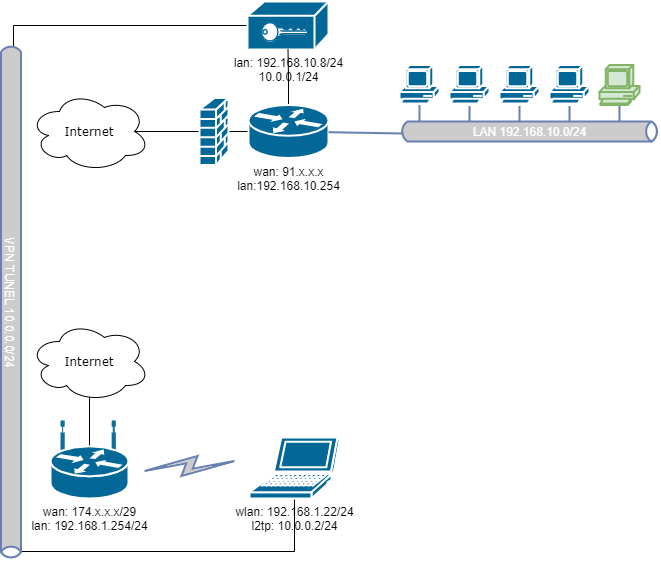

# Домашнее задание к занятию "3.8. Компьютерные сети, лекция 3"

Q1. Подключитесь к публичному маршрутизатору в интернет. Найдите маршрут к вашему публичному IP
```
telnet route-views.routeviews.org
Username: rviews
show ip route x.x.x.x/32
show bgp x.x.x.x/32
```

A1. Подключаемся и выполняем:

````
route-views>show ip route 91.203.10.138
Routing entry for 91.203.10.0/24
  Known via "bgp 6447", distance 20, metric 0
  Tag 6939, type external
  Last update from 64.71.137.241 2w0d ago
  Routing Descriptor Blocks:
  * 64.71.137.241, from 64.71.137.241, 2w0d ago
      Route metric is 0, traffic share count is 1
      AS Hops 3
      Route tag 6939
      MPLS label: none
````
````
route-views>show bgp 91.203.10.138
BGP routing table entry for 91.203.10.0/24, version 1378329204
Paths: (23 available, best #22, table default)
  Not advertised to any peer
  Refresh Epoch 3
  3303 31133 44811
    217.192.89.50 from 217.192.89.50 (138.187.128.158)
      Origin IGP, localpref 100, valid, external
      Community: 3303:1004 3303:1006 3303:1030 3303:3056
      path 7FE0105308C0 RPKI State not found
      rx pathid: 0, tx pathid: 0
  Refresh Epoch 1
  4901 6079 31133 44811
    162.250.137.254 from 162.250.137.254 (162.250.137.254)
      Origin IGP, localpref 100, valid, external
      Community: 65000:10100 65000:10300 65000:10400
      path 7FE02F9130D0 RPKI State not found
      rx pathid: 0, tx pathid: 0
  Refresh Epoch 1
  7660 2516 6762 20485 50923 50923 44811
    203.181.248.168 from 203.181.248.168 (203.181.248.168)
      Origin IGP, localpref 100, valid, external
      Community: 2516:1030 7660:9003
      path 7FE0003C0CF0 RPKI State not found
      rx pathid: 0, tx pathid: 0
  Refresh Epoch 1
  7018 1299 31133 44811
    12.0.1.63 from 12.0.1.63 (12.0.1.63)
      Origin IGP, localpref 100, valid, external
      Community: 7018:5000 7018:37232
      path 7FE17512C370 RPKI State not found
      rx pathid: 0, tx pathid: 0
  Refresh Epoch 1
  3267 31133 44811
    194.85.40.15 from 194.85.40.15 (185.141.126.1)
      Origin IGP, metric 0, localpref 100, valid, external
      path 7FE0CBD213E8 RPKI State not found
      rx pathid: 0, tx pathid: 0
  Refresh Epoch 1
  57866 28917 198354 50923 50923 44811
    37.139.139.17 from 37.139.139.17 (37.139.139.17)
      Origin IGP, metric 0, localpref 100, valid, external
      Community: 0:6939 0:16276 28917:2000 57866:304 57866:501
      path 7FE0C0D71E70 RPKI State not found
      rx pathid: 0, tx pathid: 0
  Refresh Epoch 1
  3333 31133 44811
    193.0.0.56 from 193.0.0.56 (193.0.0.56)
      Origin IGP, localpref 100, valid, external
      path 7FE117079E28 RPKI State not found
      rx pathid: 0, tx pathid: 0
  Refresh Epoch 1
  20912 3257 28917 198354 50923 50923 44811
    212.66.96.126 from 212.66.96.126 (212.66.96.126)
      Origin IGP, localpref 100, valid, external
      Community: 3257:4000 3257:8133 3257:50001 3257:50110 3257:54901 20912:65004
      path 7FE0C82ECEC0 RPKI State not found
      rx pathid: 0, tx pathid: 0
  Refresh Epoch 1
  49788 12552 31133 44811
    91.218.184.60 from 91.218.184.60 (91.218.184.60)
      Origin IGP, localpref 100, valid, external
      Community: 12552:12000 12552:12100 12552:12101 12552:22000
      Extended Community: 0x43:100:1
      path 7FE0F19EDE20 RPKI State not found
      rx pathid: 0, tx pathid: 0
  Refresh Epoch 1
  8283 31133 44811
    94.142.247.3 from 94.142.247.3 (94.142.247.3)
      Origin IGP, metric 0, localpref 100, valid, external
      Community: 8283:1 8283:101
      unknown transitive attribute: flag 0xE0 type 0x20 length 0x18
        value 0000 205B 0000 0000 0000 0001 0000 205B
              0000 0005 0000 0001
      path 7FE011254968 RPKI State not found
      rx pathid: 0, tx pathid: 0
  Refresh Epoch 1
  3356 3216 50923 50923 44811
    4.68.4.46 from 4.68.4.46 (4.69.184.201)
      Origin IGP, metric 0, localpref 100, valid, external
      Community: 3216:2001 3216:4472 3216:5010 3216:5050 3216:5070 3216:5120 3216:5206 3356:2 3356:22 3356:100 3356:123 3356:503 3356:903 3356:2067 57629:1000
      path 7FE0325753C0 RPKI State not found
      rx pathid: 0, tx pathid: 0
  Refresh Epoch 1
  852 31133 44811
    154.11.12.212 from 154.11.12.212 (96.1.209.43)
      Origin IGP, metric 0, localpref 100, valid, external
      path 7FE128B92E50 RPKI State not found
      rx pathid: 0, tx pathid: 0
  Refresh Epoch 1
  2497 174 31133 44811
    202.232.0.2 from 202.232.0.2 (58.138.96.254)
      Origin IGP, localpref 100, valid, external
      path 7FE0111C7108 RPKI State not found
      rx pathid: 0, tx pathid: 0
  Refresh Epoch 1
  1221 4637 31133 44811
    203.62.252.83 from 203.62.252.83 (203.62.252.83)
      Origin IGP, localpref 100, valid, external
      path 7FE0502C6288 RPKI State not found
      rx pathid: 0, tx pathid: 0
  Refresh Epoch 1
  20130 6939 31133 44811
    140.192.8.16 from 140.192.8.16 (140.192.8.16)
      Origin IGP, localpref 100, valid, external
      path 7FE14545DE88 RPKI State not found
      rx pathid: 0, tx pathid: 0
  Refresh Epoch 1
  701 5511 3216 50923 50923 44811
    137.39.3.55 from 137.39.3.55 (137.39.3.55)
      Origin IGP, localpref 100, valid, external
      path 7FE0E2357108 RPKI State not found
      rx pathid: 0, tx pathid: 0
  Refresh Epoch 1
  3257 28917 198354 50923 50923 44811
    89.149.178.10 from 89.149.178.10 (213.200.83.26)
      Origin IGP, metric 10, localpref 100, valid, external
      Community: 3257:4000 3257:8133 3257:50001 3257:50110 3257:54901
      path 7FE040F0C948 RPKI State not found
      rx pathid: 0, tx pathid: 0
  Refresh Epoch 1
  3549 3356 3216 50923 50923 44811
    208.51.134.254 from 208.51.134.254 (67.16.168.191)
      Origin IGP, metric 0, localpref 100, valid, external
      Community: 3216:2001 3216:4472 3216:5010 3216:5050 3216:5070 3216:5120 3216:5206 3356:2 3356:22 3356:100 3356:123 3356:503 3356:903 3356:2067 3549:2581 3549:30840 57629:1000
      path 7FE0DF1DF6A8 RPKI State not found
      rx pathid: 0, tx pathid: 0
  Refresh Epoch 1
  53767 174 31133 44811
    162.251.163.2 from 162.251.163.2 (162.251.162.3)
      Origin IGP, localpref 100, valid, external
      Community: 174:21101 174:22005 53767:5000
      path 7FE169674A70 RPKI State not found
      rx pathid: 0, tx pathid: 0
  Refresh Epoch 1
  101 3491 20485 20485 50923 50923 44811
    209.124.176.223 from 209.124.176.223 (209.124.176.223)
      Origin IGP, localpref 100, valid, external
      Community: 101:20300 101:22100 3491:300 3491:311 3491:9001 3491:9080 3491:9081 3491:9087 3491:62210 3491:62220 20485:10072 20485:52093 20485:52313 20485:52323 20485:52413
      path 7FE163385C58 RPKI State not found
      rx pathid: 0, tx pathid: 0
  Refresh Epoch 1
  3561 3910 3356 3216 50923 50923 44811
    206.24.210.80 from 206.24.210.80 (206.24.210.80)
      Origin IGP, localpref 100, valid, external
      path 7FE14DB94AC8 RPKI State not found
      rx pathid: 0, tx pathid: 0
  Refresh Epoch 1
  6939 31133 44811
    64.71.137.241 from 64.71.137.241 (216.218.252.164)
      Origin IGP, localpref 100, valid, external, best
      path 7FE035B274E8 RPKI State not found
      rx pathid: 0, tx pathid: 0x0
  Refresh Epoch 1
  1351 6939 31133 44811
    132.198.255.253 from 132.198.255.253 (132.198.255.253)
      Origin IGP, localpref 100, valid, external
      path 7FE047DA7050 RPKI State not found
      rx pathid: 0, tx pathid: 0
````

Q2. Создайте dummy0 интерфейс в Ubuntu. Добавьте несколько статических маршрутов. Проверьте таблицу маршрутизации.

A2. Выполняем:
- Создаем интерфейс `dummy0`
````
ip link add name dummy0 type dummy
````
- Присваиваем адрес:
````
ip addr add 192.168.0.2/24 dev dummy0
````
- Подымаем `dummy0`
````
ip link set dummy0 up
````
- Добавляем маршруты:
````
ip addr add 192.168.1.0/24 dev dummy0
ip addr add 192.168.2.0/24 dev dummy0
````
- Проверяем маршруты:
````
root@vagrant:~# ip ro sh
default via 10.0.2.2 dev eth0 proto dhcp src 10.0.2.15 metric 100
10.0.2.0/24 dev eth0 proto kernel scope link src 10.0.2.15
10.0.2.2 dev eth0 proto dhcp scope link src 10.0.2.15 metric 100
192.168.0.0/24 dev dummy0 proto kernel scope link src 192.168.0.2
192.168.1.0/24 dev dummy0 proto kernel scope link src 192.168.1.0
192.168.2.0/24 dev dummy0 proto kernel scope link src 192.168.2.0
````
Q3. Проверьте открытые TCP порты в Ubuntu, какие протоколы и приложения используют эти порты? Приведите несколько примеров.

A3. Открытые порты проверим командой `ss` с опциями:
- `-l` или `--listening` - посмотреть только прослушиваемые порты;
- `-p` или `--program` - показать имя программы и ее PID;
- `-t` или `--tcp` - показать tcp порты;
- `-u` или `--udp` показать udp порты;
- `-n` или `--numeric` показывать ip адреса в числовом виде.

````
root@vagrant:~# ss -tlpn
State       Recv-Q      Send-Q           Local Address:Port           Peer Address:Port      Process
LISTEN      0           4096                   0.0.0.0:111                 0.0.0.0:*          users:(("rpcbind",pid=729,fd=4),("systemd",pid=1,fd=35))
LISTEN      0           4096             127.0.0.53%lo:53                  0.0.0.0:*          users:(("systemd-resolve",pid=730,fd=13))
LISTEN      0           128                    0.0.0.0:22                  0.0.0.0:*          users:(("sshd",pid=882,fd=3))
LISTEN      0           4096                      [::]:111                    [::]:*          users:(("rpcbind",pid=729,fd=6),("systemd",pid=1,fd=37))
LISTEN      0           128                       [::]:22                     [::]:*          users:(("sshd",pid=882,fd=4))
````

Q4. Проверьте используемые UDP сокеты в Ubuntu, какие протоколы и приложения используют эти порты?

A4. Аналогично предыдущему заданию:
````
root@vagrant:~# ss -ulpn
State       Recv-Q      Send-Q            Local Address:Port           Peer Address:Port     Process
UNCONN      0           0                 127.0.0.53%lo:53                  0.0.0.0:*         users:(("systemd-resolve",pid=730,fd=12))
UNCONN      0           0                10.0.2.15%eth0:68                  0.0.0.0:*         users:(("systemd-network",pid=449,fd=19))
UNCONN      0           0                       0.0.0.0:111                 0.0.0.0:*         users:(("rpcbind",pid=729,fd=5),("systemd",pid=1,fd=36))
UNCONN      0           0                     127.0.0.1:161                 0.0.0.0:*         users:(("snmpd",pid=836,fd=6))
UNCONN      0           0                          [::]:111                    [::]:*         users:(("rpcbind",pid=729,fd=7),("systemd",pid=1,fd=38))
UNCONN      0           0                         [::1]:161                    [::]:*         users:(("snmpd",pid=836,fd=7))
````

Q5. Используя diagrams.net, создайте L3 диаграмму вашей домашней сети или любой другой сети, с которой вы работали. 

A5. Диаграмма.




 ---
## Задание для самостоятельной отработки (необязательно к выполнению)

Q6*. Установите Nginx, настройте в режиме балансировщика TCP или UDP.

Q7*. Установите bird2, настройте динамический протокол маршрутизации RIP.

Q8*. Установите Netbox, создайте несколько IP префиксов, используя curl проверьте работу API.
