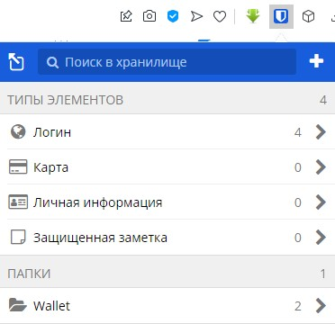
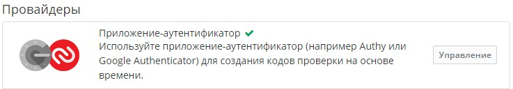
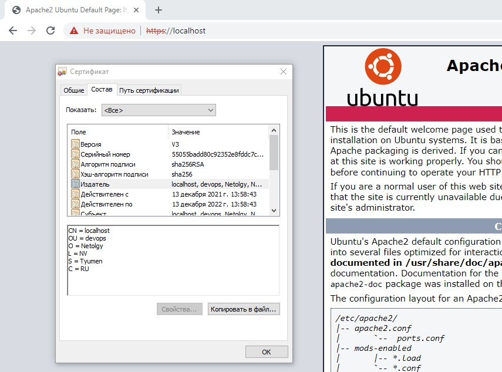
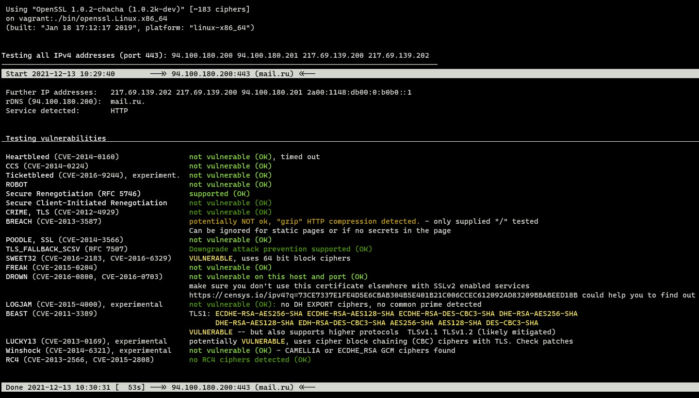
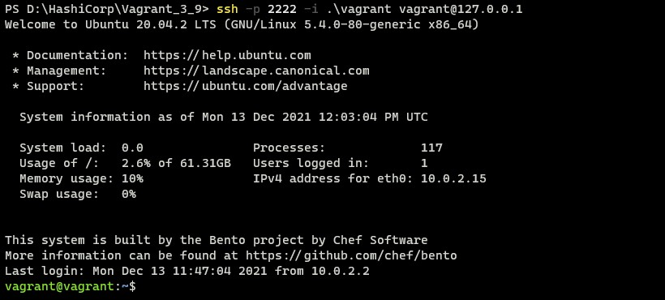
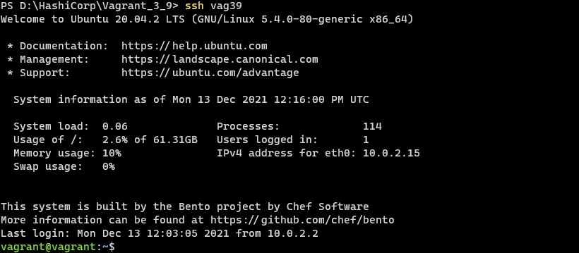
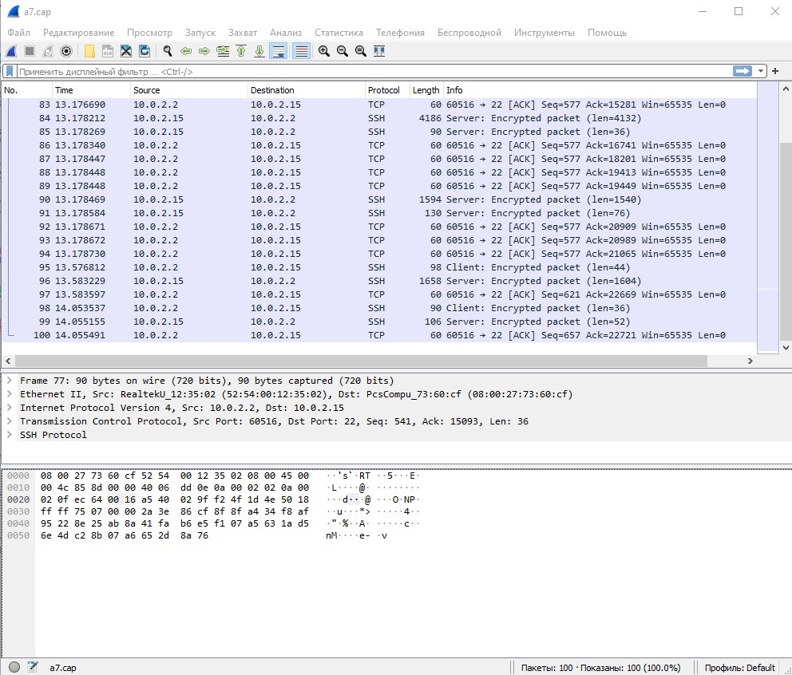

# Домашнее задание к занятию "3.9. Элементы безопасности информационных систем"

Q1. Установите Bitwarden плагин для браузера. Зарегестрируйтесь и сохраните несколько паролей.

A1. Сделано.

- Зарегистрировался и установил надстройку для браузера:



Q2. Установите Google authenticator на мобильный телефон. Настройте вход в Bitwarden акаунт через Google authenticator OTP.

A2. Сделано.

- Установил Google authenticator на мобильный телефон и включил ОТР



Q3. Установите apache2, сгенерируйте самоподписанный сертификат, настройте тестовый сайт для работы по HTTPS.

A3. Выполняем.

- Устанавливаем Apache
````
root@vagrant:~# apt install apache2
````
- Генерируем закрытый ключ и сертификат:
````
root@vagrant:~# openssl req -x509 -nodes -days 365 -newkey rsa:2048 -keyout /etc/ssl/private/ssl-cert-snakeoil.key -out /etc/ssl/certs/ssl-cert-snakeoil.pem -subj "/C=RU/ST=Tyumen/L=NV/O=Netolgy/OU=devops/CN=localhost"
````
- Включаем `mod_ssl`:
````
root@vagrant:~# a2enmod ssl
````
- Активируем HTTPS сайт по умолчанию:
````
root@vagrant:~# a2ensite default-ssl
````
- Проверяем:



Q4. Проверьте на TLS уязвимости произвольный сайт в интернете (кроме сайтов МВД, ФСБ, МинОбр, НацБанк, РосКосмос, РосАтом, РосНАНО и любых госкомпаний, объектов КИИ, ВПК ... и тому подобное).

A4. Проверяем сайт [https://mail.ru](https://mail.ru) с помощью скрипта `./testssl.sh`



Q5. Установите на Ubuntu ssh сервер, сгенерируйте новый приватный ключ. Скопируйте свой публичный ключ на другой сервер. Подключитесь к серверу по SSH-ключу.

A5. Выполняем: 

- Устанавливаем `openssh-server`:
````
apt install openssh-server
````
- Пропишем параметр в `/etc/ssh/ssh_config` 
````
PubkeyAuthentication yes
````
- На клиенте сгенерируем ключи:
````
ssh-keygen
````
- Копируем публичный ключ на сервер в файл `~/.ssh/authorized_keys`:
````
scp.exe -P 2222 .\vagrant.pub vagrant@127.0.0.1:~/.ssh/authorized_keys
````
- Проверяем вход по ключу:
````
ssh -p 2222 -i .\vagrant vagrant@127.0.0.1
````

 
Q6. Переименуйте файлы ключей из задания 5. Настройте файл конфигурации SSH клиента, так чтобы вход на удаленный сервер осуществлялся по имени сервера.

A6. Создадим файл `$HOME/.ssh/config`
````
Host vag39
  User vagrant
  HostName 127.0.0.1
  Port 2222
  IdentityFile ~/.ssh/rsa-vag39
````

Проверяем:



Q7. Соберите дамп трафика утилитой tcpdump в формате pcap, 100 пакетов. Откройте файл pcap в Wireshark.

A7. Соберем дамп трафика:
````
sudo tcpdump -c 100 -w a7.cap
````
- заберем собранный дамп на клиента:
````
scp.exe vag39:~/a7.cap .\a7.cap
````
- откроем дамп в `wireshark`:

