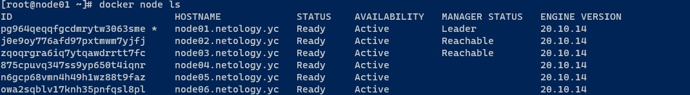
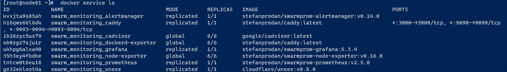

# Домашнее задание к занятию "5.5. Оркестрация кластером Docker контейнеров на примере Docker Swarm"

## Как сдавать задания

Обязательными к выполнению являются задачи без указания звездочки. Их выполнение необходимо для получения зачета и диплома о профессиональной переподготовке.

Задачи со звездочкой (*) являются дополнительными задачами и/или задачами повышенной сложности. Они не являются обязательными к выполнению, но помогут вам глубже понять тему.

Домашнее задание выполните в файле readme.md в github репозитории. В личном кабинете отправьте на проверку ссылку на .md-файл в вашем репозитории.

Любые вопросы по решению задач задавайте в чате учебной группы.

---

## Задача 1

Дайте письменные ответы на следующие вопросы:

- В чём отличие режимов работы сервисов в Docker Swarm кластере: replication и global?
- Какой алгоритм выбора лидера используется в Docker Swarm кластере?
- Что такое Overlay Network?

## Ответ:

- _В чём отличие режимов работы сервисов в Docker Swarm кластере: replication и global?_

Отличие состоит в количестве запускаемых задач на нодах. В режиме global каждая задача запустится один раз, но на каждой ноде, предварительно заданного количества задач нет. В режиме replication нам нужно указать количество необходимых реплик, одна и та же задача запустятся в указанном количестве.
- _Какой алгоритм выбора лидера используется в Docker Swarm кластере?_

В кластере одновременно могут работать несколько управляющих нод, любая из них может в любой момент времени заменить вышедрую из строя ноду. Для выбора управляющей ноды используется алгоритм поддержания распределенного консенсуса - Raft. Данный протокол позволяет любой ноде быть послодователем, кандидатом или лидером. Все зависит от "голосавания" остальных нод в кластере.
- _Что такое Overlay Network?_

Это виртуальная подсеть, она связывает несколько физических хостов, на которых запущен docker. Ее используют контейнеры расположенные на разных хостах в кластере swarm.

## Задача 2

Создать ваш первый Docker Swarm кластер в Яндекс.Облаке

Для получения зачета, вам необходимо предоставить скриншот из терминала (консоли), с выводом команды:
```
docker node ls
```

## Ответ:



## Задача 3

Создать ваш первый, готовый к боевой эксплуатации кластер мониторинга, состоящий из стека микросервисов.

Для получения зачета, вам необходимо предоставить скриншот из терминала (консоли), с выводом команды:
```
docker service ls
```

## Ответ:



## Задача 4 (*)

3Выполнить на лидере Docker Swarm кластера команду (указанную ниже) и дать письменное описание её функционала, что она делает и зачем она нужна:
```
# см.документацию: https://docs.docker.com/engine/swarm/swarm_manager_locking/
docker swarm update --autolock=true
```

