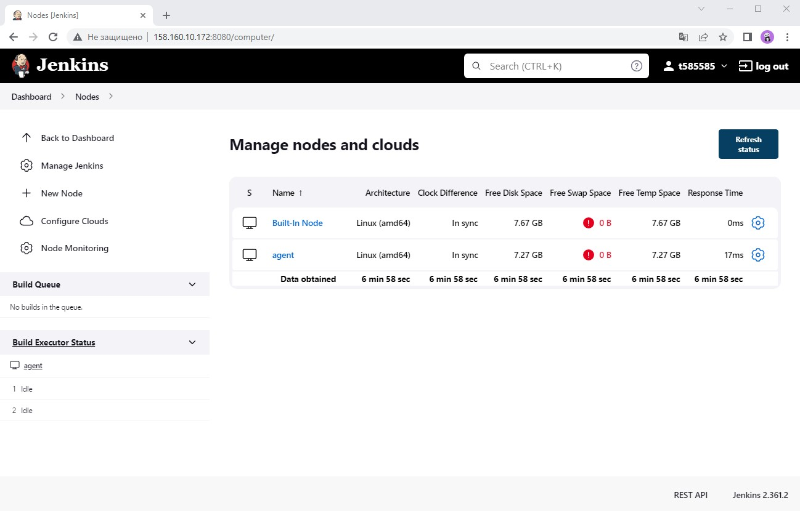
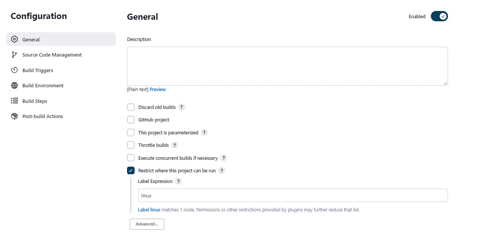
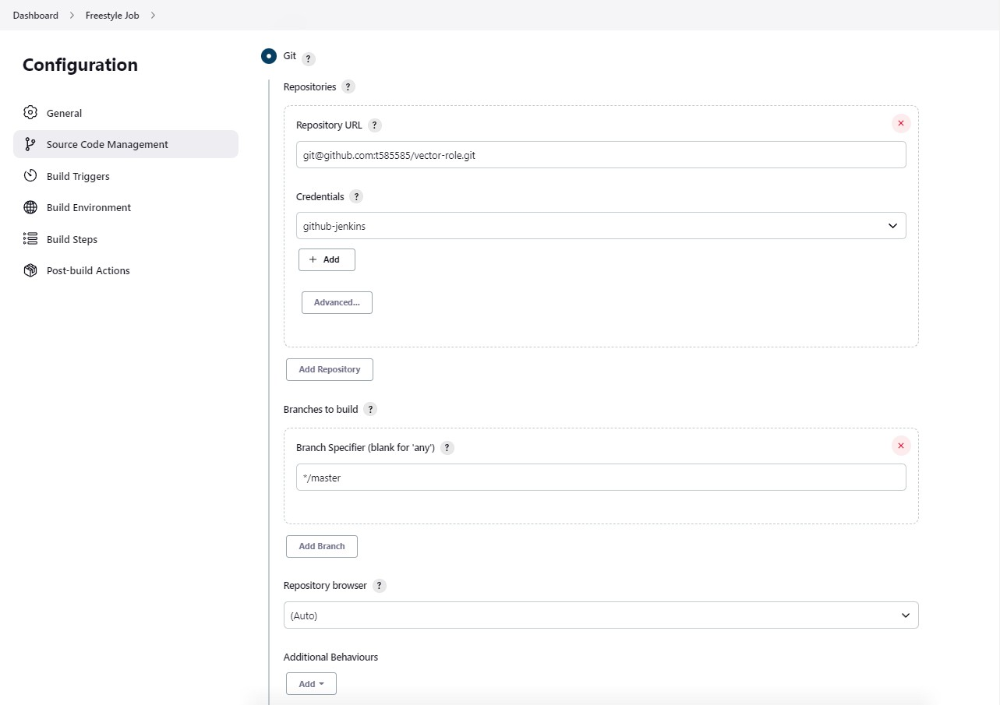
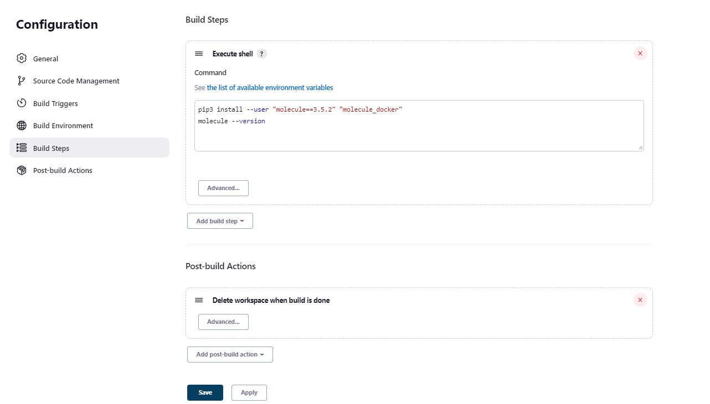
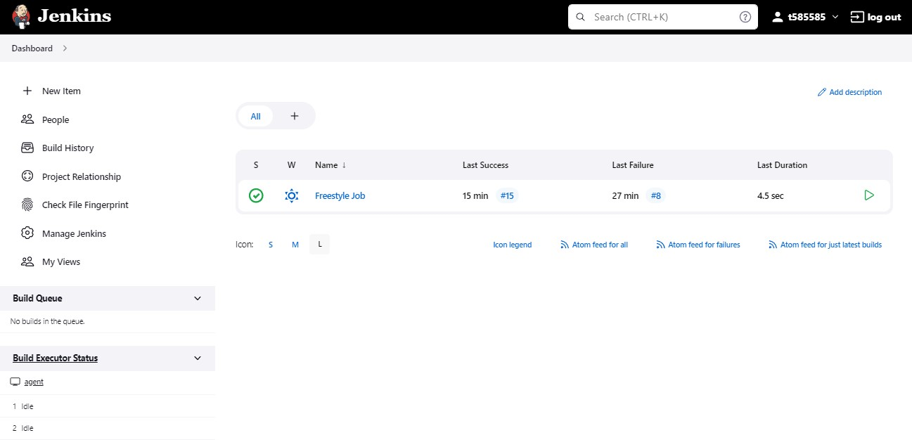
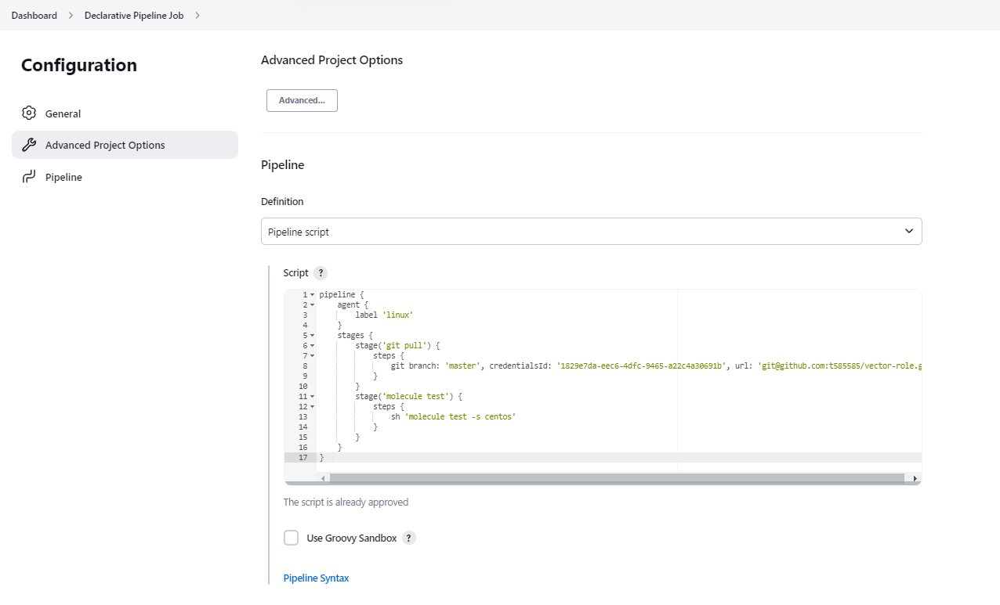
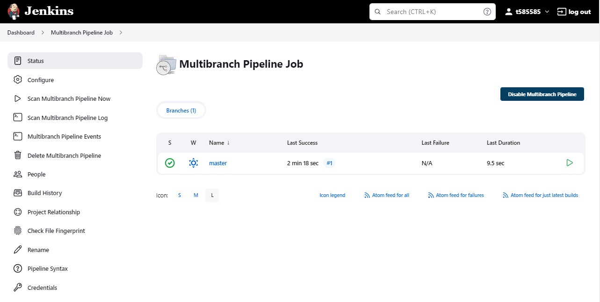
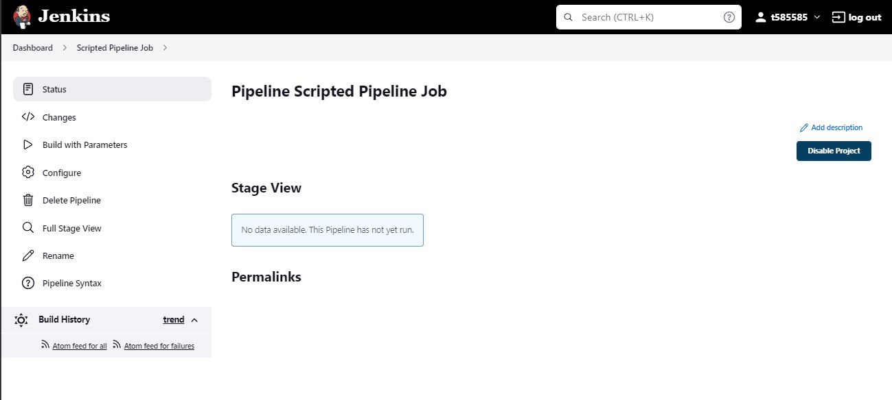
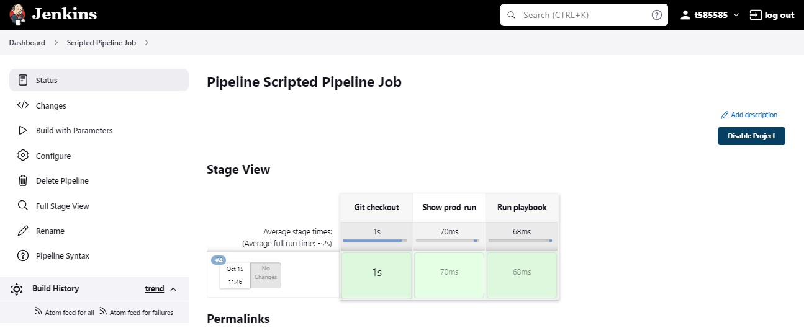

# Домашнее задание к занятию "09.04 Jenkins"

## Подготовка к выполнению

1. Создать 2 VM: для jenkins-master и jenkins-agent.
2. Установить jenkins при помощи playbook'a.
3. Запустить и проверить работоспособность.
4. Сделать первоначальную настройку.

Сделано:


## Основная часть

1. Сделать Freestyle Job, который будет запускать `molecule test` из любого вашего репозитория с ролью.

<details>
    <summary>Если ошибка при подключении к Git по SSH</summary>

- Для обращения к git по SSH:
  - приватный ключ в креды 
```shell
 sudo su jenkins -s /bin/bash
 cat ~/.ssh/id_rsa
```
  - публичный ключ в гит
```shell
 sudo su jenkins -s /bin/bash
 cat ~/.ssh/id_rsa.pub
```
</details>

- Настройки `Freestyle Job`:




- Build выполнен:


<details>
    <summary>Console Output</summary>

```shell
Started by user t585585
Running as SYSTEM
Building remotely on agent (linux) in workspace /opt/jenkins_agent/workspace/Freestyle Job
The recommended git tool is: NONE
using credential 1829e7da-eec6-4dfc-9465-a22c4a30691b
 > git rev-parse --resolve-git-dir /opt/jenkins_agent/workspace/Freestyle Job/.git # timeout=10
ERROR: Workspace has a .git repository, but it appears to be corrupt.
hudson.plugins.git.GitException: Command "git rev-parse --resolve-git-dir /opt/jenkins_agent/workspace/Freestyle Job/.git" returned status code 128:
stdout: 
stderr: fatal: not a gitdir '/opt/jenkins_agent/workspace/Freestyle Job/.git'

	at org.jenkinsci.plugins.gitclient.CliGitAPIImpl.launchCommandIn(CliGitAPIImpl.java:2697)
	at org.jenkinsci.plugins.gitclient.CliGitAPIImpl.launchCommandIn(CliGitAPIImpl.java:2627)
	at org.jenkinsci.plugins.gitclient.CliGitAPIImpl.launchCommandIn(CliGitAPIImpl.java:2623)
	at org.jenkinsci.plugins.gitclient.CliGitAPIImpl.launchCommand(CliGitAPIImpl.java:1981)
	at org.jenkinsci.plugins.gitclient.CliGitAPIImpl.launchCommand(CliGitAPIImpl.java:1993)
	at org.jenkinsci.plugins.gitclient.CliGitAPIImpl.hasGitRepo(CliGitAPIImpl.java:400)
	at hudson.plugins.git.GitAPI.hasGitRepo(GitAPI.java:241)
	at java.base/jdk.internal.reflect.NativeMethodAccessorImpl.invoke0(Native Method)
	at java.base/jdk.internal.reflect.NativeMethodAccessorImpl.invoke(NativeMethodAccessorImpl.java:62)
	at java.base/jdk.internal.reflect.DelegatingMethodAccessorImpl.invoke(DelegatingMethodAccessorImpl.java:43)
	at java.base/java.lang.reflect.Method.invoke(Method.java:566)
	at hudson.remoting.RemoteInvocationHandler$RPCRequest.perform(RemoteInvocationHandler.java:924)
	at hudson.remoting.RemoteInvocationHandler$RPCRequest.call(RemoteInvocationHandler.java:902)
	at hudson.remoting.RemoteInvocationHandler$RPCRequest.call(RemoteInvocationHandler.java:853)
	at hudson.remoting.UserRequest.perform(UserRequest.java:211)
	at hudson.remoting.UserRequest.perform(UserRequest.java:54)
	at hudson.remoting.Request$2.run(Request.java:376)
	at hudson.remoting.InterceptingExecutorService.lambda$wrap$0(InterceptingExecutorService.java:78)
	at java.base/java.util.concurrent.FutureTask.run(FutureTask.java:264)
	at java.base/java.util.concurrent.ThreadPoolExecutor.runWorker(ThreadPoolExecutor.java:1128)
	at java.base/java.util.concurrent.ThreadPoolExecutor$Worker.run(ThreadPoolExecutor.java:628)
	at java.base/java.lang.Thread.run(Thread.java:829)
Cloning the remote Git repository
Cloning repository git@github.com:t585585/vector-role.git
 > git init /opt/jenkins_agent/workspace/Freestyle Job # timeout=10
Fetching upstream changes from git@github.com:t585585/vector-role.git
 > git --version # timeout=10
 > git --version # 'git version 1.8.3.1'
using GIT_SSH to set credentials 
[INFO] Currently running in a labeled security context
[INFO] Currently SELinux is 'enforcing' on the host
 > /usr/bin/chcon --type=ssh_home_t /opt/jenkins_agent/workspace/Freestyle Job@tmp/jenkins-gitclient-ssh3817546220637379190.key
Verifying host key using known hosts file
 > git fetch --tags --progress git@github.com:t585585/vector-role.git +refs/heads/*:refs/remotes/origin/* # timeout=10
 > git config remote.origin.url git@github.com:t585585/vector-role.git # timeout=10
 > git config --add remote.origin.fetch +refs/heads/*:refs/remotes/origin/* # timeout=10
Avoid second fetch
 > git rev-parse refs/remotes/origin/master^{commit} # timeout=10
Checking out Revision a5ceb053a234d10f761afb245d4e2c272c52b23c (refs/remotes/origin/master)
 > git config core.sparsecheckout # timeout=10
 > git checkout -f a5ceb053a234d10f761afb245d4e2c272c52b23c # timeout=10
Commit message: "Update vector-role 1.2.0"
 > git rev-list --no-walk a5ceb053a234d10f761afb245d4e2c272c52b23c # timeout=10
[Freestyle Job] $ /bin/sh -xe /tmp/jenkins8576067000994192366.sh
+ pip3 install --user molecule==3.5.2 molecule_docker
Requirement already satisfied: molecule==3.5.2 in /home/jenkins/.local/lib/python3.6/site-packages (3.5.2)
Requirement already satisfied: molecule_docker in /home/jenkins/.local/lib/python3.6/site-packages (1.1.0)
Requirement already satisfied: pluggy<2.0,>=0.7.1 in /home/jenkins/.local/lib/python3.6/site-packages (from molecule==3.5.2) (1.0.0)
Requirement already satisfied: importlib-metadata in /home/jenkins/.local/lib/python3.6/site-packages (from molecule==3.5.2) (4.8.3)
Requirement already satisfied: rich>=9.5.1 in /home/jenkins/.local/lib/python3.6/site-packages (from molecule==3.5.2) (12.6.0)
Requirement already satisfied: subprocess-tee>=0.3.5 in /home/jenkins/.local/lib/python3.6/site-packages (from molecule==3.5.2) (0.3.5)
Requirement already satisfied: Jinja2>=2.11.3 in /usr/local/lib/python3.6/site-packages (from molecule==3.5.2) (3.0.3)
Requirement already satisfied: click-help-colors>=0.9 in /home/jenkins/.local/lib/python3.6/site-packages (from molecule==3.5.2) (0.9.1)
Requirement already satisfied: selinux in /usr/local/lib/python3.6/site-packages (from molecule==3.5.2) (0.2.1)
Requirement already satisfied: cookiecutter>=1.7.3 in /home/jenkins/.local/lib/python3.6/site-packages (from molecule==3.5.2) (1.7.3)
Requirement already satisfied: paramiko<3,>=2.5.0 in /home/jenkins/.local/lib/python3.6/site-packages (from molecule==3.5.2) (2.11.0)
Requirement already satisfied: PyYAML<6,>=5.1 in /home/jenkins/.local/lib/python3.6/site-packages (from molecule==3.5.2) (5.4.1)
Requirement already satisfied: ansible-compat>=0.5.0 in /home/jenkins/.local/lib/python3.6/site-packages (from molecule==3.5.2) (1.0.0)
Requirement already satisfied: click<9,>=8.0 in /home/jenkins/.local/lib/python3.6/site-packages (from molecule==3.5.2) (8.0.4)
Requirement already satisfied: cerberus!=1.3.3,!=1.3.4,>=1.3.1 in /home/jenkins/.local/lib/python3.6/site-packages (from molecule==3.5.2) (1.3.2)
Requirement already satisfied: enrich>=1.2.5 in /home/jenkins/.local/lib/python3.6/site-packages (from molecule==3.5.2) (1.2.7)
Requirement already satisfied: packaging in /usr/local/lib/python3.6/site-packages (from molecule==3.5.2) (21.3)
Requirement already satisfied: dataclasses in /home/jenkins/.local/lib/python3.6/site-packages (from molecule==3.5.2) (0.8)
Requirement already satisfied: requests in /home/jenkins/.local/lib/python3.6/site-packages (from molecule_docker) (2.27.1)
Requirement already satisfied: docker>=4.3.1 in /home/jenkins/.local/lib/python3.6/site-packages (from molecule_docker) (5.0.3)
Requirement already satisfied: cached-property~=1.5 in /home/jenkins/.local/lib/python3.6/site-packages (from ansible-compat>=0.5.0->molecule==3.5.2) (1.5.2)
Requirement already satisfied: setuptools in /usr/local/lib/python3.6/site-packages (from cerberus!=1.3.3,!=1.3.4,>=1.3.1->molecule==3.5.2) (59.6.0)
Requirement already satisfied: poyo>=0.5.0 in /home/jenkins/.local/lib/python3.6/site-packages (from cookiecutter>=1.7.3->molecule==3.5.2) (0.5.0)
Requirement already satisfied: python-slugify>=4.0.0 in /home/jenkins/.local/lib/python3.6/site-packages (from cookiecutter>=1.7.3->molecule==3.5.2) (6.1.2)
Requirement already satisfied: jinja2-time>=0.2.0 in /home/jenkins/.local/lib/python3.6/site-packages (from cookiecutter>=1.7.3->molecule==3.5.2) (0.2.0)
Requirement already satisfied: six>=1.10 in /home/jenkins/.local/lib/python3.6/site-packages (from cookiecutter>=1.7.3->molecule==3.5.2) (1.16.0)
Requirement already satisfied: binaryornot>=0.4.4 in /home/jenkins/.local/lib/python3.6/site-packages (from cookiecutter>=1.7.3->molecule==3.5.2) (0.4.4)
Requirement already satisfied: websocket-client>=0.32.0 in /home/jenkins/.local/lib/python3.6/site-packages (from docker>=4.3.1->molecule_docker) (1.3.1)
Requirement already satisfied: MarkupSafe>=2.0 in /usr/local/lib64/python3.6/site-packages (from Jinja2>=2.11.3->molecule==3.5.2) (2.0.1)
Requirement already satisfied: pynacl>=1.0.1 in /home/jenkins/.local/lib/python3.6/site-packages (from paramiko<3,>=2.5.0->molecule==3.5.2) (1.5.0)
Requirement already satisfied: bcrypt>=3.1.3 in /home/jenkins/.local/lib/python3.6/site-packages (from paramiko<3,>=2.5.0->molecule==3.5.2) (4.0.1)
Requirement already satisfied: cryptography>=2.5 in /usr/local/lib64/python3.6/site-packages (from paramiko<3,>=2.5.0->molecule==3.5.2) (38.0.1)
Requirement already satisfied: zipp>=0.5 in /home/jenkins/.local/lib/python3.6/site-packages (from importlib-metadata->molecule==3.5.2) (3.6.0)
Requirement already satisfied: typing-extensions>=3.6.4 in /home/jenkins/.local/lib/python3.6/site-packages (from importlib-metadata->molecule==3.5.2) (4.1.1)
Requirement already satisfied: charset-normalizer~=2.0.0 in /home/jenkins/.local/lib/python3.6/site-packages (from requests->molecule_docker) (2.0.12)
Requirement already satisfied: certifi>=2017.4.17 in /home/jenkins/.local/lib/python3.6/site-packages (from requests->molecule_docker) (2022.9.24)
Requirement already satisfied: idna<4,>=2.5 in /home/jenkins/.local/lib/python3.6/site-packages (from requests->molecule_docker) (3.4)
Requirement already satisfied: urllib3<1.27,>=1.21.1 in /home/jenkins/.local/lib/python3.6/site-packages (from requests->molecule_docker) (1.26.12)
Requirement already satisfied: commonmark<0.10.0,>=0.9.0 in /home/jenkins/.local/lib/python3.6/site-packages (from rich>=9.5.1->molecule==3.5.2) (0.9.1)
Requirement already satisfied: pygments<3.0.0,>=2.6.0 in /home/jenkins/.local/lib/python3.6/site-packages (from rich>=9.5.1->molecule==3.5.2) (2.13.0)
Requirement already satisfied: pyparsing!=3.0.5,>=2.0.2 in /usr/local/lib/python3.6/site-packages (from packaging->molecule==3.5.2) (3.0.9)
Requirement already satisfied: distro>=1.3.0 in /usr/local/lib/python3.6/site-packages (from selinux->molecule==3.5.2) (1.8.0)
Requirement already satisfied: chardet>=3.0.2 in /home/jenkins/.local/lib/python3.6/site-packages (from binaryornot>=0.4.4->cookiecutter>=1.7.3->molecule==3.5.2) (5.0.0)
Requirement already satisfied: cffi>=1.12 in /usr/local/lib64/python3.6/site-packages (from cryptography>=2.5->paramiko<3,>=2.5.0->molecule==3.5.2) (1.15.1)
Requirement already satisfied: arrow in /home/jenkins/.local/lib/python3.6/site-packages (from jinja2-time>=0.2.0->cookiecutter>=1.7.3->molecule==3.5.2) (1.2.3)
Requirement already satisfied: text-unidecode>=1.3 in /home/jenkins/.local/lib/python3.6/site-packages (from python-slugify>=4.0.0->cookiecutter>=1.7.3->molecule==3.5.2) (1.3)
Requirement already satisfied: pycparser in /usr/local/lib/python3.6/site-packages (from cffi>=1.12->cryptography>=2.5->paramiko<3,>=2.5.0->molecule==3.5.2) (2.21)
Requirement already satisfied: python-dateutil>=2.7.0 in /home/jenkins/.local/lib/python3.6/site-packages (from arrow->jinja2-time>=0.2.0->cookiecutter>=1.7.3->molecule==3.5.2) (2.8.2)
+ molecule --version
/home/jenkins/.local/lib/python3.6/site-packages/requests/__init__.py:104: RequestsDependencyWarning: urllib3 (1.26.12) or chardet (5.0.0)/charset_normalizer (2.0.12) doesn't match a supported version!
  RequestsDependencyWarning)
/usr/local/lib/python3.6/site-packages/ansible/parsing/vault/__init__.py:44: CryptographyDeprecationWarning: Python 3.6 is no longer supported by the Python core team. Therefore, support for it is deprecated in cryptography and will be removed in a future release.
  from cryptography.exceptions import InvalidSignature
molecule 3.5.2 using python 3.6 
    ansible:2.10.17
    delegated:3.5.2 from molecule
    docker:1.1.0 from molecule_docker requiring collections: community.docker>=1.9.1
[WS-CLEANUP] Deleting project workspace...
[WS-CLEANUP] Deferred wipeout is disabled by the node property...
[WS-CLEANUP] done
Finished: SUCCESS
```
</details>

2. Сделать Declarative Pipeline Job, который будет запускать `molecule test` из любого вашего репозитория с ролью.



<details>
    <summary>Console Output</summary>

```shell
Started by user t585585
[Pipeline] Start of Pipeline
[Pipeline] node
Running on agent in /opt/jenkins_agent/workspace/Declarative Pipeline Job
[Pipeline] {
[Pipeline] stage
[Pipeline] { (git pull)
[Pipeline] git
The recommended git tool is: NONE
using credential 1829e7da-eec6-4dfc-9465-a22c4a30691b
Fetching changes from the remote Git repository
 > git rev-parse --resolve-git-dir /opt/jenkins_agent/workspace/Declarative Pipeline Job/.git # timeout=10
 > git config remote.origin.url git@github.com:t585585/vector-role.git # timeout=10
Fetching upstream changes from git@github.com:t585585/vector-role.git
 > git --version # timeout=10
 > git --version # 'git version 1.8.3.1'
using GIT_SSH to set credentials 
[INFO] Currently running in a labeled security context
[INFO] Currently SELinux is 'enforcing' on the host
 > /usr/bin/chcon --type=ssh_home_t /opt/jenkins_agent/workspace/Declarative Pipeline Job@tmp/jenkins-gitclient-ssh8513575949158157493.key
Verifying host key using known hosts file
 > git fetch --tags --progress git@github.com:t585585/vector-role.git +refs/heads/*:refs/remotes/origin/* # timeout=10
Checking out Revision a5ceb053a234d10f761afb245d4e2c272c52b23c (refs/remotes/origin/master)
Commit message: "Update vector-role 1.2.0"
 > git rev-parse refs/remotes/origin/master^{commit} # timeout=10
 > git config core.sparsecheckout # timeout=10
 > git checkout -f a5ceb053a234d10f761afb245d4e2c272c52b23c # timeout=10
 > git branch -a -v --no-abbrev # timeout=10
 > git branch -D master # timeout=10
 > git checkout -b master a5ceb053a234d10f761afb245d4e2c272c52b23c # timeout=10
 > git rev-list --no-walk a5ceb053a234d10f761afb245d4e2c272c52b23c # timeout=10
[Pipeline] }
[Pipeline] // stage
[Pipeline] stage
[Pipeline] { (molecule test)
[Pipeline] sh
+ molecule --version
/home/jenkins/.local/lib/python3.6/site-packages/requests/__init__.py:104: RequestsDependencyWarning: urllib3 (1.26.12) or chardet (5.0.0)/charset_normalizer (2.0.12) doesn't match a supported version!
  RequestsDependencyWarning)
/usr/local/lib/python3.6/site-packages/ansible/parsing/vault/__init__.py:44: CryptographyDeprecationWarning: Python 3.6 is no longer supported by the Python core team. Therefore, support for it is deprecated in cryptography and will be removed in a future release.
  from cryptography.exceptions import InvalidSignature
molecule 3.5.2 using python 3.6 
    ansible:2.10.17
    delegated:3.5.2 from molecule
    docker:1.1.0 from molecule_docker requiring collections: community.docker>=1.9.1
[Pipeline] }
[Pipeline] // stage
[Pipeline] }
[Pipeline] // node
[Pipeline] End of Pipeline
Finished: SUCCESS
```
</details>

3. Перенести Declarative Pipeline в репозиторий в файл `Jenkinsfile`.

 - [Jenkinsfile](https://github.com/t585585/vector-role/blob/master/Jenkinsfile)

4. Создать Multibranch Pipeline на запуск `Jenkinsfile` из репозитория.


<details>
    <summary>Console Output</summary>

```shell
Branch indexing
 > git rev-parse --resolve-git-dir /var/lib/jenkins/caches/git-4c51144299382d2d6a14c1a6c97861f6/.git # timeout=10
Setting origin to git@github.com:t585585/vector-role.git
 > git config remote.origin.url git@github.com:t585585/vector-role.git # timeout=10
Fetching origin...
Fetching upstream changes from origin
 > git --version # timeout=10
 > git --version # 'git version 1.8.3.1'
 > git config --get remote.origin.url # timeout=10
using GIT_SSH to set credentials 
[INFO] Currently running in a labeled security context
[INFO] Currently SELinux is 'enforcing' on the host
 > /usr/bin/chcon --type=ssh_home_t /var/lib/jenkins/caches/git-4c51144299382d2d6a14c1a6c97861f6@tmp/jenkins-gitclient-ssh812766732560580173.key
Verifying host key using known hosts file
 > git fetch --tags --progress origin +refs/heads/*:refs/remotes/origin/* # timeout=10
Seen branch in repository origin/master
Seen 1 remote branch
Obtained Jenkinsfile from a027d7eda8a2ce2561723a3f45d8b84713d6c8c0
[Pipeline] Start of Pipeline
[Pipeline] node
Running on agent in /opt/jenkins_agent/workspace/Multibranch_Pipeline_Job_master
[Pipeline] {
[Pipeline] stage
[Pipeline] { (Declarative: Checkout SCM)
[Pipeline] checkout
Selected Git installation does not exist. Using Default
The recommended git tool is: NONE
using credential 1829e7da-eec6-4dfc-9465-a22c4a30691b
Cloning the remote Git repository
Cloning with configured refspecs honoured and without tags
Cloning repository git@github.com:t585585/vector-role.git
 > git init /opt/jenkins_agent/workspace/Multibranch_Pipeline_Job_master # timeout=10
Fetching upstream changes from git@github.com:t585585/vector-role.git
 > git --version # timeout=10
 > git --version # 'git version 1.8.3.1'
using GIT_SSH to set credentials 
[INFO] Currently running in a labeled security context
[INFO] Currently SELinux is 'enforcing' on the host
 > /usr/bin/chcon --type=ssh_home_t /opt/jenkins_agent/workspace/Multibranch_Pipeline_Job_master@tmp/jenkins-gitclient-ssh7295152521124304638.key
Verifying host key using known hosts file
 > git fetch --no-tags --progress git@github.com:t585585/vector-role.git +refs/heads/*:refs/remotes/origin/* # timeout=10
Avoid second fetch
Checking out Revision a027d7eda8a2ce2561723a3f45d8b84713d6c8c0 (master)
Commit message: "Added Jenkinsfile"
First time build. Skipping changelog.
[Pipeline] }
[Pipeline] // stage
[Pipeline] withEnv
[Pipeline] {
[Pipeline] stage
[Pipeline] { (git pull)
[Pipeline] git
Selected Git installation does not exist. Using Default
The recommended git tool is: NONE
using credential 1829e7da-eec6-4dfc-9465-a22c4a30691b
Fetching changes from the remote Git repository
 > git config remote.origin.url git@github.com:t585585/vector-role.git # timeout=10
 > git config --add remote.origin.fetch +refs/heads/*:refs/remotes/origin/* # timeout=10
 > git config core.sparsecheckout # timeout=10
 > git checkout -f a027d7eda8a2ce2561723a3f45d8b84713d6c8c0 # timeout=10
 > git rev-parse --resolve-git-dir /opt/jenkins_agent/workspace/Multibranch_Pipeline_Job_master/.git # timeout=10
 > git config remote.origin.url git@github.com:t585585/vector-role.git # timeout=10
Fetching upstream changes from git@github.com:t585585/vector-role.git
 > git --version # timeout=10
 > git --version # 'git version 1.8.3.1'
using GIT_SSH to set credentials 
[INFO] Currently running in a labeled security context
[INFO] Currently SELinux is 'enforcing' on the host
 > /usr/bin/chcon --type=ssh_home_t /opt/jenkins_agent/workspace/Multibranch_Pipeline_Job_master@tmp/jenkins-gitclient-ssh15105363190644062876.key
Verifying host key using known hosts file
 > git fetch --tags --progress git@github.com:t585585/vector-role.git +refs/heads/*:refs/remotes/origin/* # timeout=10
Checking out Revision a027d7eda8a2ce2561723a3f45d8b84713d6c8c0 (refs/remotes/origin/master)
Commit message: "Added Jenkinsfile"
[Pipeline] }
[Pipeline] // stage
[Pipeline] stage
[Pipeline] { (molecule test)
[Pipeline] sh
+ molecule --version
 > git rev-parse refs/remotes/origin/master^{commit} # timeout=10
 > git config core.sparsecheckout # timeout=10
 > git checkout -f a027d7eda8a2ce2561723a3f45d8b84713d6c8c0 # timeout=10
 > git branch -a -v --no-abbrev # timeout=10
 > git checkout -b master a027d7eda8a2ce2561723a3f45d8b84713d6c8c0 # timeout=10
/home/jenkins/.local/lib/python3.6/site-packages/requests/__init__.py:104: RequestsDependencyWarning: urllib3 (1.26.12) or chardet (5.0.0)/charset_normalizer (2.0.12) doesn't match a supported version!
  RequestsDependencyWarning)
/usr/local/lib/python3.6/site-packages/ansible/parsing/vault/__init__.py:44: CryptographyDeprecationWarning: Python 3.6 is no longer supported by the Python core team. Therefore, support for it is deprecated in cryptography and will be removed in a future release.
  from cryptography.exceptions import InvalidSignature
molecule 3.5.2 using python 3.6 
    ansible:2.10.17
    delegated:3.5.2 from molecule
    docker:1.1.0 from molecule_docker requiring collections: community.docker>=1.9.1
[Pipeline] }
[Pipeline] // stage
[Pipeline] }
[Pipeline] // withEnv
[Pipeline] }
[Pipeline] // node
[Pipeline] End of Pipeline
Finished: SUCCESS
```
</details>

5. Создать Scripted Pipeline, наполнить его скриптом из [pipeline](./pipeline).



6. Внести необходимые изменения, чтобы Pipeline запускал `ansible-playbook` без флагов `--check --diff`, если не установлен параметр при запуске джобы (prod_run = True), по умолчанию параметр имеет значение False и запускает прогон с флагами `--check --diff`.

```python
node("linux"){
    stage("Git checkout"){
        git credentialsId: '1829e7da-eec6-4dfc-9465-a22c4a30691b', url: 'git@github.com:aragastmatb/example-playbook.git'
    }
    stage("Show prod_run"){
        echo prod_run
    }
    stage("Run playbook"){
        if (prod_run == 'True'){
            echo " sh 'ansible-playbook site.yml -i inventory/prod.yml' "
        }
        else{
            echo " sh 'ansible-playbook site.yml -i inventory/prod.yml --diff --check' "
        }
    }
}
```

7. Проверить работоспособность, исправить ошибки, исправленный Pipeline вложить в репозиторий в файл `ScriptedJenkinsfile`.



<details>
    <summary>Console Output</summary>

```shell
Started by user t585585
[Pipeline] Start of Pipeline
[Pipeline] node
Running on agent in /opt/jenkins_agent/workspace/Scripted Pipeline Job
[Pipeline] {
[Pipeline] stage
[Pipeline] { (Git checkout)
[Pipeline] git
The recommended git tool is: NONE
using credential 1829e7da-eec6-4dfc-9465-a22c4a30691b
Fetching changes from the remote Git repository
 > git rev-parse --resolve-git-dir /opt/jenkins_agent/workspace/Scripted Pipeline Job/.git # timeout=10
 > git config remote.origin.url git@github.com:aragastmatb/example-playbook.git # timeout=10
Fetching upstream changes from git@github.com:aragastmatb/example-playbook.git
 > git --version # timeout=10
 > git --version # 'git version 1.8.3.1'
using GIT_SSH to set credentials 
[INFO] Currently running in a labeled security context
[INFO] Currently SELinux is 'enforcing' on the host
 > /usr/bin/chcon --type=ssh_home_t /opt/jenkins_agent/workspace/Scripted Pipeline Job@tmp/jenkins-gitclient-ssh15674533371752418545.key
Verifying host key using known hosts file
 > git fetch --tags --progress git@github.com:aragastmatb/example-playbook.git +refs/heads/*:refs/remotes/origin/* # timeout=10
Checking out Revision 20bd8d945340bb742acdd9e8c1a8fb5b73cc1700 (refs/remotes/origin/master)
Commit message: "Merge branch 'master' of https://github.com/aragastmatb/example-playbook"
 > git rev-parse refs/remotes/origin/master^{commit} # timeout=10
 > git config core.sparsecheckout # timeout=10
 > git checkout -f 20bd8d945340bb742acdd9e8c1a8fb5b73cc1700 # timeout=10
 > git branch -a -v --no-abbrev # timeout=10
 > git branch -D master # timeout=10
 > git checkout -b master 20bd8d945340bb742acdd9e8c1a8fb5b73cc1700 # timeout=10
 > git rev-list --no-walk 20bd8d945340bb742acdd9e8c1a8fb5b73cc1700 # timeout=10
[Pipeline] }
[Pipeline] // stage
[Pipeline] stage
[Pipeline] { (Show prod_run)
[Pipeline] echo
False
[Pipeline] }
[Pipeline] // stage
[Pipeline] stage
[Pipeline] { (Run playbook)
[Pipeline] echo
 sh 'ansible-playbook site.yml -i inventory/prod.yml --diff --check' 
[Pipeline] }
[Pipeline] // stage
[Pipeline] }
[Pipeline] // node
[Pipeline] End of Pipeline
Finished: SUCCESS
```
</details>

8. Отправить ссылку на репозиторий с ролью и Declarative Pipeline и Scripted Pipeline.

- [Jenkinsfile](./src/Jenkinsfile)
- [ScriptedJenkinsfile](./src/ScriptedJenkinsfile)


## Необязательная часть

1. Создать скрипт на groovy, который будет собирать все Job, которые завершились хотя бы раз неуспешно. Добавить скрипт в репозиторий с решеним с названием `AllJobFailure.groovy`.
2. Дополнить Scripted Pipeline таким образом, чтобы он мог сначала запустить через Ya.Cloud CLI необходимое количество инстансов, прописать их в инвентори плейбука и после этого запускать плейбук. Тем самым, мы должны по нажатию кнопки получить готовую к использованию систему.

---

### Как оформить ДЗ?

Выполненное домашнее задание пришлите ссылкой на .md-файл в вашем репозитории.

---
