# Домашнее задание к занятию "09.05 Teamcity"

## Подготовка к выполнению

1. В Ya.Cloud создайте новый инстанс (4CPU4RAM) на основе образа `jetbrains/teamcity-server`
2. Дождитесь запуска teamcity, выполните первоначальную настройку

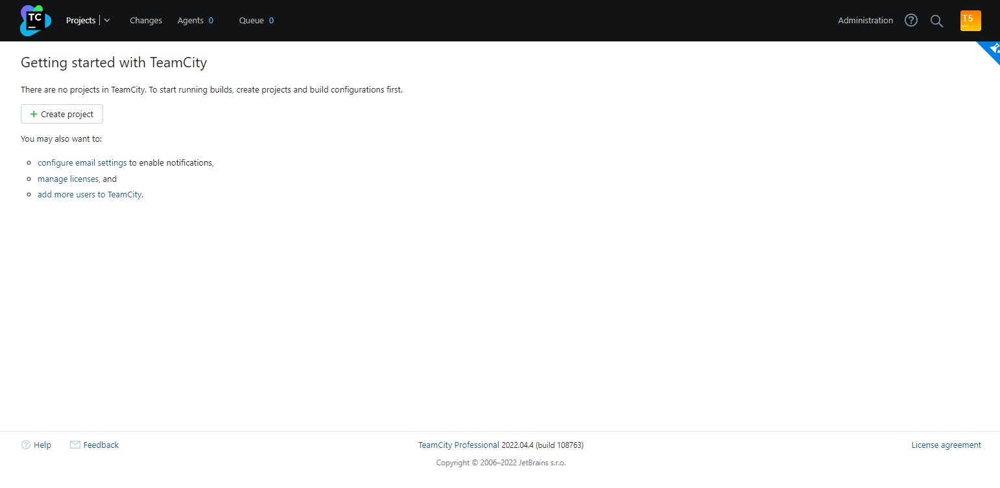

3. Создайте ещё один инстанс(2CPU4RAM) на основе образа `jetbrains/teamcity-agent`. Пропишите к нему переменную окружения `SERVER_URL: "http://<teamcity_url>:8111"`
4. Авторизуйте агент

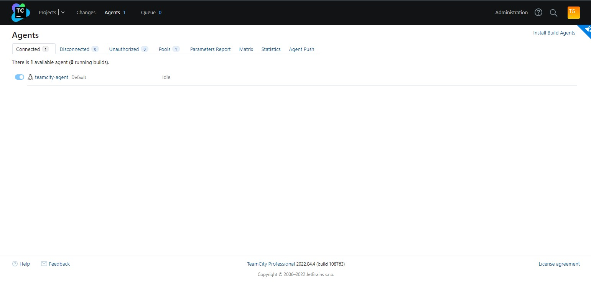

5. Сделайте fork [репозитория](https://github.com/aragastmatb/example-teamcity)
6. Создать VM (2CPU4RAM) и запустить [playbook](./infrastructure)

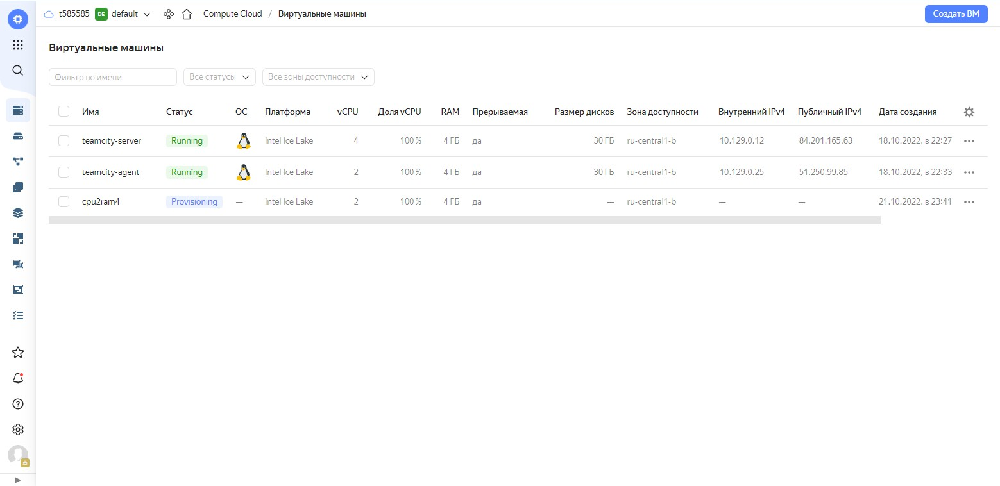

<details>
    <summary>Playbook</summary>

```shell
vagrant@vagrant:~/09-ci-05-teamcity/playbook$ ansible-playbook -i inventory/cicd/hosts.yml site.yml

PLAY [Get Nexus installed] *********************************************************************************************
TASK [Gathering Facts] *************************************************************************************************The authenticity of host '51.250.107.4 (51.250.107.4)' can't be established.
ED25519 key fingerprint is SHA256:iB+NT/GAhQAi96Ezhfj2V8gFph4kvy0go5h2/qft+Hg.
This key is not known by any other names
Are you sure you want to continue connecting (yes/no/[fingerprint])? yes
ok: [nexus-01]

TASK [Create Nexus group] **********************************************************************************************changed: [nexus-01]

TASK [Create Nexus user] ***********************************************************************************************changed: [nexus-01]

TASK [Install JDK] *****************************************************************************************************changed: [nexus-01]

TASK [Create Nexus directories] ****************************************************************************************changed: [nexus-01] => (item=/home/nexus/log)
changed: [nexus-01] => (item=/home/nexus/sonatype-work/nexus3)
changed: [nexus-01] => (item=/home/nexus/sonatype-work/nexus3/etc)
changed: [nexus-01] => (item=/home/nexus/pkg)
changed: [nexus-01] => (item=/home/nexus/tmp)

TASK [Download Nexus] **************************************************************************************************[WARNING]: Module remote_tmp /home/nexus/.ansible/tmp did not exist and was created with a mode of 0700, this may cause
issues when running as another user. To avoid this, create the remote_tmp dir with the correct permissions manually
changed: [nexus-01]

TASK [Unpack Nexus] ****************************************************************************************************changed: [nexus-01]

TASK [Link to Nexus Directory] *****************************************************************************************changed: [nexus-01]

TASK [Add NEXUS_HOME for Nexus user] ***********************************************************************************changed: [nexus-01]

TASK [Add run_as_user to Nexus.rc] *************************************************************************************changed: [nexus-01]

TASK [Raise nofile limit for Nexus user] *******************************************************************************[WARNING]: The value "65536" (type int) was converted to "u'65536'" (type string). If this does not look like what you
expect, quote the entire value to ensure it does not change.
changed: [nexus-01]

TASK [Create Nexus service for SystemD] ********************************************************************************changed: [nexus-01]

TASK [Ensure Nexus service is enabled for SystemD] *********************************************************************changed: [nexus-01]

TASK [Create Nexus vmoptions] ******************************************************************************************changed: [nexus-01]

TASK [Create Nexus properties] *****************************************************************************************changed: [nexus-01]

TASK [Lower Nexus disk space threshold] ********************************************************************************skipping: [nexus-01]

TASK [Start Nexus service if enabled] **********************************************************************************changed: [nexus-01]

TASK [Ensure Nexus service is restarted] *******************************************************************************skipping: [nexus-01]

TASK [Wait for Nexus port if started] **********************************************************************************ok: [nexus-01]

PLAY RECAP *************************************************************************************************************
nexus-01                   : ok=17   changed=15   unreachable=0    failed=0    skipped=2    rescued=0    ignored=0
```
</details>

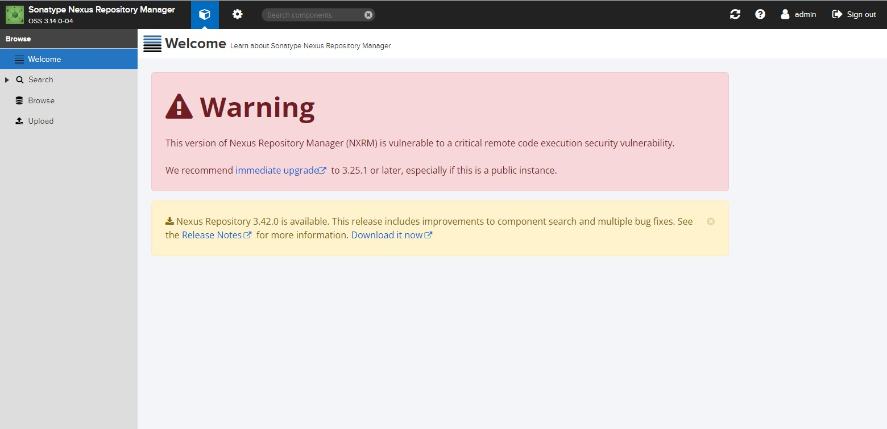

## Основная часть

1. Создайте новый проект в teamcity на основе fork

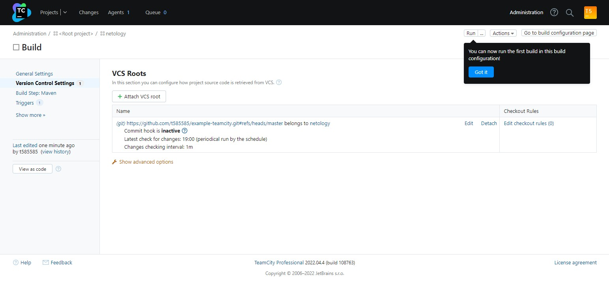

2. Сделайте autodetect конфигурации

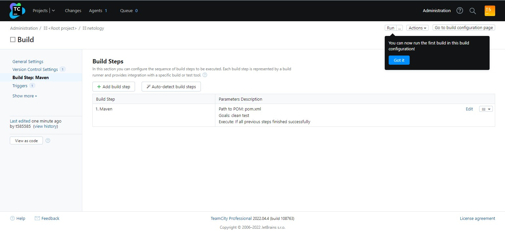

3. Сохраните необходимые шаги, запустите первую сборку master'a

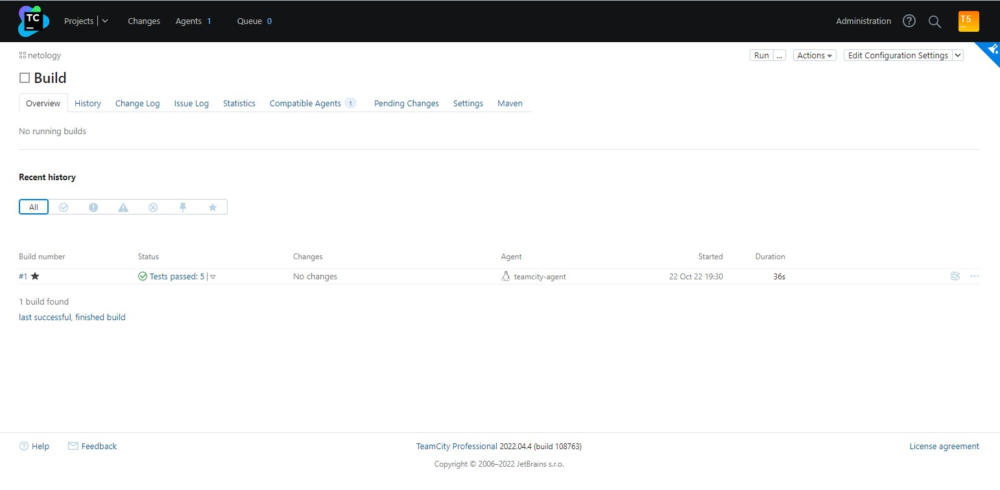

4. Поменяйте условия сборки: если сборка по ветке `master`, то должен происходит `mvn clean deploy`, иначе `mvn clean test`

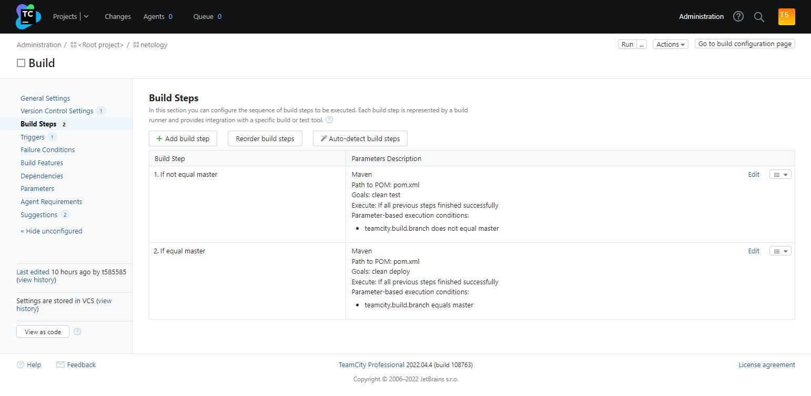

5. Для deploy будет необходимо загрузить [settings.xml](./teamcity/settings.xml) в набор конфигураций maven у teamcity, предварительно записав туда креды для подключения к nexus

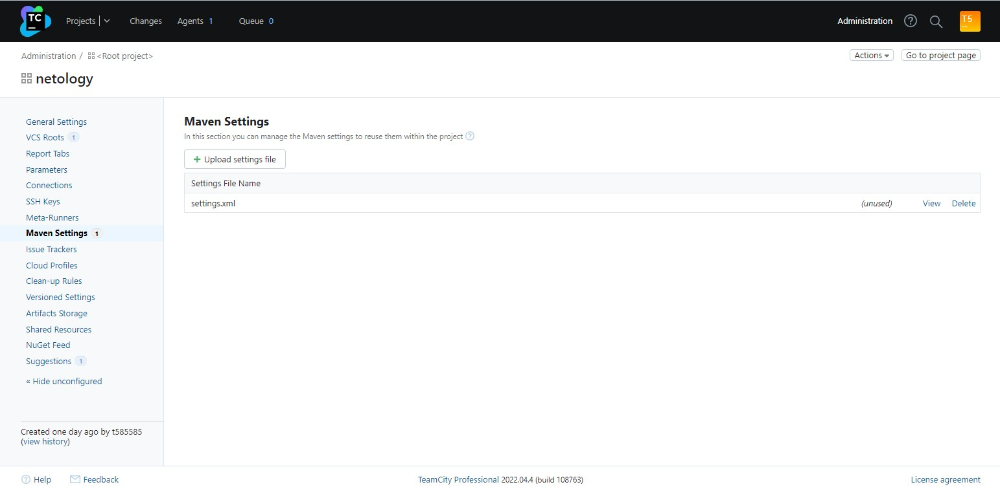

6. В pom.xml необходимо поменять ссылки на репозиторий и nexus

- [pom.xml](https://github.com/t585585/example-teamcity/blob/master/pom.xml)

7. Запустите сборку по master, убедитесь что всё прошло успешно, артефакт появился в nexus

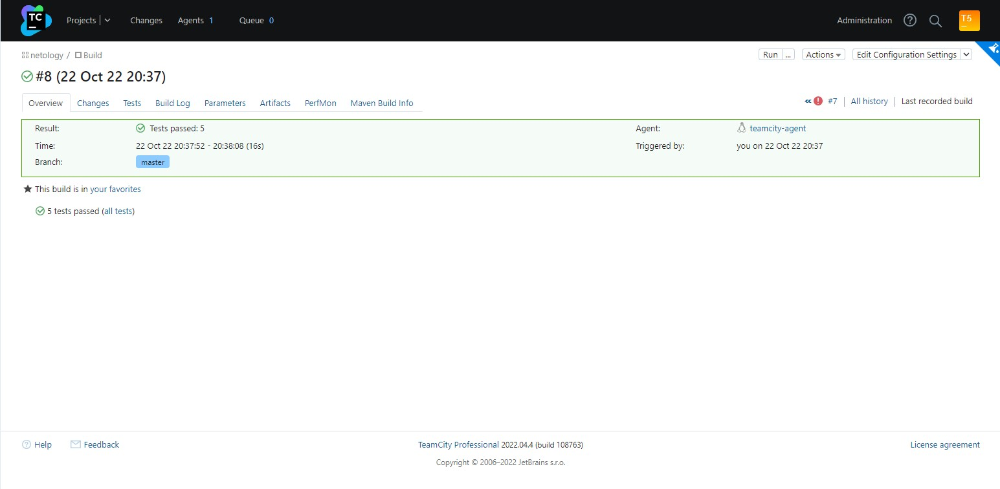
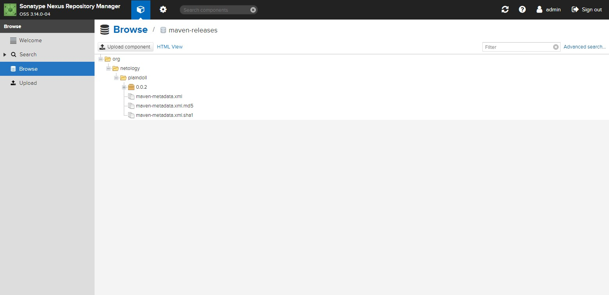

8. Мигрируйте `build configuration` в репозиторий

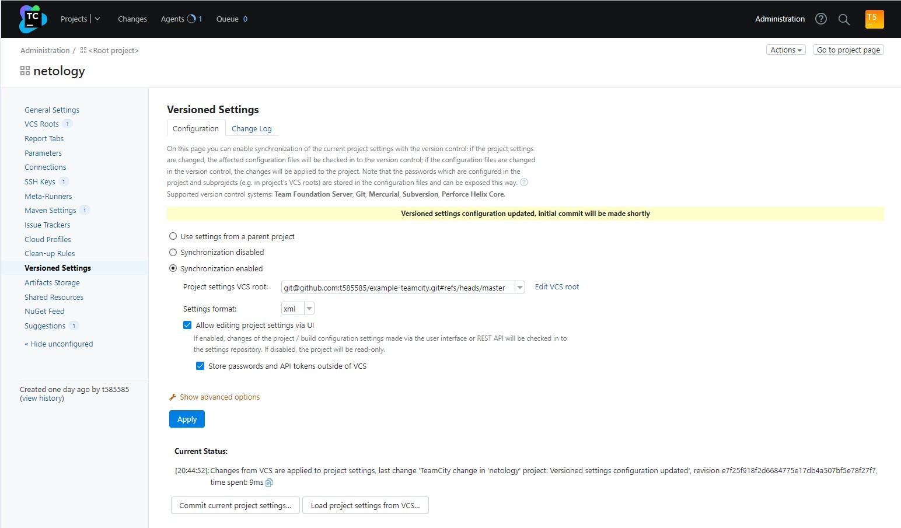

9. Создайте отдельную ветку `feature/add_reply` в репозитории

```shell
vagrant@vagrant:~/09-ci-05-teamcity/example-teamcity$ git branch
* feature/add_reply
  master
```

10. Напишите новый метод для класса Welcomer: метод должен возвращать произвольную реплику, содержащую слово `hunter`

```shell
vagrant@vagrant:~/09-ci-05-teamcity/example-teamcity$ cat ./src/main/java/plaindoll/Welcomer.java
package plaindoll;

public class Welcomer{
        public String sayWelcome() {
                return "Welcome home, good hunter. What is it your desire?";
        }
        public String sayFarewell() {
                return "Farewell, good hunter. May you find your worth in waking world.";
        }
        public String sayNeedGold(){
                return "Not enough gold";
        }
        public String saySome(){
                return "something in the way";
        }
        public String sayHunter(){
                return "Return of the hunter";
        }
}
```

```shell
vagrant@vagrant:~/09-ci-05-teamcity/example-teamcity$ cat ./src/main/java/plaindoll/HelloPlayer.java
package plaindoll;

public class HelloPlayer{
        public static void main(String[] args) {
                Welcomer welcomer = new Welcomer();
                System.out.println(welcomer.sayWelcome());
                System.out.println(welcomer.sayFarewell());
                System.out.println(welcomer.sayHunter());
        }
}
```

11. Дополните тест для нового метода на поиск слова `hunter` в новой реплике

```shell
vagrant@vagrant:~/09-ci-05-teamcity/example-teamcity$ cat ./src/test/java/plaindoll/WelcomerTest.java
package plaindoll;

import static org.hamcrest.CoreMatchers.containsString;
import static org.junit.Assert.*;

import org.junit.Test;

public class WelcomerTest {

        private Welcomer welcomer = new Welcomer();

        @Test
        public void welcomerSaysWelcome() {
                assertThat(welcomer.sayWelcome(), containsString("Welcome"));
        }
        @Test
        public void welcomerSaysFarewell() {
                assertThat(welcomer.sayFarewell(), containsString("Farewell"));
        }
        @Test
        public void welcomerSaysHunter() {
                assertThat(welcomer.sayWelcome(), containsString("hunter"));
                assertThat(welcomer.sayFarewell(), containsString("hunter"));
                assertThat(welcomer.sayHunter(), containsString("hunter"));
        }
        @Test
        public void welcomerSaysSilver(){
                assertThat(welcomer.sayNeedGold(), containsString("gold"));
        }
        @Test
        public void welcomerSaysSomething(){
                assertThat(welcomer.saySome(), containsString("something"));
        }
```

12. Сделайте push всех изменений в новую ветку в репозиторий

- Сделано

13. Убедитесь что сборка самостоятельно запустилась, тесты прошли успешно

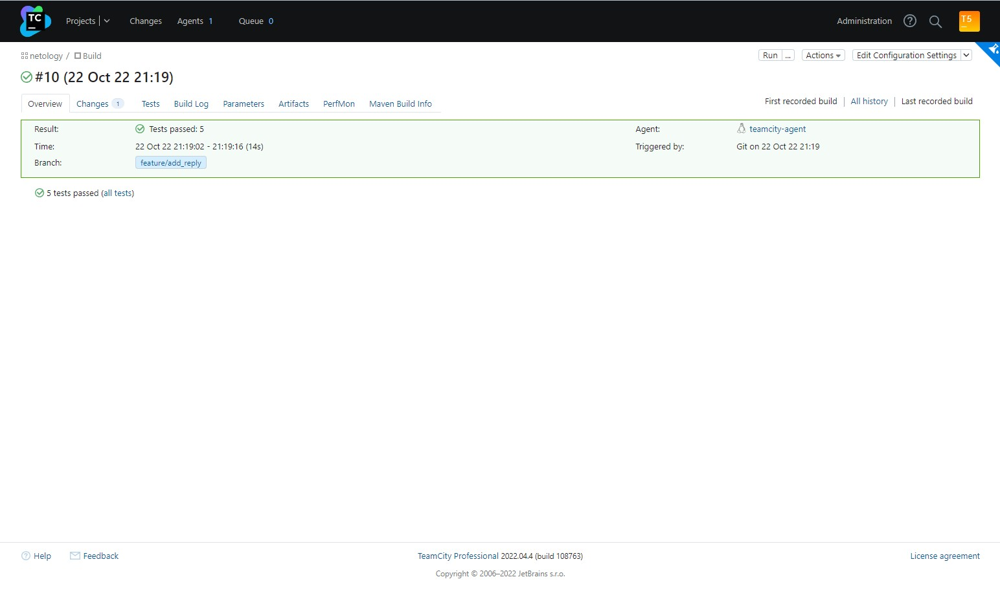

14. Внесите изменения из произвольной ветки `feature/add_reply` в `master` через `Merge`

```shell
vagrant@vagrant:~/09-ci-05-teamcity/example-teamcity$ git checkout master
Switched to branch 'master'
Your branch is up to date with 'origin/master'.
vagrant@vagrant:~/09-ci-05-teamcity/example-teamcity$ git merge feature/add_reply
Updating e7f25f9..3d6db06
Fast-forward
 src/main/java/plaindoll/Welcomer.java     | 3 +++
 src/test/java/plaindoll/WelcomerTest.java | 1 +
 2 files changed, 4 insertions(+)
vagrant@vagrant:~/09-ci-05-teamcity/example-teamcity$ git push origin master
Total 0 (delta 0), reused 0 (delta 0), pack-reused 0
To github.com:t585585/example-teamcity.git
   e7f25f9..3d6db06  master -> master
```

15. Убедитесь, что нет собранного артефакта в сборке по ветке `master`


16. Настройте конфигурацию так, чтобы она собирала `.jar` в артефакты сборки

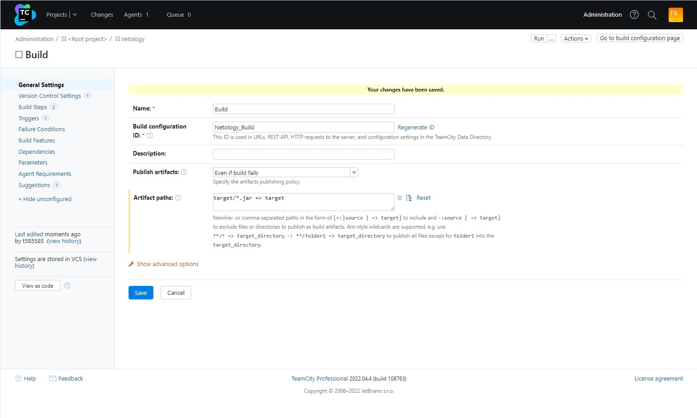

17. Проведите повторную сборку мастера, убедитесь, что сбора прошла успешно и артефакты собраны

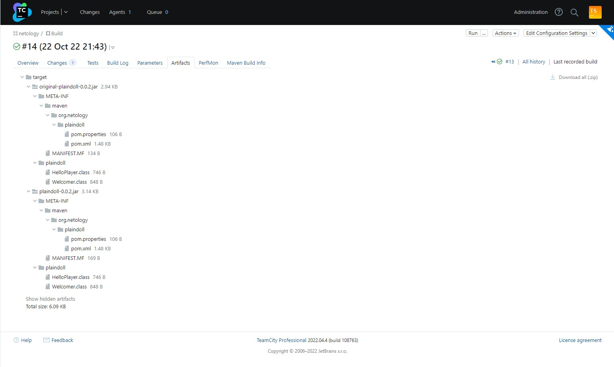

18. Проверьте, что конфигурация в репозитории содержит все настройки конфигурации из teamcity

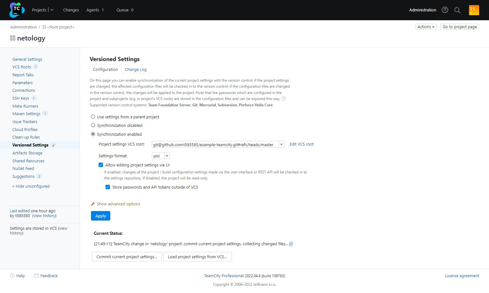

19. В ответ предоставьте ссылку на репозиторий

[Ссылка на репозиторий Example-teamcity](https://github.com/t585585/example-teamcity/tree/master)

---

### Как оформить ДЗ?

Выполненное домашнее задание пришлите ссылкой на .md-файл в вашем репозитории.

---
