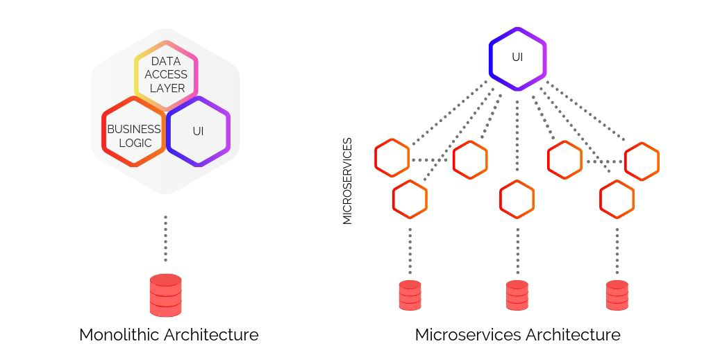

# Домашнее задание к занятию "11.01 Введение в микросервисы"

## Задача 1: Интернет Магазин

Руководство крупного интернет магазина у которого постоянно растёт пользовательская база и количество заказов рассматривает возможность переделки своей внутренней ИТ системы на основе микросервисов. 

Вас пригласили в качестве консультанта для оценки целесообразности перехода на микросервисную архитектуру. 

Опишите какие выгоды может получить компания от перехода на микросервисную архитектуру и какие проблемы необходимо будет решить в первую очередь.

---

## Ответ

#### Выгоды от перехода на микросервисную архитектуру:

- Возможность применять разные технологии;
- Простота замены модулей;
- Простота развертывания;
- Масштабируемость;
- Устойчивость к ошибкам.

#### Проблемы, которые необходимо будет решить в первую очередь:

- Обеспечение совместимости;
- Автоматизация сборки и тестирование;
- Мониторинг сервисов и сбор логов; 
- Версии артефактов;
- Инфраструктура разработки: шаблоны и скрипты быстрого развертывания сервисов, общий репозиторий пакетов и библиотек;
- Управление настройками сервисов и инфраструктурой в целом.

---

>Сергей Андрюнин
ПРЕПОДАВАТЕЛЬ
3 января 2023 21:31\
Антон, спасибо за работу, но отправлю на доработку. Все что вы зачислили в минусы, оно к монолиту выходит не применимо?
Я думаю если материалов лекции не хватило то обратите внимание на Сэма Ньюмана и Криса ричардсона, есть целых 2 книги посвещенных этой теме, чтение первых 2-х глав которых раскроет сполна всю суть вопроса

### Доработка:

***Попробую исправить список проблем:***

#### Проблемы, которые необходимо будет решить в первую очередь:

- Декомпозирование - определить границы микросервисов;
- Шаблоны миграции - определиться с методами перехода от "монолита" к "микросервисам";
- Команда - формирование команды, способной обеспечить достижение, поставленной руководством, цели;
- Множество различных проблем которые появятся в процессе миграции...

---

### Как оформить ДЗ?

Выполненное домашнее задание пришлите ссылкой на .md-файл в вашем репозитории.

---
