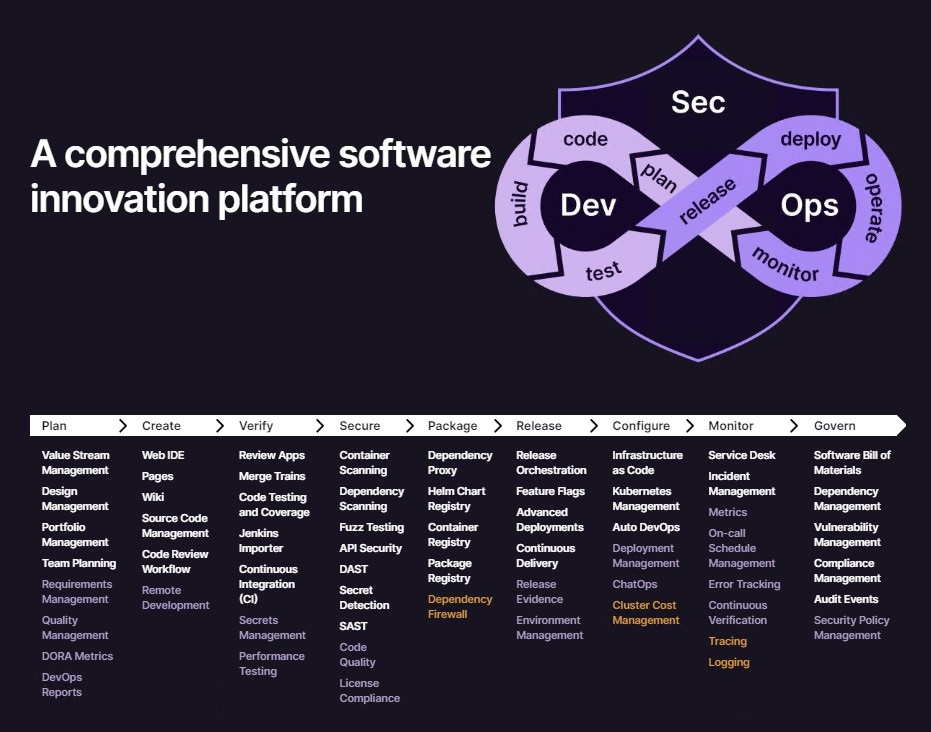
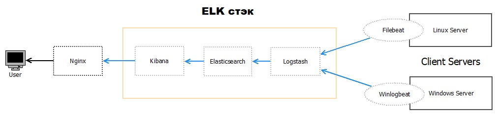
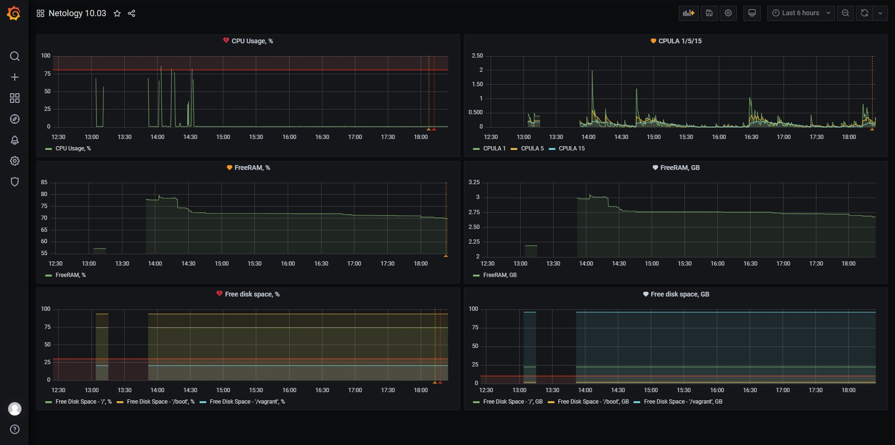

# Домашнее задание к занятию "11.03 Микросервисы: подходы"

Вы работаете в крупной компанию, которая строит систему на основе микросервисной архитектуры.
Вам как DevOps специалисту необходимо выдвинуть предложение по организации инфраструктуры, для разработки и эксплуатации.

## Задача 1: Обеспечить разработку

Предложите решение для обеспечения процесса разработки: хранение исходного кода, непрерывная интеграция и непрерывная поставка. 
Решение может состоять из одного или нескольких программных продуктов и должно описывать способы и принципы их взаимодействия.

Решение должно соответствовать следующим требованиям:
- Облачная система;
- Система контроля версий Git;
- Репозиторий на каждый сервис;
- Запуск сборки по событию из системы контроля версий;
- Запуск сборки по кнопке с указанием параметров;
- Возможность привязать настройки к каждой сборке;
- Возможность создания шаблонов для различных конфигураций сборок;
- Возможность безопасного хранения секретных данных: пароли, ключи доступа;
- Несколько конфигураций для сборки из одного репозитория;
- Кастомные шаги при сборке;
- Собственные докер образы для сборки проектов;
- Возможность развернуть агентов сборки на собственных серверах;
- Возможность параллельного запуска нескольких сборок;
- Возможность параллельного запуска тестов;

Обоснуйте свой выбор.

## Ответ:

Предложу `GitLab CI` - соответствует требованиям, проходили на курсе Нетологии. Использование того или иного инструмента обычно основано на предпочтениях людей, принимающих соответствующие решения.

## Задача 2: Логи

Предложите решение для обеспечения сбора и анализа логов сервисов в микросервисной архитектуре.
Решение может состоять из одного или нескольких программных продуктов и должно описывать способы и принципы их взаимодействия.

Решение должно соответствовать следующим требованиям:
- Сбор логов в центральное хранилище со всех хостов обслуживающих систему;
- Минимальные требования к приложениям, сбор логов из stdout;
- Гарантированная доставка логов до центрального хранилища;
- Обеспечение поиска и фильтрации по записям логов;
- Обеспечение пользовательского интерфейса с возможностью предоставления доступа разработчикам для поиска по записям логов;
- Возможность дать ссылку на сохраненный поиск по записям логов;

Обоснуйте свой выбор.

## Ответ:

Можно предложить в качестве решения `Стэк ELK`\
В зависимости от масштабов проекта, наверное, можно подобрать что-то другое, но, как пишут в интернете, данный стэк уже показал свою эффективность и можно считать его промышленным стандартом, а также он соответствует вышеуказанным требованиям.

`ELK` включает следующие компоненты:

- `Elasticsearch (ES)` – масштабируемая утилита полнотекстового поиска и аналитики, которая позволяет быстро в режиме реального времени хранить, искать и анализировать большие объемы данных. Как правило, ES используется в качестве NoSQL-базы данных для приложений со сложными функциями поиска. Elasticsearch основана на библиотеке Apache Lucene, предназначенной для индексирования и поиска информации в любом типе документов. В масштабных Big Data системах несколько копий Elasticsearch объединяются в кластер.
- `Logstash` — средство сбора, преобразования и сохранения в общем хранилище событий из файлов, баз данных, логов и других источников в реальном времени. Logsatsh позволяет модифицировать полученные данные с помощью фильтров: разбить строку на поля, обогатить их, агрегировать несколько строк, преобразовать их в JSON-документы и пр. Обработанные данные Logsatsh отправляет в системы-потребители. 
- `Kibana` – визуальный инструмент для Elasticsearch, чтобы взаимодействовать с данными, которые хранятся в индексах ES. Веб-интерфейс Kibana позволяет быстро создавать и обмениваться динамическими панелями мониторинга, включая таблицы, графики и диаграммы, которые отображают изменения в ES-запросах в реальном времени. Примечательно, что изначально Kibana была ориентирована на работу с Logstash, а не на Elasticsearch. Однако, с интеграцией 3-х систем в единую ELK-платформу, Kibana стала работать непосредственно с ES.
- `FileBeat` – агент на серверах для отправки различных типов оперативных данных в Elasticsearch.

## Задача 3: Мониторинг

Предложите решение для обеспечения сбора и анализа состояния хостов и сервисов в микросервисной архитектуре.
Решение может состоять из одного или нескольких программных продуктов и должно описывать способы и принципы их взаимодействия.

Решение должно соответствовать следующим требованиям:
- Сбор метрик со всех хостов, обслуживающих систему;
- Сбор метрик состояния ресурсов хостов: CPU, RAM, HDD, Network;
- Сбор метрик потребляемых ресурсов для каждого сервиса: CPU, RAM, HDD, Network;
- Сбор метрик, специфичных для каждого сервиса;
- Пользовательский интерфейс с возможностью делать запросы и агрегировать информацию;
- Пользовательский интерфейс с возможностью настраивать различные панели для отслеживания состояния системы;

Обоснуйте свой выбор.

## Ответ:

Предложу grafana, где в роли источника данных будет выступать prometheus, а сборщиком данных node-exporter:

- `Prometheus` - основной компонент. Prometheus получает метрики из разных сервисов и собирает их в одном месте.

- `Node exporter` — небольшое приложение, собирающее метрики операционной системы и предоставляющее к ним доступ по HTTP. Prometheus собирает данные с одного или нескольких экземпляров Node Exporter.

- `Grafana` — отображает данные из Prometheus в виде графиков и диаграмм, организованных в дашборды.

## Задача 4: Логи * (необязательная)

Продолжить работу по задаче API Gateway: сервисы используемые в задаче пишут логи в stdout. 

Добавить в систему сервисы для сбора логов Vector + ElasticSearch + Kibana со всех сервисов обеспечивающих работу API.

### Результат выполнения: 

docker compose файл запустив который можно перейти по адресу http://localhost:8081 по которому доступна Kibana.
Логин в Kibana должен быть admin пароль qwerty123456

## Задача 5: Мониторинг * (необязательная)

Продолжить работу по задаче API Gateway: сервисы используемые в задаче предоставляют набор метрик в формате prometheus:

- Сервис security по адресу /metrics
- Сервис uploader по адресу /metrics
- Сервис storage (minio) по адресу /minio/v2/metrics/cluster

Добавить в систему сервисы для сбора метрик (Prometheus и Grafana) со всех сервисов обеспечивающих работу API.
Построить в Graphana dashboard показывающий распределение запросов по сервисам.

### Результат выполнения: 

docker compose файл запустив который можно перейти по адресу http://localhost:8081 по которому доступна Grafana с настроенным Dashboard.
Логин в Grafana должен быть admin пароль qwerty123456

---

### Как оформить ДЗ?

Выполненное домашнее задание пришлите ссылкой на .md-файл в вашем репозитории.

---
