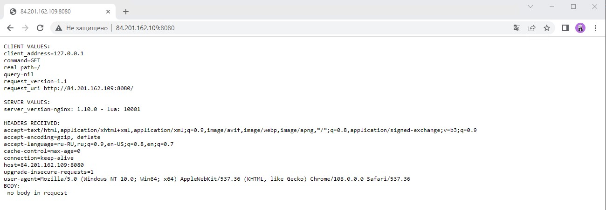

# Домашнее задание к занятию "12.1 Компоненты Kubernetes"

Вы DevOps инженер в крупной компании с большим парком сервисов. Ваша задача — разворачивать эти продукты в корпоративном кластере. 

## Задача 1: Установить Minikube

Для экспериментов и валидации ваших решений вам нужно подготовить тестовую среду для работы с Kubernetes. Оптимальное решение — развернуть на рабочей машине Minikube.

### Как поставить на AWS:
- создать EC2 виртуальную машину (Ubuntu Server 20.04 LTS (HVM), SSD Volume Type) с типом **t3.small**. Для работы потребуется настроить Security Group для доступа по ssh. Не забудьте указать keypair, он потребуется для подключения.
- подключитесь к серверу по ssh (ssh ubuntu@<ipv4_public_ip> -i <keypair>.pem)
- установите миникуб и докер следующими командами:
  - curl -LO https://storage.googleapis.com/kubernetes-release/release/`curl -s https://storage.googleapis.com/kubernetes-release/release/stable.txt`/bin/linux/amd64/kubectl
  - chmod +x ./kubectl
  - sudo mv ./kubectl /usr/local/bin/kubectl
  - sudo apt-get update && sudo apt-get install docker.io conntrack -y
  - curl -Lo minikube https://storage.googleapis.com/minikube/releases/latest/minikube-linux-amd64 && chmod +x minikube && sudo mv minikube /usr/local/bin/
- проверить версию можно командой minikube version
- переключаемся на root и запускаем миникуб: minikube start --vm-driver=none
- после запуска стоит проверить статус: minikube status
- запущенные служебные компоненты можно увидеть командой: kubectl get pods --namespace=kube-system

### Для сброса кластера стоит удалить кластер и создать заново:
- minikube delete
- minikube start --vm-driver=none

Возможно, для повторного запуска потребуется выполнить команду: sudo sysctl fs.protected_regular=0

Инструкция по установке Minikube - [ссылка](https://kubernetes.io/ru/docs/tasks/tools/install-minikube/)

**Важно**: t3.small не входит во free tier, следите за бюджетом аккаунта и удаляйте виртуалку.


### Ответ:

Установил minikube на ВМ в YC по [инструкции](https://www.fosstechnix.com/how-to-install-minikube-on-ubuntu-20-04-lts/#minikube-system-requirements). 

```shell
root@minicube:~# minikube version
minikube version: v1.28.0
commit: 986b1ebd987211ed16f8cc10aed7d2c42fc8392f
```
```shell
root@minicube:~# minikube start --vm-driver=none
* minikube v1.28.0 on Ubuntu 22.04 (amd64)
* Using the none driver based on user configuration
* Starting control plane node minikube in cluster minikube
* Running on localhost (CPUs=4, Memory=3922MB, Disk=20065MB) ...
* OS release is Ubuntu 22.04.1 LTS
* Preparing Kubernetes v1.25.3 on Docker 20.10.22 ...
  - kubelet.resolv-conf=/run/systemd/resolve/resolv.conf
  - Generating certificates and keys ...
  - Booting up control plane ...
  - Configuring RBAC rules ...
* Configuring local host environment ...
*
! The 'none' driver is designed for experts who need to integrate with an existing VM
* Most users should use the newer 'docker' driver instead, which does not require root!
* For more information, see: https://minikube.sigs.k8s.io/docs/reference/drivers/none/
*
! kubectl and minikube configuration will be stored in /root
! To use kubectl or minikube commands as your own user, you may need to relocate them. For example, to overwrite your own settings, run:
*
  - sudo mv /root/.kube /root/.minikube $HOME
  - sudo chown -R $USER $HOME/.kube $HOME/.minikube
*
* This can also be done automatically by setting the env var CHANGE_MINIKUBE_NONE_USER=true
* Verifying Kubernetes components...
  - Using image gcr.io/k8s-minikube/storage-provisioner:v5
* Enabled addons: default-storageclass, storage-provisioner
* Done! kubectl is now configured to use "minikube" cluster and "default" namespace by default
```
```shell
root@minicube:~# minikube status
minikube
type: Control Plane
host: Running
kubelet: Running
apiserver: Running
kubeconfig: Configured
```

## Задача 2: Запуск Hello World
После установки Minikube требуется его проверить. Для этого подойдет стандартное приложение hello world. А для доступа к нему потребуется ingress.

- развернуть через Minikube тестовое приложение по [туториалу](https://kubernetes.io/ru/docs/tutorials/hello-minikube/#%D1%81%D0%BE%D0%B7%D0%B4%D0%B0%D0%BD%D0%B8%D0%B5-%D0%BA%D0%BB%D0%B0%D1%81%D1%82%D0%B5%D1%80%D0%B0-minikube)
- установить аддоны ingress и dashboard

### Ответ:

- развернуть через Minikube тестовое приложение
```shell
root@minicube:~# kubectl create deployment hello-node --image=k8s.gcr.io/echoserver:1.4
deployment.apps/hello-node created
```

```shell
root@minicube:~# kubectl get pods
NAME                         READY   STATUS    RESTARTS   AGE
hello-node-697897c86-ld292   1/1     Pending   0          42s
```

```shell
root@minicube:~# kubectl get deployments
NAME         READY   UP-TO-DATE   AVAILABLE   AGE
hello-node   1/1     1            0           65s
```

- установить аддоны ingress и dashboard
```shell
root@minicube:~# minikube addons enable ingress
root@minicube:~# minikube addons enable dashboard
```


## Задача 3: Установить kubectl

Подготовить рабочую машину для управления корпоративным кластером. Установить клиентское приложение kubectl.
- подключиться к minikube 
- проверить работу приложения из задания 2, запустив port-forward до кластера

### Ответ:

```shell
root@minicube:~# kubectl expose deployment hello-node --type=NodePort --port=8080
service/hello-node exposed
root@minicube:~# minikube service hello-node --url
http://10.129.0.22:31418
root@minicube:~# kubectl get services
NAME         TYPE        CLUSTER-IP     EXTERNAL-IP   PORT(S)          AGE
hello-node   NodePort    10.99.215.60   <none>        8080:31418/TCP   14s
kubernetes   ClusterIP   10.96.0.1      <none>        443/TCP          44m
root@minicube:~# kubectl port-forward --address 0.0.0.0 service/hello-node 8080:8080
Forwarding from 0.0.0.0:8080 -> 8080
```


## Задача 4 (*): собрать через ansible (необязательное)

Профессионалы не делают одну и ту же задачу два раза. Давайте закрепим полученные навыки, автоматизировав выполнение заданий  ansible-скриптами. При выполнении задания обратите внимание на доступные модули для k8s под ansible.
 - собрать роль для установки minikube на aws сервисе (с установкой ingress)
 - собрать роль для запуска в кластере hello world
  
  ---

### Как оформить ДЗ?

Выполненное домашнее задание пришлите ссылкой на .md-файл в вашем репозитории.

---
