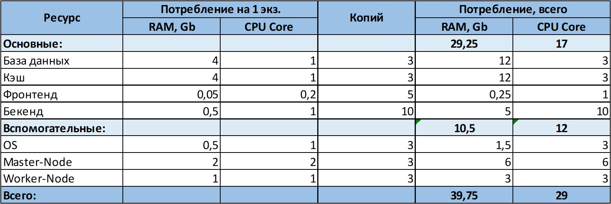

# Домашнее задание к занятию "12.3 Развертывание кластера на собственных серверах, лекция 1"
Поработав с персональным кластером, можно заняться проектами. Вам пришла задача подготовить кластер под новый проект.

## Задание 1: Описать требования к кластеру
Сначала проекту необходимо определить требуемые ресурсы. Известно, что проекту нужны база данных, система кеширования, а само приложение состоит из бекенда и фронтенда. Опишите, какие ресурсы нужны, если известно:

* База данных должна быть отказоустойчивой. Потребляет 4 ГБ ОЗУ в работе, 1 ядро. 3 копии.
* Кэш должен быть отказоустойчивый. Потребляет 4 ГБ ОЗУ в работе, 1 ядро. 3 копии.
* Фронтенд обрабатывает внешние запросы быстро, отдавая статику. Потребляет не более 50 МБ ОЗУ на каждый экземпляр, 0.2 ядра. 5 копий.
* Бекенд потребляет 600 МБ ОЗУ и по 1 ядру на копию. 10 копий.

## Как оформить ДЗ?

Выполненное домашнее задание пришлите ссылкой на .md-файл в вашем репозитории.

План расчета
1. Сначала сделайте расчет всех необходимых ресурсов.
2. Затем прикиньте количество рабочих нод, которые справятся с такой нагрузкой.
3. Добавьте к полученным цифрам запас, который учитывает выход из строя как минимум одной ноды.
4. Добавьте служебные ресурсы к нодам. Помните, что для разных типов нод требовния к ресурсам разные.
5. Рассчитайте итоговые цифры.
6. В результате должно быть указано количество нод и их параметры.

### Ответ:

**Всего ресурсов необходимо: RAM-40Gb, CPU-29**

Не рассказали на лекции как считать необходимое количество нод. Распределю ресурсы на виртуальные машины по принципу RAID5 - таким образом, можно будет поиграться с ценой на ВМ и определить, что выгоднее меньше нод, но мощнее ВМ или больше нод, но слабее ВМ.

Начнем с 3-х на которых расположим ноды и, соответственно, для каждой ВМ возьмем ресурсов с учетом выхода из строя одной ноды, тогда на одну ВМ нужно:
- RAM - 24Gb
- CPU - 16
