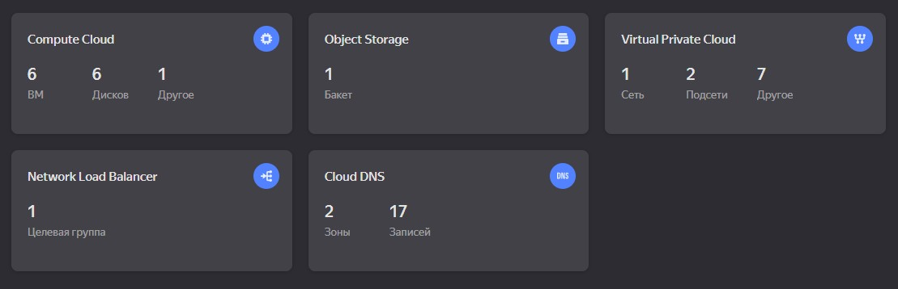
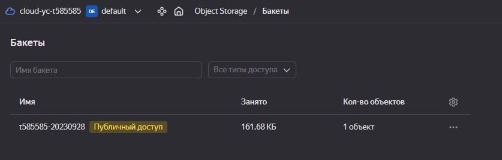
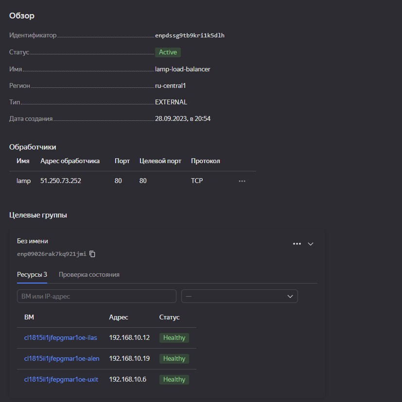
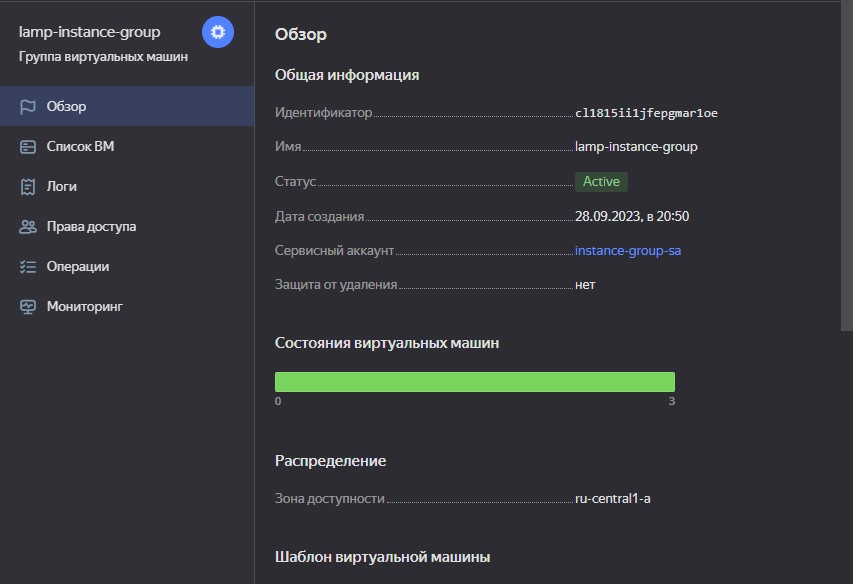
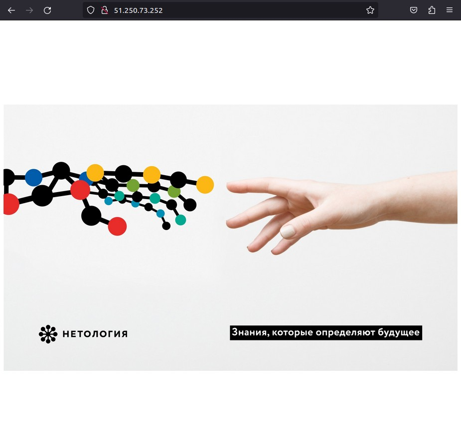
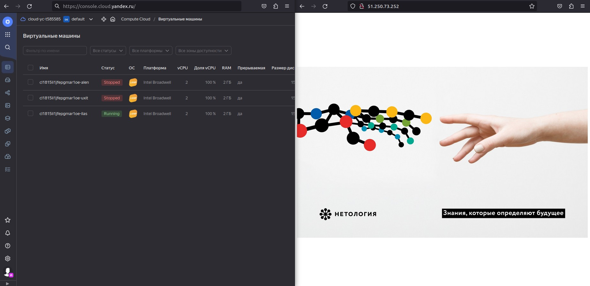

# Домашнее задание к занятию «Вычислительные мощности. Балансировщики нагрузки»  

### Подготовка к выполнению задания

1. Домашнее задание состоит из обязательной части, которую нужно выполнить на провайдере Yandex Cloud, и дополнительной части в AWS (выполняется по желанию). 
2. Все домашние задания в блоке 15 связаны друг с другом и в конце представляют пример законченной инфраструктуры.  
3. Все задания нужно выполнить с помощью Terraform. Результатом выполненного домашнего задания будет код в репозитории. 
4. Перед началом работы настройте доступ к облачным ресурсам из Terraform, используя материалы прошлых лекций и домашних заданий.

---
## Задание 1. Yandex Cloud 

**Что нужно сделать**

1. Создать бакет Object Storage и разместить в нём файл с картинкой:

 - Создать бакет в Object Storage с произвольным именем (например, _имя_студента_дата_).
 - Положить в бакет файл с картинкой.
 - Сделать файл доступным из интернета.
 
2. Создать группу ВМ в public подсети фиксированного размера с шаблоном LAMP и веб-страницей, содержащей ссылку на картинку из бакета:

 - Создать Instance Group с тремя ВМ и шаблоном LAMP. Для LAMP рекомендуется использовать `image_id = fd827b91d99psvq5fjit`.
 - Для создания стартовой веб-страницы рекомендуется использовать раздел `user_data` в [meta_data](https://cloud.yandex.ru/docs/compute/concepts/vm-metadata).
 - Разместить в стартовой веб-странице шаблонной ВМ ссылку на картинку из бакета.
 - Настроить проверку состояния ВМ.
 
3. Подключить группу к сетевому балансировщику:

 - Создать сетевой балансировщик.
 - Проверить работоспособность, удалив одну или несколько ВМ.
4. (дополнительно)* Создать Application Load Balancer с использованием Instance group и проверкой состояния.

Полезные документы:

- [Compute instance group](https://registry.terraform.io/providers/yandex-cloud/yandex/latest/docs/resources/compute_instance_group).
- [Network Load Balancer](https://registry.terraform.io/providers/yandex-cloud/yandex/latest/docs/resources/lb_network_load_balancer).
- [Группа ВМ с сетевым балансировщиком](https://cloud.yandex.ru/docs/compute/operations/instance-groups/create-with-balancer).

## Решение 1. Yandex Cloud

* Конфигурационные файлы `terraform` созданы ([файлы тут](./terraform_config/)).

* Запустим создание ресурсов

```shell
terraform apply --auto-approve
```

<details>
    <summary>Вывод экрана</summary>

```shell
yandex_iam_service_account.instance-group-sa: Creating...
yandex_vpc_network.default: Creating...
yandex_iam_service_account.sa: Creating...
yandex_vpc_network.default: Creation complete after 3s [id=enpbo8vf8klnbrb2fesq]
yandex_vpc_route_table.private-route-table: Creating...
yandex_vpc_subnet.public: Creating...
yandex_iam_service_account.sa: Creation complete after 3s [id=ajeq81ggbfhh835ksf7j]
yandex_iam_service_account_static_access_key.sa-static-key: Creating...
yandex_resourcemanager_folder_iam_member.sa-editor: Creating...
yandex_vpc_subnet.public: Creation complete after 0s [id=e9bk3nvtck3oc1epikek]
yandex_compute_instance.public-nat: Creating...
yandex_compute_instance.public-host: Creating...
yandex_vpc_route_table.private-route-table: Creation complete after 1s [id=enpj48hgl8qo0vdf7kd2]
yandex_vpc_subnet.private: Creating...
yandex_iam_service_account_static_access_key.sa-static-key: Creation complete after 2s [id=ajes72bhpp5rfe94k8ub]
yandex_storage_bucket.s3: Creating...
yandex_vpc_subnet.private: Creation complete after 1s [id=e9bd1q1fbv803gppfau7]
yandex_compute_instance.private-host: Creating...
yandex_iam_service_account.instance-group-sa: Creation complete after 6s [id=aje07k5qvu4s28h2g2g7]
yandex_resourcemanager_folder_iam_member.instance-group-editor: Creating...
yandex_resourcemanager_folder_iam_member.sa-editor: Creation complete after 5s [id=b1ghuk1b7h050bht7vcu/storage.editor/serviceAccount:ajeq81ggbfhh835ksf7j]
yandex_resourcemanager_folder_iam_member.instance-group-editor: Creation complete after 6s [id=b1ghuk1b7h050bht7vcu/editor/serviceAccount:aje07k5qvu4s28h2g2g7]
yandex_compute_instance.public-nat: Still creating... [10s elapsed]
yandex_compute_instance.public-host: Still creating... [10s elapsed]
yandex_storage_bucket.s3: Still creating... [10s elapsed]
yandex_compute_instance.private-host: Still creating... [10s elapsed]
yandex_compute_instance.public-nat: Still creating... [20s elapsed]
yandex_compute_instance.public-host: Still creating... [20s elapsed]
yandex_storage_bucket.s3: Still creating... [20s elapsed]
yandex_compute_instance.private-host: Still creating... [20s elapsed]
yandex_compute_instance.public-nat: Still creating... [30s elapsed]
yandex_compute_instance.public-host: Still creating... [30s elapsed]
yandex_storage_bucket.s3: Still creating... [30s elapsed]
yandex_compute_instance.private-host: Still creating... [30s elapsed]
yandex_compute_instance.public-nat: Still creating... [40s elapsed]
yandex_compute_instance.public-host: Still creating... [40s elapsed]
yandex_storage_bucket.s3: Still creating... [40s elapsed]
yandex_compute_instance.private-host: Still creating... [40s elapsed]
yandex_compute_instance.private-host: Creation complete after 45s [id=fhmc3f4d7ropt3rlou67]
yandex_compute_instance.public-nat: Still creating... [50s elapsed]
yandex_compute_instance.public-host: Still creating... [50s elapsed]
yandex_storage_bucket.s3: Still creating... [50s elapsed]
yandex_compute_instance.public-host: Still creating... [1m1s elapsed]
yandex_compute_instance.public-nat: Still creating... [1m1s elapsed]
yandex_storage_bucket.s3: Still creating... [1m0s elapsed]
yandex_compute_instance.public-host: Creation complete after 1m7s [id=fhmvtc4cqmjfi2gb4bfl]
yandex_compute_instance.public-nat: Still creating... [1m11s elapsed]
yandex_storage_bucket.s3: Still creating... [1m10s elapsed]
yandex_compute_instance.public-nat: Still creating... [1m21s elapsed]
yandex_storage_bucket.s3: Still creating... [1m20s elapsed]
yandex_compute_instance.public-nat: Still creating... [1m31s elapsed]
yandex_compute_instance.public-nat: Creation complete after 1m32s [id=fhm6jd31e126vsafrs1f]
yandex_storage_bucket.s3: Still creating... [1m30s elapsed]
yandex_storage_bucket.s3: Still creating... [1m40s elapsed]
yandex_storage_bucket.s3: Still creating... [1m50s elapsed]
yandex_storage_bucket.s3: Still creating... [2m0s elapsed]
yandex_storage_bucket.s3: Creation complete after 2m6s [id=t585585-20230928]
yandex_storage_object.picture: Creating...
yandex_compute_instance_group.lamp-instance-group: Creating...
yandex_storage_object.picture: Creation complete after 1s [id=picture]
yandex_compute_instance_group.lamp-instance-group: Still creating... [10s elapsed]
yandex_compute_instance_group.lamp-instance-group: Still creating... [20s elapsed]
yandex_compute_instance_group.lamp-instance-group: Still creating... [30s elapsed]
yandex_compute_instance_group.lamp-instance-group: Still creating... [40s elapsed]
yandex_compute_instance_group.lamp-instance-group: Still creating... [51s elapsed]
yandex_compute_instance_group.lamp-instance-group: Still creating... [1m1s elapsed]
yandex_compute_instance_group.lamp-instance-group: Still creating... [1m11s elapsed]
yandex_compute_instance_group.lamp-instance-group: Still creating... [1m21s elapsed]
yandex_compute_instance_group.lamp-instance-group: Still creating... [1m31s elapsed]
yandex_compute_instance_group.lamp-instance-group: Still creating... [1m41s elapsed]
yandex_compute_instance_group.lamp-instance-group: Still creating... [1m51s elapsed]
yandex_compute_instance_group.lamp-instance-group: Still creating... [2m1s elapsed]
yandex_compute_instance_group.lamp-instance-group: Still creating... [2m11s elapsed]
yandex_compute_instance_group.lamp-instance-group: Still creating... [2m21s elapsed]
yandex_compute_instance_group.lamp-instance-group: Still creating... [2m31s elapsed]
yandex_compute_instance_group.lamp-instance-group: Still creating... [2m41s elapsed]
yandex_compute_instance_group.lamp-instance-group: Still creating... [2m51s elapsed]
yandex_compute_instance_group.lamp-instance-group: Still creating... [3m1s elapsed]
yandex_compute_instance_group.lamp-instance-group: Still creating... [3m11s elapsed]
yandex_compute_instance_group.lamp-instance-group: Still creating... [3m21s elapsed]
yandex_compute_instance_group.lamp-instance-group: Still creating... [3m31s elapsed]
yandex_compute_instance_group.lamp-instance-group: Still creating... [3m41s elapsed]
yandex_compute_instance_group.lamp-instance-group: Creation complete after 3m44s [id=cl1815ii1jfepgmar1oe]
yandex_lb_network_load_balancer.lamp-load-balancer: Creating...
yandex_lb_network_load_balancer.lamp-load-balancer: Creation complete after 6s [id=enpdssg9tb9kri1k5dlh]

Apply complete! Resources: 16 added, 0 changed, 0 destroyed.

Outputs:

external_ip_address_private-host = ""
external_ip_address_public-host = "158.160.61.225"
external_ip_address_public-nat = "84.252.129.62"
internal_ip_address_private-host = "192.168.20.4"
internal_ip_address_public-host = "192.168.10.23"
internal_ip_address_public-nat = "192.168.10.254"
load_balancer_ip = "51.250.73.252"
```

</details>

* Поднятая инфраструктура в YC



* Хранилище  



* Балансировщик  



* Группа ВМ



* Картинка с "лампы"  



* Доступность при отключенной одной или двух ВМ



* Дестроим ИС в YC

```shell
terraform destroy --auto-approve
```

---
## Задание 2*. AWS (задание со звёздочкой)

Это необязательное задание. Его выполнение не влияет на получение зачёта по домашней работе.

**Что нужно сделать**

Используя конфигурации, выполненные в домашнем задании из предыдущего занятия, добавить к Production like сети Autoscaling group из трёх EC2-инстансов с  автоматической установкой веб-сервера в private домен.

1. Создать бакет S3 и разместить в нём файл с картинкой:

 - Создать бакет в S3 с произвольным именем (например, _имя_студента_дата_).
 - Положить в бакет файл с картинкой.
 - Сделать доступным из интернета.
2. Сделать Launch configurations с использованием bootstrap-скрипта с созданием веб-страницы, на которой будет ссылка на картинку в S3. 
3. Загрузить три ЕС2-инстанса и настроить LB с помощью Autoscaling Group.

Resource Terraform:

- [S3 bucket](https://registry.terraform.io/providers/hashicorp/aws/latest/docs/resources/s3_bucket)
- [Launch Template](https://registry.terraform.io/providers/hashicorp/aws/latest/docs/resources/launch_template).
- [Autoscaling group](https://registry.terraform.io/providers/hashicorp/aws/latest/docs/resources/autoscaling_group).
- [Launch configuration](https://registry.terraform.io/providers/hashicorp/aws/latest/docs/resources/launch_configuration).

Пример bootstrap-скрипта:

```
#!/bin/bash
yum install httpd -y
service httpd start
chkconfig httpd on
cd /var/www/html
echo "<html><h1>My cool web-server</h1></html>" > index.html
```
### Правила приёма работы

Домашняя работа оформляется в своём Git репозитории в файле README.md. Выполненное домашнее задание пришлите ссылкой на .md-файл в вашем репозитории.
Файл README.md должен содержать скриншоты вывода необходимых команд, а также скриншоты результатов.
Репозиторий должен содержать тексты манифестов или ссылки на них в файле README.md.
