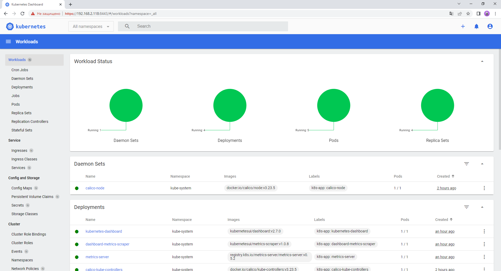

# Домашнее задание к занятию «Kubernetes. Причины появления. Команда kubectl»

### Ответ

````shell
ubuntu@VM104:~$ kubectl get nodes
NAME    STATUS   ROLES    AGE    VERSION
vm104   Ready    <none>   114m   v1.26.3
````

````shell
ubuntu@VM104:~$ microk8s kubectl port-forward -n kube-system service/kubernetes-dashboard 8443:443 --address 0.0.0.0
````


