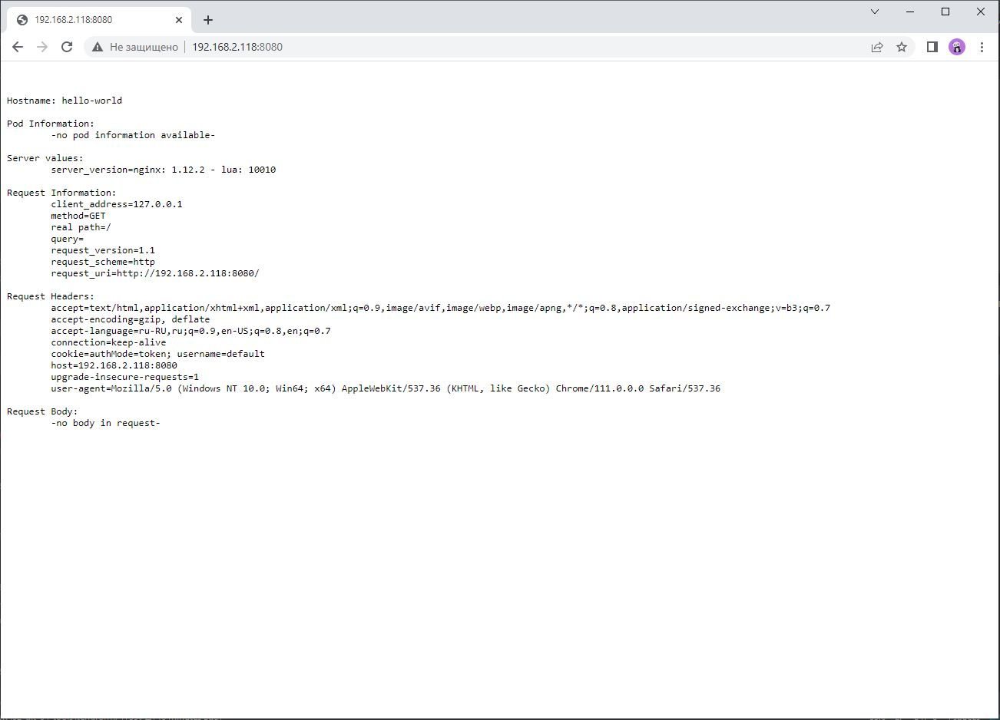
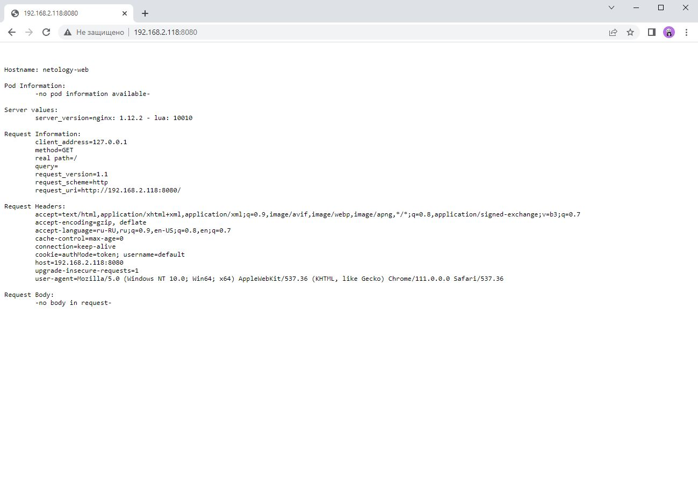

# Домашнее задание к занятию «Базовые объекты K8S»

### Задание 1. Создать Pod с именем hello-world

1. Создать манифест (yaml-конфигурацию) Pod.
2. Использовать image - gcr.io/kubernetes-e2e-test-images/echoserver:2.2.
3. Подключиться локально к Pod с помощью `kubectl port-forward` и вывести значение (curl или в браузере).

### Ответ

```yaml
ubuntu@VM104:~/12.2$ cat pod.yaml
apiVersion: v1
kind: Pod
metadata:
  labels:
    app: echoserver
  name: hello-world
spec:
  containers:
    - name: hello-world
      image: gcr.io/kubernetes-e2e-test-images/echoserver:2.2
      ports:
      - containerPort: 8080
        protocol: TCP
```

```shell
ubuntu@VM104:~/12.2$ microk8s kubectl apply -f pod.yaml
pod/hello-world created
```

```shell
ubuntu@VM104:~/12.2$ microk8s kubectl get pods
NAME          READY   STATUS    RESTARTS   AGE
hello-world   1/1     Running   0          33m
```

```shell
ubuntu@VM104:~/12.2$ microk8s kubectl port-forward hello-world 8080:8080 --address 0.0.0.0
Forwarding from 0.0.0.0:8080 -> 8080
```



------

### Задание 2. Создать Service и подключить его к Pod

1. Создать Pod с именем netology-web.
2. Использовать image — gcr.io/kubernetes-e2e-test-images/echoserver:2.2.
3. Создать Service с именем netology-svc и подключить к netology-web.
4. Подключиться локально к Service с помощью `kubectl port-forward` и вывести значение (curl или в браузере).

### Ответ

```yaml
ubuntu@VM104:~/12.2$ cat netology-web.yaml
apiVersion: v1
kind: Pod
metadata:
  labels:
    app: echoserver
  name: netology-web
spec:
  containers:
    - name: netology-web
      image: gcr.io/kubernetes-e2e-test-images/echoserver:2.2
      ports:
      - containerPort: 8080
        name: echo
        protocol: TCP
```

```shell
ubuntu@VM104:~/12.2$ microk8s kubectl apply -f netology-web.yaml
pod/netology-web created
```

```shell
ubuntu@VM104:~/12.2$ microk8s kubectl get pods --show-labels
NAME           READY   STATUS    RESTARTS   AGE    LABELS
hello-world    1/1     Running   0          48m    <none>
netology-web   1/1     Running   0          3m6s   app=echoserver
```

```yaml
ubuntu@VM104:~/12.2$ cat  netology-svc.yaml
apiVersion: v1
kind: Service
metadata:
  name: netology-svc
spec:
  ports:
    - name: web
      port: 80
  selector:
    app: echoserver
```

```shell
ubuntu@VM104:~/12.2$ microk8s kubectl apply -f netology-svc.yaml
service/netology-svc created
```

```shell
ubuntu@VM104:~/12.2$ microk8s kubectl get svc,ep
NAME                   TYPE        CLUSTER-IP       EXTERNAL-IP   PORT(S)    AGE
service/kubernetes     ClusterIP   10.152.183.1     <none>        443/TCP    23h
service/netology-svc   ClusterIP   10.152.183.247   <none>        8080/TCP   4m8s

NAME                     ENDPOINTS             AGE
endpoints/kubernetes     192.168.2.118:16443   23h
endpoints/netology-svc   10.1.240.14:8080      4m8s
```

```shell
ubuntu@VM104:~/12.2$ microk8s kubectl port-forward svc/netology-svc 8080:8080 --address 0.0.0.0
Forwarding from 0.0.0.0:8080 -> 8080
```



Файлы манифестов:
- [pod.yaml](src/pod.yaml)
- [netology-web.yaml](src/netology-web.yaml)
- [netology-svc.yaml](src/netology-svc.yaml)

------

### Правила приёма работы

1. Домашняя работа оформляется в своем Git-репозитории в файле README.md. Выполненное домашнее задание пришлите ссылкой на .md-файл в вашем репозитории.
2. Файл README.md должен содержать скриншоты вывода команд `kubectl get pods`, а также скриншот результата подключения.
3. Репозиторий должен содержать файлы манифестов и ссылки на них в файле README.md.

------

### Критерии оценки
Зачёт — выполнены все задания, ответы даны в развернутой форме, приложены соответствующие скриншоты и файлы проекта, в выполненных заданиях нет противоречий и нарушения логики.

На доработку — задание выполнено частично или не выполнено, в логике выполнения заданий есть противоречия, существенные недостатки.


