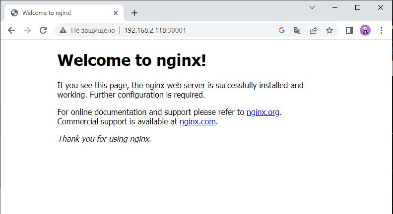
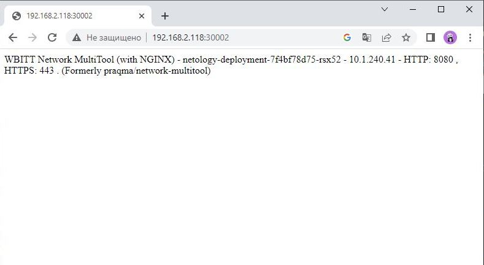

# Домашнее задание к занятию «Сетевое взаимодействие в K8S. Часть 1»

### Цель задания

В тестовой среде Kubernetes необходимо обеспечить доступ к приложению, установленному в предыдущем ДЗ и состоящему из двух контейнеров, по разным портам в разные контейнеры как внутри кластера, так и снаружи.

------

### Чеклист готовности к домашнему заданию

1. Установленное k8s-решение (например, MicroK8S).
2. Установленный локальный kubectl.
3. Редактор YAML-файлов с подключённым Git-репозиторием.

------

### Инструменты и дополнительные материалы, которые пригодятся для выполнения задания

1. [Описание](https://kubernetes.io/docs/concepts/workloads/controllers/deployment/) Deployment и примеры манифестов.
2. [Описание](https://kubernetes.io/docs/concepts/services-networking/service/) Описание Service.
3. [Описание](https://github.com/wbitt/Network-MultiTool) Multitool.

------

### Задание 1. Создать Deployment и обеспечить доступ к контейнерам приложения по разным портам из другого Pod внутри кластера

1. Создать Deployment приложения, состоящего из двух контейнеров (nginx и multitool), с количеством реплик 3 шт.
2. Создать Service, который обеспечит доступ внутри кластера до контейнеров приложения из п.1 по порту 9001 — nginx 80, по 9002 — multitool 8080.
3. Создать отдельный Pod с приложением multitool и убедиться с помощью `curl`, что из пода есть доступ до приложения из п.1 по разным портам в разные контейнеры.
4. Продемонстрировать доступ с помощью `curl` по доменному имени сервиса.
5. Предоставить манифесты Deployment и Service в решении, а также скриншоты или вывод команды п.4.


### Ответ 1.

1. Создал [deployments.yaml](src/deployments.yaml)

```shell
ubuntu@VM104:~$ microk8s kubectl get deployment
NAME                  READY   UP-TO-DATE   AVAILABLE   AGE
netology-deployment   3/3     3            3           38s
```
2. Создал [myservice.yaml](src/myservice.yaml)
```shell
ubuntu@VM104:~$ microk8s kubectl get svc
NAME         TYPE        CLUSTER-IP      EXTERNAL-IP   PORT(S)             AGE
kubernetes   ClusterIP   10.152.183.1    <none>        443/TCP             65d
service      ClusterIP   10.152.183.61   <none>        9001/TCP,9002/TCP   9s

```
3. Создал [multitool.yaml](src/multitool.yaml) 
```shell
ubuntu@VM104:~$ microk8s kubectl get pods
NAME                                   READY   STATUS    RESTARTS   AGE
netology-deployment-7f4bf78d75-rsx52   2/2     Running   0          9m16s
netology-deployment-7f4bf78d75-z9wdr   2/2     Running   0          9m16s
netology-deployment-7f4bf78d75-kr4vr   2/2     Running   0          9m16s
multitool-67879794bc-gjvmk             1/1     Running   0          18s

```
4. Доступ к сервису по доменному имени
```shell
ubuntu@VM104:~$ microk8s kubectl exec multitool-67879794bc-gjvmk -- curl service:9001
  % Total    % Received % Xferd  Average Speed   Time    Time     Time  Current
                                 Dload  Upload   Total   Spent    Left  Speed
  0     0    0     0    0     0      0      0 --:--:-- --:--:-- --:--:--     0<!DOCTYPE html>
<html>
<head>
<title>Welcome to nginx!</title>
<style>
    body {
        width: 35em;
        margin: 0 auto;
        font-family: Tahoma, Verdana, Arial, sans-serif;
    }
</style>
</head>
<body>
<h1>Welcome to nginx!</h1>
<p>If you see this page, the nginx web server is successfully installed and
working. Further configuration is required.</p>

<p>For online documentation and support please refer to
<a href="http://nginx.org/">nginx.org</a>.<br/>
Commercial support is available at
<a href="http://nginx.com/">nginx.com</a>.</p>

<p><em>Thank you for using nginx.</em></p>
</body>
</html>
100   612  100   612    0     0  13477      0 --:--:-- --:--:-- --:--:-- 13600

```
```shell
ubuntu@VM104:~$ microk8s kubectl exec multitool-67879794bc-gjvmk -- curl service:9002
WBITT Network MultiTool (with NGINX) - netology-deployment-7f4bf78d75-kr4vr - 10.1.240.43 - HTTP: 8080 , HTTPS: 443 . (Formerly praqma/network-multitool)
  % Total    % Received % Xferd  Average Speed   Time    Time     Time  Current
                                 Dload  Upload   Total   Spent    Left  Speed
100   154  100   154    0     0  42019      0 --:--:-- --:--:-- --:--:-- 51333

```
5. Файлы манифестов
- [deployments.yaml](src/deployments.yaml)
- [myservice.yaml](src/myservice.yaml)
------

### Задание 2. Создать Service и обеспечить доступ к приложениям снаружи кластера

1. Создать отдельный Service приложения из Задания 1 с возможностью доступа снаружи кластера к nginx, используя тип NodePort.
2. Продемонстрировать доступ с помощью браузера или `curl` с локального компьютера.
3. Предоставить манифест и Service в решении, а также скриншоты или вывод команды п.2.

### Ответ 2.

1. Создал [nodeport.yaml](src/nodeport.yaml)
```shell
ubuntu@VM104:~$ microk8s kubectl get svc
NAME               TYPE        CLUSTER-IP       EXTERNAL-IP   PORT(S)                         AGE
kubernetes         ClusterIP   10.152.183.1     <none>        443/TCP                         65d
service            ClusterIP   10.152.183.61    <none>        9001/TCP,9002/TCP               23m
nodeport-service   NodePort    10.152.183.225   <none>        9001:30001/TCP,9002:30002/TCP   7m21s

```
2. Доступ с локального компьютера



3. Манифест
- [nodeport.yaml](src/nodeport.yaml)


------

### Правила приёма работы

1. Домашняя работа оформляется в своем Git-репозитории в файле README.md. Выполненное домашнее задание пришлите ссылкой на .md-файл в вашем репозитории.
2. Файл README.md должен содержать скриншоты вывода необходимых команд `kubectl` и скриншоты результатов.
3. Репозиторий должен содержать тексты манифестов или ссылки на них в файле README.md.

