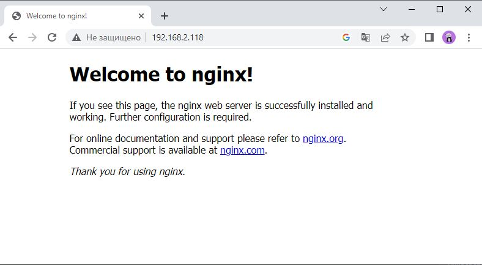
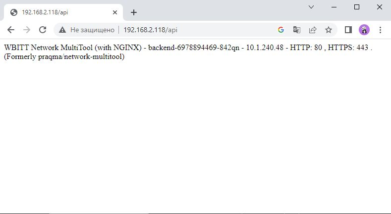

# Домашнее задание к занятию «Сетевое взаимодействие в K8S. Часть 2»

### Цель задания

В тестовой среде Kubernetes необходимо обеспечить доступ к двум приложениям снаружи кластера по разным путям.

------

### Чеклист готовности к домашнему заданию

1. Установленное k8s-решение (например, MicroK8S).
2. Установленный локальный kubectl.
3. Редактор YAML-файлов с подключённым Git-репозиторием.

------

### Инструменты и дополнительные материалы, которые пригодятся для выполнения задания

1. [Инструкция](https://microk8s.io/docs/getting-started) по установке MicroK8S.
2. [Описание](https://kubernetes.io/docs/concepts/services-networking/service/) Service.
3. [Описание](https://kubernetes.io/docs/concepts/services-networking/ingress/) Ingress.
4. [Описание](https://github.com/wbitt/Network-MultiTool) Multitool.

------

### Задание 1. Создать Deployment приложений backend и frontend

1. Создать Deployment приложения _frontend_ из образа nginx с количеством реплик 3 шт.
2. Создать Deployment приложения _backend_ из образа multitool. 
3. Добавить Service, которые обеспечат доступ к обоим приложениям внутри кластера. 
4. Продемонстрировать, что приложения видят друг друга с помощью Service.
5. Предоставить манифесты Deployment и Service в решении, а также скриншоты или вывод команды п.4.

### Ответ 1

Создал манифесты деплоймента приложений и сервисов:
- [deployment_frontend.yaml](src/deployment_frontend.yaml)
- [deployment_backend.yaml](src/deployment_backend.yaml)
```shell
ubuntu@VM104:~$ microk8s kubectl get deployments
NAME       READY   UP-TO-DATE   AVAILABLE   AGE
frontend   3/3     3            3           43s
backend    1/1     1            1           32s

```

Проверяем доступность
- frontend
```shell
ubuntu@VM104:~$ microk8s kubectl exec backend-6978894469-842qn -- curl fe-svc
<!DOCTYPE html>
<html>
<head>
<title>Welcome to nginx!</title>
<style>
    body {
        width: 35em;
        margin: 0 auto;
        font-family: Tahoma, Verdana, Arial, sans-serif;
    }
</style>
</head>
<body>
<h1>Welcome to nginx!</h1>
<p>If you see this page, the nginx web server is successfully installed and
working. Further configuration is required.</p>

<p>For online documentation and support please refer to
<a href="http://nginx.org/">nginx.org</a>.<br/>
Commercial support is available at
<a href="http://nginx.com/">nginx.com</a>.</p>

<p><em>Thank you for using nginx.</em></p>
</body>
</html>
  % Total    % Received % Xferd  Average Speed   Time    Time     Time  Current
                                 Dload  Upload   Total   Spent    Left  Speed
100   612  100   612    0     0   282k      0 --:--:-- --:--:-- --:--:--  298k

```
- backend
```shell
ubuntu@VM104:~$ microk8s kubectl exec frontend-67f895b69-dt42h -- curl be-svc
  % Total    % Received % Xferd  Average Speed   Time    Time     Time  Current
                                 Dload  Upload   Total   Spent    Left  Speed
100   140  100   140    0     0   5384      0 --:--:-- --:--:-- --:--:--  5384
WBITT Network MultiTool (with NGINX) - backend-6978894469-842qn - 10.1.240.48 - HTTP: 80 , HTTPS: 443 . (Formerly praqma/network-multitool)

```

------

### Задание 2. Создать Ingress и обеспечить доступ к приложениям снаружи кластера

1. Включить Ingress-controller в MicroK8S.
2. Создать Ingress, обеспечивающий доступ снаружи по IP-адресу кластера MicroK8S так, чтобы при запросе только по адресу открывался _frontend_ а при добавлении /api - _backend_.
3. Продемонстрировать доступ с помощью браузера или `curl` с локального компьютера.
4. Предоставить манифесты и скриншоты или вывод команды п.2.

### Ответ 2

1. Включаем `ingress-controller`
```shell
ubuntu@VM104:~$ microk8s enable ingress
Infer repository core for addon ingress
Enabling Ingress
ingressclass.networking.k8s.io/public created
ingressclass.networking.k8s.io/nginx created
namespace/ingress created
serviceaccount/nginx-ingress-microk8s-serviceaccount created
clusterrole.rbac.authorization.k8s.io/nginx-ingress-microk8s-clusterrole created
role.rbac.authorization.k8s.io/nginx-ingress-microk8s-role created
clusterrolebinding.rbac.authorization.k8s.io/nginx-ingress-microk8s created
rolebinding.rbac.authorization.k8s.io/nginx-ingress-microk8s created
configmap/nginx-load-balancer-microk8s-conf created
configmap/nginx-ingress-tcp-microk8s-conf created
configmap/nginx-ingress-udp-microk8s-conf created
daemonset.apps/nginx-ingress-microk8s-controller created
Ingress is enabled

```

2. Создал [ingress.yaml](src/ingress.yaml)

```shell
ubuntu@VM104:~$ microk8s kubectl describe ingress
Name:             ingress
Labels:           <none>
Namespace:        default
Address:          127.0.0.1
Ingress Class:    public
Default backend:  <default>
Rules:
  Host        Path  Backends
  ----        ----  --------
  *
              /      fe-svc:80 (10.1.240.45:80,10.1.240.46:80,10.1.240.47:80)
              /api   be-svc:80 (10.1.240.48:80)
Annotations:  nginx.ingress.kubernetes.io/rewrite-target: /
Events:
  Type    Reason  Age               From                      Message
  ----    ------  ----              ----                      -------
  Normal  Sync    9s (x3 over 11m)  nginx-ingress-controller  Scheduled for sync

```

3. Доступ с помощью браузера с локального компьютера
- Frontend


- Backend


4. Манифест
- [ingress.yaml](src/ingress.yaml)

------

### Правила приема работы

1. Домашняя работа оформляется в своем Git-репозитории в файле README.md. Выполненное домашнее задание пришлите ссылкой на .md-файл в вашем репозитории.
2. Файл README.md должен содержать скриншоты вывода необходимых команд `kubectl` и скриншоты результатов.
3. Репозиторий должен содержать тексты манифестов или ссылки на них в файле README.md.

------
