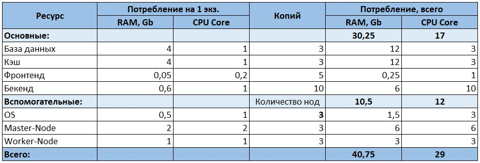

# Домашнее задание к занятию «Компоненты Kubernetes»

### Цель задания

Рассчитать требования к кластеру под проект

------

### Инструменты и дополнительные материалы, которые пригодятся для выполнения задания:

- [Considerations for large clusters](https://kubernetes.io/docs/setup/best-practices/cluster-large/),
- [Architecting Kubernetes clusters — choosing a worker node size](https://learnk8s.io/kubernetes-node-size).

------

### Задание. Необходимо определить требуемые ресурсы
Известно, что проекту нужны база данных, система кеширования, а само приложение состоит из бекенда и фронтенда. Опишите, какие ресурсы нужны, если известно:

1. Необходимо упаковать приложение в чарт для деплоя в разные окружения. 
2. База данных должна быть отказоустойчивой. Потребляет 4 ГБ ОЗУ в работе, 1 ядро. 3 копии. 
3. Кеш должен быть отказоустойчивый. Потребляет 4 ГБ ОЗУ в работе, 1 ядро. 3 копии. 
4. Фронтенд обрабатывает внешние запросы быстро, отдавая статику. Потребляет не более 50 МБ ОЗУ на каждый экземпляр, 0.2 ядра. 5 копий. 
5. Бекенд потребляет 600 МБ ОЗУ и по 1 ядру на копию. 10 копий.

## Ответ

Всего ресурсов необходимо: RAM-41Gb, CPU-29

Распределю ресурсы на виртуальные машины по принципу RAID5 - таким образом, можно будет поиграться с ценой на ВМ и определить, что выгоднее меньше нод, но мощнее ВМ или больше нод, но слабее ВМ.

Начну с 3-х на которых расположу ноды и, соответственно, для каждой ВМ возьму ресурсов с учетом выхода из строя одной ноды, тогда на одну ВМ нужно:

- RAM - 24Gb
- CPU - 16

- PS: [Файл для расчета](src/Расчет%20количества%20нод.xlsx)
----

### Правила приёма работы

1. Домашняя работа оформляется в своем Git-репозитории в файле README.md. Выполненное домашнее задание пришлите ссылкой на .md-файл в вашем репозитории.
2. Сначала сделайте расчёт всех необходимых ресурсов.
3. Затем прикиньте количество рабочих нод, которые справятся с такой нагрузкой.
4. Добавьте к полученным цифрам запас, который учитывает выход из строя как минимум одной ноды. 
5. Добавьте служебные ресурсы к нодам. Помните, что для разных типов нод требовния к ресурсам разные. 
6. В результате должно быть указано количество нод и их параметры.

