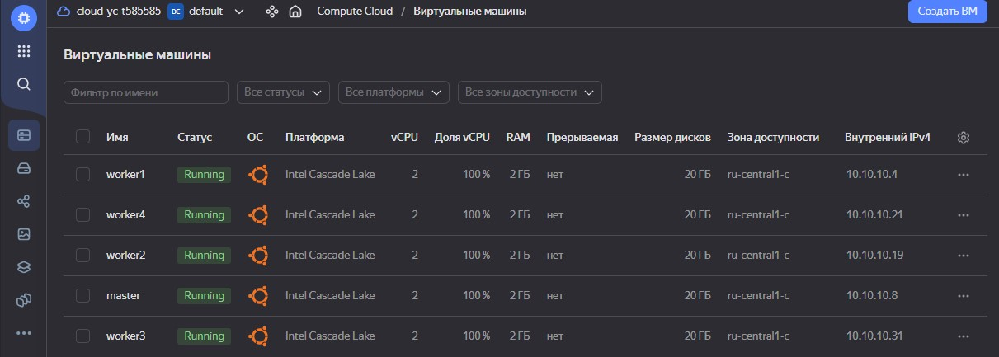

# Домашнее задание к занятию «Установка Kubernetes»

### Цель задания

Установить кластер K8s.

### Чеклист готовности к домашнему заданию

1. Развёрнутые ВМ с ОС Ubuntu 20.04-lts.


### Инструменты и дополнительные материалы, которые пригодятся для выполнения задания

1. [Инструкция по установке kubeadm](https://kubernetes.io/docs/setup/production-environment/tools/kubeadm/create-cluster-kubeadm/).
2. [Документация kubespray](https://kubespray.io/).

-----

### Задание 1. Установить кластер k8s с 1 master node

1. Подготовка работы кластера из 5 нод: 1 мастер и 4 рабочие ноды.
2. В качестве CRI — containerd.
3. Запуск etcd производить на мастере.
4. Способ установки выбрать самостоятельно.

### Ответ №1

- Подготовим сети и виртуальные машины для выполнения задания в YC ([скрипты тут](src))
```
ubuntu@ud:~/hw14.2$ ./yc_create_net.sh 
id: enp5h1qeb4adh54a4hao
folder_id: b1ghuk1b7h050bht7vcu
created_at: "2023-09-20T21:58:17Z"
name: net
description: net
labels:
  my-label: netology
default_security_group_id: enpr4sikiar25fm5rlnv

id: b0ce90o0ht34hi1613ic
folder_id: b1ghuk1b7h050bht7vcu
created_at: "2023-09-20T21:58:18Z"
name: my-subnet
description: subnet
network_id: enp5h1qeb4adh54a4hao
zone_id: ru-central1-c
v4_cidr_blocks:
  - 10.10.10.0/24
```
```
ubuntu@ud:~/hw14.2$ ./yc_create_vm.sh 
done (39s)
id: ef3jgq77b9slurnr7a0f
folder_id: b1ghuk1b7h050bht7vcu
created_at: "2023-09-20T21:59:10Z"
name: master
zone_id: ru-central1-c
platform_id: standard-v2
resources:
  memory: "2147483648"
  cores: "2"
  core_fraction: "100"
status: RUNNING
metadata_options:
  gce_http_endpoint: ENABLED
  aws_v1_http_endpoint: ENABLED
  gce_http_token: ENABLED
  aws_v1_http_token: DISABLED
boot_disk:
  mode: READ_WRITE
  device_name: ef3caedlrp6d18stbah8
  auto_delete: true
  disk_id: ef3caedlrp6d18stbah8
network_interfaces:
  - index: "0"
    mac_address: d0:0d:13:86:8e:75
    subnet_id: b0ce90o0ht34hi1613ic
    primary_v4_address:
      address: 10.10.10.8
      one_to_one_nat:
        address: 51.250.39.40
        ip_version: IPV4
gpu_settings: {}
fqdn: master.ru-central1.internal
scheduling_policy: {}
network_settings:
  type: STANDARD
placement_policy: {}
...
+----------------------+---------+---------------+---------+---------------+-------------+
|          ID          |  NAME   |    ZONE ID    | STATUS  |  EXTERNAL IP  | INTERNAL IP |
+----------------------+---------+---------------+---------+---------------+-------------+
| ef33ibffb4le4r04eop1 | worker1 | ru-central1-c | RUNNING | 51.250.37.168 | 10.10.10.4  |
| ef3chjvafn27h327fvb6 | worker4 | ru-central1-c | RUNNING | 51.250.44.87  | 10.10.10.21 |
| ef3e5mpqccl06s8vq8bt | worker2 | ru-central1-c | RUNNING | 51.250.37.240 | 10.10.10.19 |
| ef3jgq77b9slurnr7a0f | master  | ru-central1-c | RUNNING | 51.250.39.40  | 10.10.10.8  |
| ef3u8uatbv12162ojvl2 | worker3 | ru-central1-c | RUNNING | 51.250.43.112 | 10.10.10.31 |
+----------------------+---------+---------------+---------+---------------+-------------+

```


- Подключимся к "master" и скачаем `kubespray` из репозитория
```
ubuntu@ud:~/hw14.2$ ssh yc-user@51.250.39.40
```
  - Установим `git` и `pip` 
```
yc-user@master:~$ sudo apt update && sudo apt install git pip
```
- Склонируем `kuberspray`
```
yc-user@master: git clone https://github.com/kubernetes-sigs/kubespray
```
- Переключимся на стабильную версию 2.21.0
```
yc-user@master:~/kubespray$ git checkout -b v2.21.0 tags/v2.21.0
```
- Установим зависимости
```
yc-user@master:~/kubespray$ sudo pip3 install -r requirements.txt
Collecting ansible==5.7.1
  Using cached ansible-5.7.1.tar.gz (35.7 MB)
Collecting ansible-core==2.12.5
  Downloading ansible-core-2.12.5.tar.gz (7.8 MB)
     |████████████████████████████████| 7.8 MB 65 kB/s 
...
Successfully installed MarkupSafe-1.1.1 ansible-5.7.1 ansible-core-2.12.5 cryptography-3.4.8 jinja2-2.11.3 jmespath-0.9.5 packaging-23.1 pbr-5.4.4 resolvelib-0.5.4 ruamel.yaml-0.16.10 ruamel.yaml.clib-0.2.7
```
- Подготовим файл [hosts.yaml](src/hosts.yaml) и подправим его под нашу задачу 
```
yc-user@master:~/kubespray$ declare -a IPS=(10.10.10.4 10.10.10.8 10.10.10.19 10.10.10.21 10.10.10.31)
yc-user@master:~/kubespray$ CONFIG_FILE=inventory/mycluster/hosts.yaml python3 contrib/inventory_builder/inventory.py ${IPS[@]}
```
```
yc-user@master:~/kubespray$ cat inventory/mycluster/hosts.yaml 
all:
  hosts:
    worker1:
      ansible_host: 10.10.10.4
      ip: 10.10.10.4
      access_ip: 10.10.10.4
      ansible_user: yc-user
    master:
      ansible_host: 10.10.10.8
      ip: 10.10.10.8
      access_ip: 10.10.10.8
      ansible_user: yc-user
    worker2:
      ansible_host: 10.10.10.19
      ip: 10.10.10.19
      access_ip: 10.10.10.19
      ansible_user: yc-user
    worker4:
      ansible_host: 10.10.10.21
      ip: 10.10.10.21
      access_ip: 10.10.10.21
      ansible_user: yc-user
    worker3:
      ansible_host: 10.10.10.31
      ip: 10.10.10.31
      access_ip: 10.10.10.31
      ansible_user: yc-user
  children:
    kube_control_plane:
      hosts:
        master:
    kube_node:
      hosts:
        worker1:
        worker2:
        worker3:
        worker4:
    etcd:
      hosts:
        master:
    k8s_cluster:
      children:
        kube_control_plane:
        kube_node:
    calico_rr:
      hosts: {}
```
- Скопируем сертификат `id_rsa` и назначим права `chmod 0700 ~/.ssh/id_rsa`
- Запустим `playbook`
```
yc-user@master:~/kubespray$ ansible-playbook -i inventory/mycluster/hosts.yaml cluster.yml -b -v
Using /home/yc-user/kubespray/ansible.cfg as config file
[WARNING]: Skipping callback plugin 'ara_default', unable to load

PLAY [localhost] *******************************************************************************************************************
Thursday 21 September 2023  00:28:39 +0000 (0:00:00.016)       0:00:00.016 **** 

TASK [Check 2.11.0 <= Ansible version < 2.13.0] ************************************************************************************
ok: [localhost] => {
    "changed": false,
    "msg": "All assertions passed"
}
...
   очень много букв )
...
PLAY RECAP *************************************************************************************************************************
localhost                  : ok=3    changed=0    unreachable=0    failed=0    skipped=0    rescued=0    ignored=0   
master                     : ok=730  changed=144  unreachable=0    failed=0    skipped=1258 rescued=0    ignored=8   
worker1                    : ok=506  changed=92   unreachable=0    failed=0    skipped=780  rescued=0    ignored=1   
worker2                    : ok=506  changed=92   unreachable=0    failed=0    skipped=779  rescued=0    ignored=1   
worker3                    : ok=506  changed=92   unreachable=0    failed=0    skipped=779  rescued=0    ignored=1   
worker4                    : ok=506  changed=92   unreachable=0    failed=0    skipped=779  rescued=0    ignored=1   

Thursday 21 September 2023  00:48:11 +0000 (0:00:00.134)       0:19:32.643 **** 
=============================================================================== 
network_plugin/calico : Wait for calico kubeconfig to be created ----------------------------------------------------------- 46.95s
download : download_container | Download image if required ----------------------------------------------------------------- 44.59s
kubernetes/preinstall : Install packages requirements ---------------------------------------------------------------------- 43.16s
kubernetes/control-plane : kubeadm | Initialize first master --------------------------------------------------------------- 35.81s
download : download_container | Download image if required ----------------------------------------------------------------- 35.62s
kubernetes/kubeadm : Join to cluster --------------------------------------------------------------------------------------- 32.58s
download : download_container | Download image if required ----------------------------------------------------------------- 22.88s
download : download_container | Download image if required ----------------------------------------------------------------- 20.64s
download : download_container | Download image if required ----------------------------------------------------------------- 20.11s
download : download_container | Download image if required ----------------------------------------------------------------- 19.73s
download : download_container | Download image if required ----------------------------------------------------------------- 19.26s
kubernetes/preinstall : Update package management cache (APT) -------------------------------------------------------------- 17.25s
download : download_container | Download image if required ----------------------------------------------------------------- 14.06s
download : download_container | Download image if required ----------------------------------------------------------------- 13.57s
kubernetes-apps/ansible : Kubernetes Apps | Start Resources ---------------------------------------------------------------- 11.69s
download : download_container | Download image if required ----------------------------------------------------------------- 11.68s
kubernetes/preinstall : Preinstall | wait for the apiserver to be running -------------------------------------------------- 11.38s
network_plugin/cni : CNI | Copy cni plugins -------------------------------------------------------------------------------- 10.88s
network_plugin/calico : Calico | Copy calicoctl binary from download dir ---------------------------------------------------- 9.30s
etcd : reload etcd ---------------------------------------------------------------------------------------------------------- 8.54s
```
- Смотрим, что всё получилось
```
yc-user@master:~$ sudo kubectl get nodes
NAME      STATUS   ROLES           AGE   VERSION
master    Ready    control-plane   33m   v1.25.6
worker1   Ready    <none>          31m   v1.25.6
worker2   Ready    <none>          31m   v1.25.6
worker3   Ready    <none>          31m   v1.25.6
worker4   Ready    <none>          31m   v1.25.6
```
- Освобождаем ресурсы в облаке YC
```
ubuntu@ud:~/hw14.2$ ./yc_delete_vm_net.sh

```

## Доработка
- обновил python до версии 3.9, т.к. с 3.8 не устанавливались зависимости кубеспрея
```
PLAY RECAP *******************************************************************************************************************
localhost                  : ok=3    changed=0    unreachable=0    failed=0    skipped=0    rescued=0    ignored=0   
master                     : ok=754  changed=149  unreachable=0    failed=0    skipped=1280 rescued=0    ignored=8   
worker1                    : ok=514  changed=93   unreachable=0    failed=0    skipped=780  rescued=0    ignored=1   
worker2                    : ok=514  changed=93   unreachable=0    failed=0    skipped=779  rescued=0    ignored=1   
worker3                    : ok=514  changed=93   unreachable=0    failed=0    skipped=779  rescued=0    ignored=1   
worker4                    : ok=514  changed=93   unreachable=0    failed=0    skipped=779  rescued=0    ignored=1   

Friday 22 September 2023  21:41:25 +0000 (0:00:00.254)       0:22:06.817 ****** 
=============================================================================== 
download : Download_file | Download item ----------------------------------------------------------------------------- 65.78s
download : Download_container | Download image if required ----------------------------------------------------------- 34.56s
kubernetes/preinstall : Install packages requirements ---------------------------------------------------------------- 33.93s
download : Download_file | Download item ----------------------------------------------------------------------------- 30.21s
network_plugin/calico : Wait for calico kubeconfig to be created ----------------------------------------------------- 29.99s
bootstrap-os : Install dbus for the hostname module ------------------------------------------------------------------ 28.97s
download : Download_file | Download item ----------------------------------------------------------------------------- 27.65s
container-engine/containerd : Download_file | Download item ---------------------------------------------------------- 24.45s
container-engine/crictl : Download_file | Download item -------------------------------------------------------------- 24.32s
container-engine/runc : Download_file | Download item ---------------------------------------------------------------- 23.68s
container-engine/nerdctl : Download_file | Download item ------------------------------------------------------------- 23.58s
download : Download_container | Download image if required ----------------------------------------------------------- 22.08s
download : Download_container | Download image if required ----------------------------------------------------------- 20.20s
kubernetes/kubeadm : Join to cluster --------------------------------------------------------------------------------- 20.16s
container-engine/crictl : Extract_file | Unpacking archive ----------------------------------------------------------- 17.05s
container-engine/nerdctl : Extract_file | Unpacking archive ---------------------------------------------------------- 16.52s
download : Download_container | Download image if required ----------------------------------------------------------- 15.46s
download : Download_container | Download image if required ----------------------------------------------------------- 14.60s
container-engine/nerdctl : Download_file | Validate mirrors ---------------------------------------------------------- 14.53s
container-engine/crictl : Download_file | Validate mirrors ----------------------------------------------------------- 14.26s
root@master:~/kubespray# kubectl get nodes
NAME      STATUS   ROLES           AGE     VERSION
master    Ready    control-plane   4m12s   v1.28.2
worker1   Ready    <none>          3m20s   v1.28.2
worker2   Ready    <none>          3m20s   v1.28.2
worker3   Ready    <none>          3m19s   v1.28.2
worker4   Ready    <none>          3m19s   v1.28.2
```


## Дополнительные задания (со звёздочкой)

**Настоятельно рекомендуем выполнять все задания под звёздочкой.** Их выполнение поможет глубже разобраться в материале.   
Задания под звёздочкой необязательные к выполнению и не повлияют на получение зачёта по этому домашнему заданию. 

------
### Задание 2*. Установить HA кластер

1. Установить кластер в режиме HA.
2. Использовать нечётное количество Master-node.
3. Для cluster ip использовать keepalived или другой способ.

### Правила приёма работы

1. Домашняя работа оформляется в своем Git-репозитории в файле README.md. Выполненное домашнее задание пришлите ссылкой на .md-файл в вашем репозитории.
2. Файл README.md должен содержать скриншоты вывода необходимых команд `kubectl get nodes`, а также скриншоты результатов.
3. Репозиторий должен содержать тексты манифестов или ссылки на них в файле README.md.
