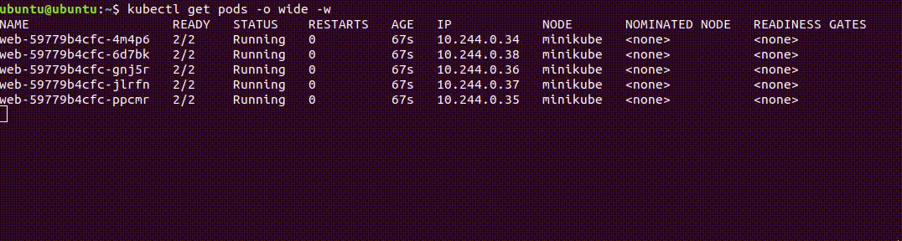
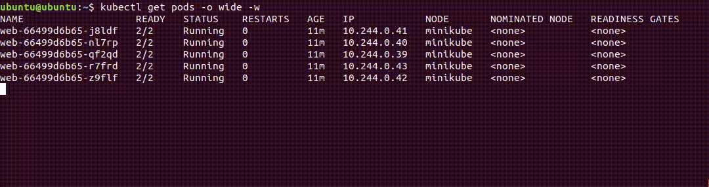
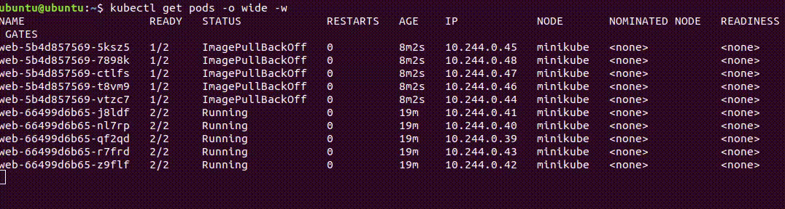

# Домашнее задание к занятию «Обновление приложений»

### Цель задания

Выбрать и настроить стратегию обновления приложения.

### Чеклист готовности к домашнему заданию

1. Кластер K8s.

### Инструменты и дополнительные материалы, которые пригодятся для выполнения задания

1. [Документация Updating a Deployment](https://kubernetes.io/docs/concepts/workloads/controllers/deployment/#updating-a-deployment).
2. [Статья про стратегии обновлений](https://habr.com/ru/companies/flant/articles/471620/).

-----

### Задание 1. Выбрать стратегию обновления приложения и описать ваш выбор

1. Имеется приложение, состоящее из нескольких реплик, которое требуется обновить.
2. Ресурсы, выделенные для приложения, ограничены, и нет возможности их увеличить.
3. Запас по ресурсам в менее загруженный момент времени составляет 20%.
4. Обновление мажорное, новые версии приложения не умеют работать со старыми.
5. Вам нужно объяснить свой выбор стратегии обновления приложения.

### Ответ 1

При данных условиях, одним из вариантов может быть использование канареечного развертывания `canary deployment`.

В данном случае, когда ресурсы ограничены и невозможно увеличить их, думаю, канареечное развертывание является хорошим выбором. Позволяет запускать новую версию приложения только на небольшой части реплик, называемых "канарейками" (ps: история про шахтеров понравилась). Мы сможем оценить производительность и стабильность новой версии приложения без значительной нагрузки на ресурсы. Если новая версия проходит проверку успешно и не вызывает проблем, она может быть развернута на остальных репликах. Если возникают проблемы, развертывание можно остановить и решить возникшие проблемы, либо вернуться к предыдущей стабильной версии приложения.

А может лучше использовать `recreate` -  всё "грохнуть" и развернуть заново, т.к. в условиях только сказано про ограниченные ресурсы, а про доступность не сказано.

### Задание 2. Обновить приложение

1. Создать deployment приложения с контейнерами nginx и multitool. Версию nginx взять 1.19. Количество реплик — 5.
2. Обновить версию nginx в приложении до версии 1.20, сократив время обновления до минимума. Приложение должно быть доступно.
3. Попытаться обновить nginx до версии 1.28, приложение должно оставаться доступным.
4. Откатиться после неудачного обновления.

### Решение 2

- Создадим deployment приложения с контейнерами nginx и multitool из манифеста [deployment.yaml](src/deployment.yaml)

```shell
kubectl apply -f deployment.yaml
kubectl get pods -o wide
```

```text
NAME                   READY   STATUS    RESTARTS   AGE   IP            NODE       NOMINATED NODE   READINESS GATES
web-59779b4cfc-4m4p6   2/2     Running   0          78s   10.244.0.34   minikube   <none>           <none>
web-59779b4cfc-6d7bk   2/2     Running   0          78s   10.244.0.38   minikube   <none>           <none>
web-59779b4cfc-gnj5r   2/2     Running   0          78s   10.244.0.36   minikube   <none>           <none>
web-59779b4cfc-jlrfn   2/2     Running   0          78s   10.244.0.37   minikube   <none>           <none>
web-59779b4cfc-ppcmr   2/2     Running   0          78s   10.244.0.35   minikube   <none>           <none>

```

- Для обновления приложения в манифест добавим стратегию `Rolling update` и изменим версию на `nginx:1.20`

```yaml
  strategy:
    type: RollingUpdate
    rollingUpdate:
      maxSurge: 100%
      maxUnavailable: 0
```

- Запустим обновление приложения из обновленного манифеста и посмотрим как происходит обновление

```shell
kubectl apply -f deployment.yaml
kubectl get pods -w
```



Сначала создаются поды с новой версией приложения, а затем удаляются старые.

```text
NAME                   READY   STATUS    RESTARTS   AGE     IP            NODE       NOMINATED NODE   READINESS GATES
web-66499d6b65-j8ldf   2/2     Running   0          5m11s   10.244.0.41   minikube   <none>           <none>
web-66499d6b65-nl7rp   2/2     Running   0          5m11s   10.244.0.40   minikube   <none>           <none>
web-66499d6b65-qf2qd   2/2     Running   0          5m11s   10.244.0.39   minikube   <none>           <none>
web-66499d6b65-r7frd   2/2     Running   0          5m11s   10.244.0.43   minikube   <none>           <none>
web-66499d6b65-z9flf   2/2     Running   0          5m11s   10.244.0.42   minikube   <none>           <none>
```

- Подготовим манифест для обновления на версию `nginx:1.28` и выполним обновление.



При обновлении возникли ошибки - не получается скачать необходимый образ. Старые поды не удаляются пока не запустятся новые.

```text
NAME                   READY   STATUS             RESTARTS   AGE     IP            NODE       NOMINATED NODE   READINESS GATES
web-5b4d857569-5ksz5   1/2     ErrImagePull       0          3m36s   10.244.0.45   minikube   <none>           <none>
web-5b4d857569-7898k   1/2     ErrImagePull       0          3m36s   10.244.0.48   minikube   <none>           <none>
web-5b4d857569-ctlfs   1/2     ImagePullBackOff   0          3m36s   10.244.0.47   minikube   <none>           <none>
web-5b4d857569-t8vm9   1/2     ErrImagePull       0          3m36s   10.244.0.46   minikube   <none>           <none>
web-5b4d857569-vtzc7   1/2     ImagePullBackOff   0          3m36s   10.244.0.44   minikube   <none>           <none>
web-66499d6b65-j8ldf   2/2     Running            0          15m     10.244.0.41   minikube   <none>           <none>
web-66499d6b65-nl7rp   2/2     Running            0          15m     10.244.0.40   minikube   <none>           <none>
web-66499d6b65-qf2qd   2/2     Running            0          15m     10.244.0.39   minikube   <none>           <none>
web-66499d6b65-r7frd   2/2     Running            0          15m     10.244.0.43   minikube   <none>           <none>
web-66499d6b65-z9flf   2/2     Running            0          15m     10.244.0.42   minikube   <none>           <none>
```

- Откатим неудачное обновление

```shell
kubectl rollout undo deployment/web
```



Старые поды остались, новые удалены.

```text
NAME                   READY   STATUS    RESTARTS   AGE   IP            NODE       NOMINATED NODE   READINESS GATES
web-66499d6b65-j8ldf   2/2     Running   0          24m   10.244.0.41   minikube   <none>           <none>
web-66499d6b65-nl7rp   2/2     Running   0          24m   10.244.0.40   minikube   <none>           <none>
web-66499d6b65-qf2qd   2/2     Running   0          24m   10.244.0.39   minikube   <none>           <none>
web-66499d6b65-r7frd   2/2     Running   0          24m   10.244.0.43   minikube   <none>           <none>
web-66499d6b65-z9flf   2/2     Running   0          24m   10.244.0.42   minikube   <none>           <none>

```

## Дополнительные задания — со звёздочкой*

Задания дополнительные, необязательные к выполнению, они не повлияют на получение зачёта по домашнему заданию. **Но мы настоятельно рекомендуем вам выполнять все задания со звёздочкой.** Это поможет лучше разобраться в материале.

### Задание 3*. Создать Canary deployment

1. Создать два deployment'а приложения nginx.
2. При помощи разных ConfigMap сделать две версии приложения — веб-страницы.
3. С помощью ingress создать канареечный деплоймент, чтобы можно было часть трафика перебросить на разные версии приложения.

### Правила приёма работы

1. Домашняя работа оформляется в своем Git-репозитории в файле README.md. Выполненное домашнее задание пришлите ссылкой на .md-файл в вашем репозитории.
2. Файл README.md должен содержать скриншоты вывода необходимых команд, а также скриншоты результатов.
3. Репозиторий должен содержать тексты манифестов или ссылки на них в файле README.md.
