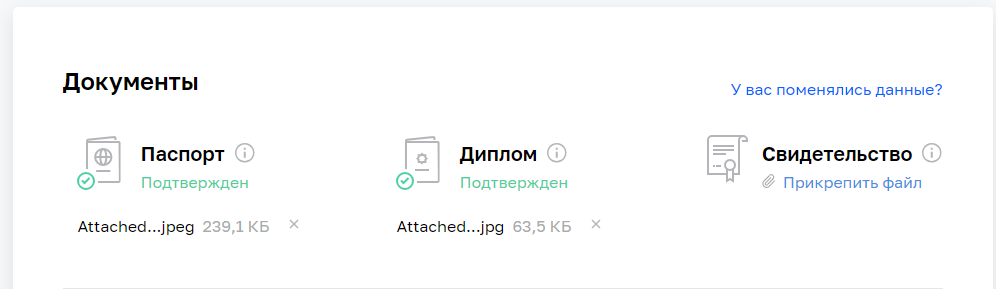
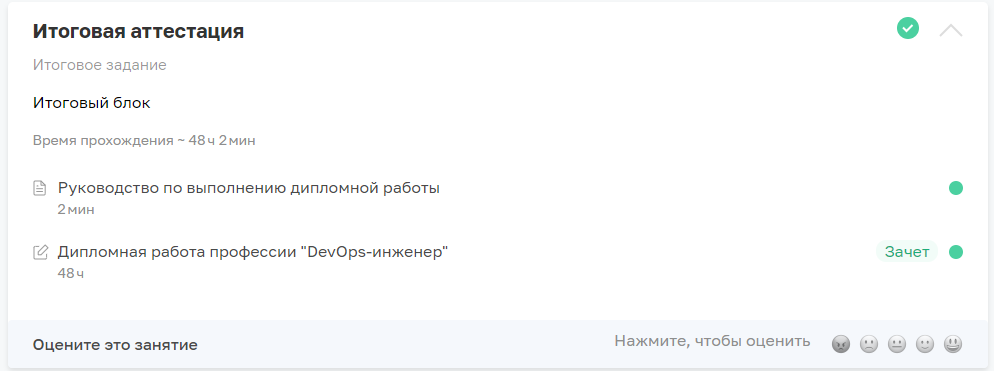
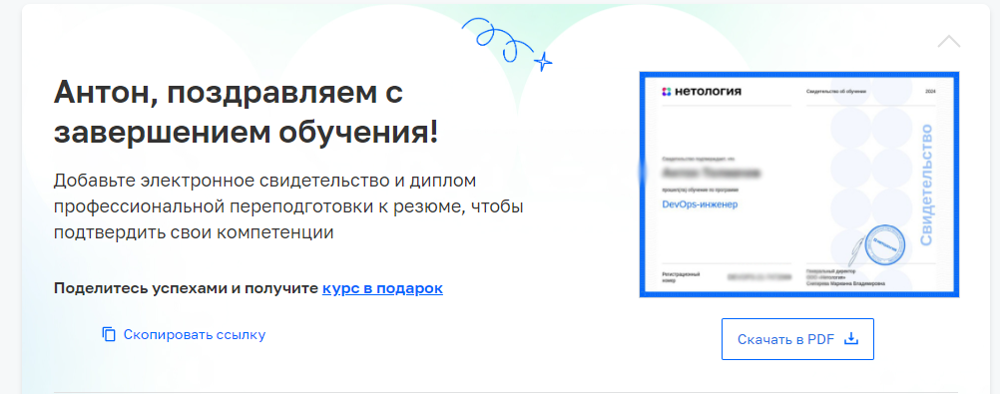
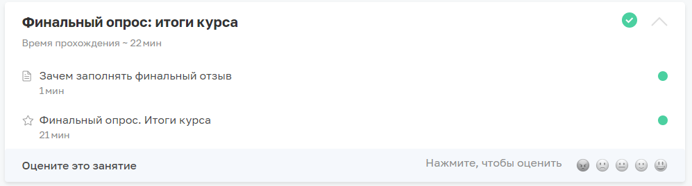

# Завершающее задание курса
## Задание
### Вопросы по заданию
1. Настройте свой профиль в личном кабинете
2. Проверьте, что ваша дипломная работа загружена, получена оценка «Зачёт»
3. Проверьте, получили ли вы поздравления об успешном окончании обучения на курсе:
4. Пройдите финальный опрос — Отзыв о курсе.

## Выполнение
1. Профиль в личном кабинете настроен:

2. Дипломная работа загружена, получена оценка «Зачёт»:

3. Получил поздравления об успешном окончании обучения на курсе:

4. Пройден финальный опрос — Отзыв о курсе.

